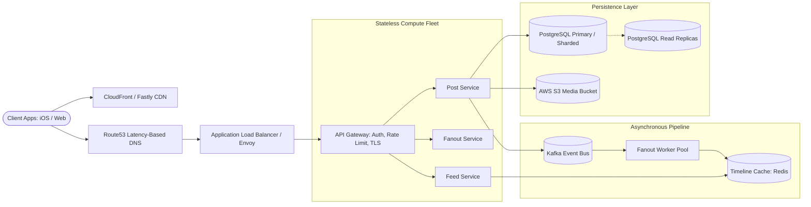
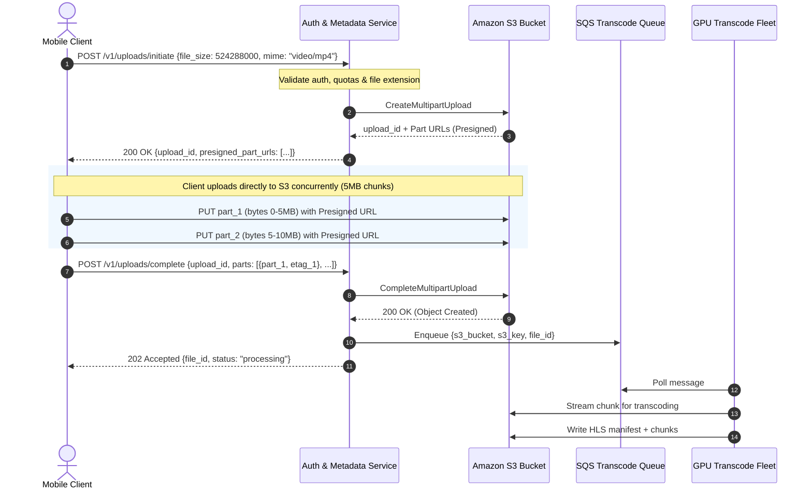
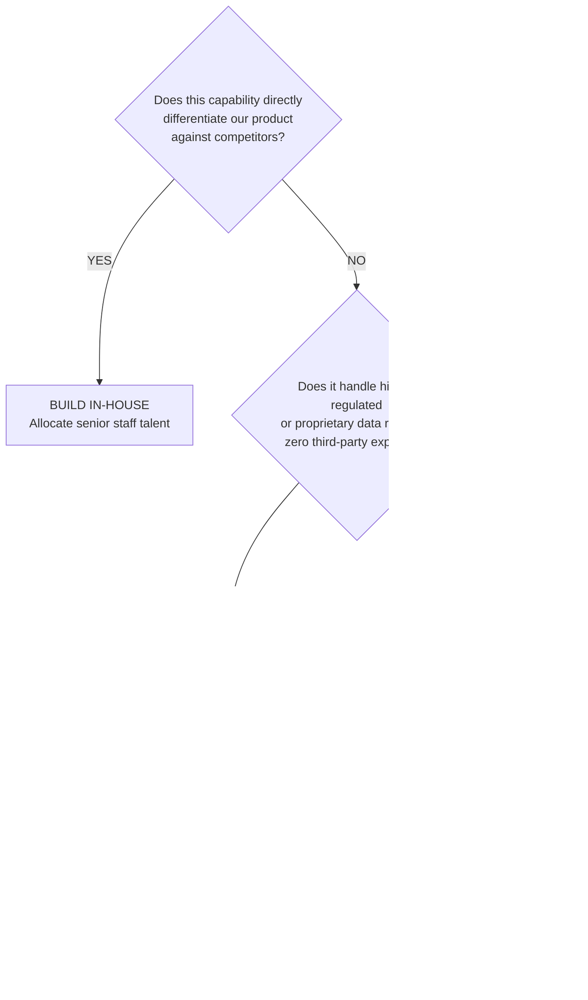
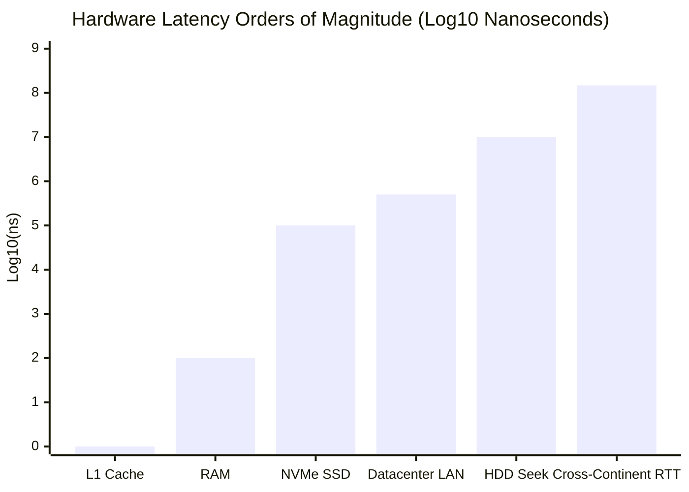

# 01. System Design Framework & Staff Architectural Mindset

> **Target Role**: Staff / Principal Backend & Distributed Systems Engineer  
> **Module**: 07-system-design / 01-framework-and-staff-mindset  
> **Core Focus**: Alex Xu 4-Step System Design Interview Framework, Staff Architectural Mindset (Challenging the PRD, Cost/Scale Engineering), Build vs. Buy vs. Open Source Economics, and Back-of-the-Envelope Capacity Estimation.

---

## Table of Contents
1. [The Alex Xu 4-Step System Design Framework](#1-the-alex-xu-4-step-system-design-framework)
   - [1.1 Step 1: Understand the Problem & Establish Design Scope](#11-step-1-understand-the-problem--establish-design-scope-3-5-min)
   - [1.2 Step 2: Propose High-Level Design & Get Buy-In](#12-step-2-propose-high-level-design--get-buy-in-10-15-min)
   - [1.3 Step 3: Deep Dive into Critical Components & Bottlenecks](#13-step-3-design-deep-dive-10-15-min)
   - [1.4 Step 4: Wrap-Up, Failure Modes & Operational Readiness](#14-step-4-wrap-up-trade-offs--operational-resilience-3-5-min)
   - [1.5 Production Framework Outages & Anti-Patterns](#15-production-framework-outages--anti-patterns)
   - [1.6 Framework Trade-Offs & Senior/Staff Q&A](#16-framework-trade-offs--seniorstaff-qa)
2. [Staff Architectural Mindset: Challenging the PRD](#2-staff-architectural-mindset-challenging-the-prd)
   - [2.1 Definition & "Why Over How" Principle](#21-definition--the-why-over-how-principle)
   - [2.2 Network Constraints: Direct S3 Presigned Uploads vs. App Server Proxying](#22-network-constraints-direct-s3-presigned-uploads-vs-app-server-proxying)
   - [2.3 Compute Constraints: Async SQS Fleet & Managed Pipelines vs. Inline Blocking](#23-compute-constraints-async-sqs-worker-fleet-vs-inline-blocking)
   - [2.4 UX Constraints: Push Protocols (WebSockets / SSE) vs. Polling Storms](#24-ux-constraints-push-protocols-websockets-sse-vs-polling-storms)
   - [2.5 Cost & Financial Modeling: Real-Time Driver Ping Economics](#25-cost--financial-modeling-real-time-driver-ping-economics)
   - [2.6 Staff Mindset Production Outages, Trade-offs & Q&A](#26-staff-mindset-production-outages-trade-offs--qa)
3. [Build vs. Buy vs. Open Source Decision Framework](#3-build-vs-buy-vs-open-source-decision-framework)
   - [3.1 The Code-as-a-Liability Principle](#31-the-code-as-a-liability-principle)
   - [3.2 Core Differentiators vs. Commodity Capabilities](#32-core-differentiators-vs-commodity-capabilities)
   - [3.3 Comprehensive TCO Financial Evaluation Matrix](#33-comprehensive-tco-financial-evaluation-matrix)
   - [3.4 Production Outages from Misguided In-House Builds](#34-production-outages-from-misguided-in-house-builds)
   - [3.5 Decision Matrix & Staff Interview Q&A](#35-decision-matrix--staff-interview-qa)
4. [Back-of-the-Envelope Estimation & Hardware Realities](#4-back-of-the-envelope-estimation--hardware-realities)
   - [4.1 Hardware Latencies Every Systems Architect Must Know](#41-hardware-latencies-every-systems-architect-must-know)
   - [4.2 Web Server QPS & Throughput Limits](#42-web-server-qps--throughput-limits)
   - [4.3 Storage, Bandwidth, and Read:Write Ratio Formulas](#43-storage-bandwidth-and-readwrite-ratio-formulas)
   - [4.4 Complete Worked Example: Global Microblogging Platform (Twitter Scale)](#44-complete-worked-example-global-microblogging-platform-twitter-scale)
   - [4.5 Production Outages from Capacity Blind Spots & Interview Q&A](#45-production-outages-from-capacity-blind-spots--interview-qa)

---

# 1. The Alex Xu 4-Step System Design Framework

### 1.1 Step 1: Understand the Problem & Establish Design Scope (3-5 min)

#### Core Concept
A system design interview is an open-ended, ambiguous architectural collaboration, not a trivia contest. Junior candidates rush directly into drawing databases and microservices; **Staff engineers clarify scope, identify constraints, and establish business drivers before proposing a single box.**

```
+-----------------------------------------------------------------------------+
|                               STEP 1 DRILL-DOWN                             |
+-----------------------------------------------------------------------------+
| 1. Clarifying Questions  --> Who is the user? What platforms? Scale?       |
| 2. Functional Scope      --> Core 2-3 P0 features. Explicitly cut non-goals.|
| 3. Non-Functional Scope  --> 99.99% vs 99.9%? P99 latency? CAP constraints? |
| 4. Back-of-Envelope      --> Write QPS, Read QPS, Network ingress/egress,   |
|                              Storage over 5 years, Cache RAM sizing.        |
+-----------------------------------------------------------------------------+
```

#### The Structured Scope Checklist
1. **Clarifying Scope & Constraints**:
   - What is the primary user persona (B2C consumers, B2B enterprise tenants, IoT devices)?
   - What are the core user flows? (e.g., Can users only post tweets, or also search, retweet, and upload 4K video?)
   - What platforms must be supported (Mobile, Web, low-bandwidth 3G edge devices)?
   - Are there regulatory or geographical constraints (GDPR, HIPAA, data residency in EU/US)?
2. **Functional Requirements (P0 vs. Out of Scope)**:
   - **In-Scope (P0)**: User posts a message (<= 280 chars), User views home timeline aggregated from followees, User follows/unfollows other users.
   - **Out-of-Scope (Non-Goals)**: Ad-targeting engine, user sentiment analysis, AI-generated feed recommendations, direct messaging. Explicitly declaring non-goals signals senior product empathy and execution focus.
3. **Non-Functional Requirements (SLAs / SLOs)**:
   - **Availability**: High availability ($99.99\%$ = 52.6 minutes downtime/year). Availability takes precedence over strict real-time consistency (AP system).
   - **Latency**: P99 read latency for home timeline $< 100\text{ ms}$; P99 write latency for publishing $< 200\text{ ms}$.
   - **Consistency**: Eventual consistency for timeline aggregation (seconds of fan-out delay is acceptable); Read-your-own-writes consistency for the author's own profile.
   - **Durability**: Zero data loss for accepted posts ($11\text{ nines}$ object storage durability, WAL-persisted writes).

---

### 1.2 Step 2: Propose High-Level Design & Get Buy-In (10-15 min)

#### Core Concept
In Step 2, you establish the macro blueprint. You define the network boundaries, API contracts, data models, and core system blocks. **Crucially, do not dive into fine-grained caching algorithms or partition schemes yet.** Validate the macro design with the interviewer first.



#### Concrete API Contracts (REST / JSON-RPC / gRPC)
Design strict, idempotent APIs with clear status codes, error payloads, and pagination tokens:

```http
POST /v1/posts
Content-Type: application/json
Idempotency-Key: 7b26d834-0371-4c12-9c16-cfc1265c8e31
Authorization: Bearer <jwt_token>

{
  "content": "Deploying zero-downtime schema migrations with Postgres 16!",
  "media_ids": ["med_984f88ad1", "med_339b1a09c"]
}

Response: 202 Accepted
{
  "post_id": "post_10928374829102",
  "status": "processing",
  "created_at": 1773294800
}
```

```http
GET /v1/timelines/home?limit=20&cursor=eyJwb3N0X2lkIjoxMDkyODM3LCJ0cyI6MTc3MzI5NDgwMH0=
Authorization: Bearer <jwt_token>

Response: 200 OK
{
  "data": [
    {
      "post_id": "post_10928374829102",
      "author_id": "usr_99182",
      "content": "Deploying zero-downtime schema migrations with Postgres 16!",
      "media_urls": ["https://cdn.example.com/med_984f88ad1.jpg"],
      "created_at": 1773294800,
      "like_count": 42
    }
  ],
  "pagination": {
    "has_more": true,
    "next_cursor": "eyJwb3N0X2lkIjoxMDkxMDAxLCJ0cyI6MTc3MzI5NDQwMH0="
  }
}
```

#### Core Relational / Document Data Schema
Define minimal schemas with clear column types, primary keys, and indexing strategies:

```sql
-- PostgreSQL DDL: Sharded or Partitioned by created_at / author_id
CREATE TABLE users (
    user_id BIGINT PRIMARY KEY,
    username VARCHAR(32) NOT NULL UNIQUE,
    email VARCHAR(255) NOT NULL UNIQUE,
    password_hash CHAR(60) NOT NULL, -- bcrypt hash
    created_at TIMESTAMPTZ NOT NULL DEFAULT NOW()
);

CREATE TABLE follows (
    follower_id BIGINT NOT NULL,
    followee_id BIGINT NOT NULL,
    created_at TIMESTAMPTZ NOT NULL DEFAULT NOW(),
    PRIMARY KEY (follower_id, followee_id)
);
CREATE INDEX idx_follows_followee ON follows(followee_id, follower_id);

CREATE TABLE posts (
    post_id BIGINT PRIMARY KEY, -- 64-bit Snowflake ID
    author_id BIGINT NOT NULL,
    content VARCHAR(280) NOT NULL,
    media_count SMALLINT NOT NULL DEFAULT 0,
    created_at TIMESTAMPTZ NOT NULL,
    deleted_at TIMESTAMPTZ NULL
) PARTITION BY RANGE (created_at);

-- Timeline schema in Redis (ZSET):
-- Key: timeline:user:{user_id}
-- Score: post_id (or 64-bit timestamp)
-- Member: post_id
```

---

### 1.3 Step 3: Design Deep Dive (10-15 min)

#### Core Concept
Step 3 is where the interviewer evaluates your depth as a Staff/Principal engineer. Select 2 to 3 bottleneck areas or Single Points of Failure (SPOFs) and drill all the way down to concurrency control, kernel limits, cache eviction semantics, and partition skew.

```mermaid
graph TD
    subgraph Fanout Deep Dive: Handling Celebrity Skew
        Author([Author Posts Tweet]) --> Ingest[Post Ingestion Service]
        Ingest --> DB[(Write to Posts DB)]
        Ingest --> Kafka[Kafka Topic: new-posts]
        
        Kafka --> Router{Is Author a Celebrity?<br/>Followers > 50,000?}
        
        Router -- "No (Standard User)" --> PushWorker[Fanout-on-Write Worker Fleet]
        PushWorker --> ZSetCache[(Push post_id into each<br/>follower's Redis ZSET)]
        
        Router -- "Yes (Celebrity User)" --> Skip[Do NOT Fanout to 50M Caches]
        Skip --> CelebrityCache[(Store post in Celebrity Outbox)]
    end
    
    subgraph Feed Aggregation at Read Time
        Reader([Follower Opens App]) --> FeedAPI[Feed Service]
        FeedAPI --> ReadZSet[Fetch User's Redis ZSET<br/>top 800 items]
        FeedAPI --> FolloweeList[Lookup Followed Celebrities]
        FolloweeList --> FetchCeleb[Fetch Top Posts from Celeb Outboxes]
        FetchCeleb --> KWayMerge[K-Way Merge Sort in Memory]
        ReadZSet --> KWayMerge
        KWayMerge --> Hydrate[Hydrate Post Metadata from Memcached]
        Hydrate --> ReturnClient([Return Timeline to Client])
    end
```



#### Bottlenecks & Failure Domains to Address:
1. **Fanout-on-Write Explosions (The "Bieber / Musk" Problem)**:
   - If an account has $80,000,000$ followers, publishing one tweet triggers $80\text{ million}$ Redis `ZADD` commands. If each `ZADD` takes $50\ \mu\text{s}$, a single post blocks worker threads and saturates cluster ingress bandwidth for minutes.
   - *Solution*: **Hybrid Fan-out**. Accounts with $< 50,000$ followers use Fanout-on-Write (push). Accounts with $\ge 50,000$ followers skip fan-out; their posts are fetched on-read and merged via a K-way min-heap during feed reads.
2. **Redis Memory Saturation & Eviction Thrashing**:
   - Caching timelines for all users wastes memory on inactive accounts.
   - *Solution*: Store only the top 800 post IDs per active user (users active within the past 7 days). An 800-item Redis Sorted Set costs $\approx 16\text{ KB}$. For $30\text{ million}$ daily active users, total timeline cache $= 30 \times 10^6 \times 16\text{ KB} \approx 480\text{ GB}$ RAM—easily handled by a 6-node Redis cluster with 128 GB RAM each.
3. **Database Sharding & Hot Spots**:
   - Sharding by `user_id` groups all posts of a user together, but hot celebrity accounts overload individual database nodes.
   - Sharding by `post_id` distributes write load evenly across nodes, but requires scatter-gather queries to fetch a user's posts.
   - *Solution*: Shard `posts` by `post_id` (Snowflake ID, where top bits are timestamps for range scans). Maintain an index table mapping `(user_id, post_id)` sharded by `user_id` to enable zero-scatter profile lookups.

---

### 1.4 Step 4: Wrap-Up, Trade-Offs & Operational Resilience (3-5 min)

#### Core Concept
Conclude the interview systematically:
1. **Review System Bottlenecks**: Summarize known points of strain and how the system degrades under failure.
2. **Observability & Telemetry**:
   - **Metrics**: Track P50, P95, P99 latencies, cache hit ratios, queue backlog sizes, HTTP 4xx/5xx rates.
   - **Distributed Tracing**: Propagate W3C `traceparent` headers across API Gateway $\to$ Microservices $\to$ Kafka $\to$ Storage.
3. **Disaster Recovery & Failure Modes**:
   - If Redis cluster fails completely, degrade gracefully: read timelines directly from read replicas with aggressive pagination limits (10 items instead of 50) and rate-limit feed refreshes.
   - Multi-Region Active-Active deployment with latency-based Route53 routing; asynchronous cross-region replication for storage.

---

### 1.5 Production Framework Outages & Anti-Patterns

#### Incident 1: The "Scatter-Gather" Cascading Failure
*Context*: An engineering team designed a feed aggregator that sharded posts by `post_id`. To generate a timeline, the feed service queried 64 database shards concurrently using `Promise.all()` to fetch recent posts from all followees.  
*Root Cause*: Under high morning traffic, one database shard suffered high I/O wait due to an autovacuum freeze. Because the client waited for all 64 requests, the slowest shard determined overall request latency (tail latency amplification: $P(\text{all fast}) = (1 - p)^N$). Connection pools on all web nodes saturated within 45 seconds, crashing the entire web tier.  
*Remedy*: Replaced on-the-fly cross-shard querying with pre-materialized Redis timeline caches and strict 50ms timeouts with circuit breakers on shard reads.

#### Incident 2: Unbounded Redis ZSET Timeline Growth
*Context*: A social platform allowed Redis timeline ZSETs to grow without limit. Power users with thousands of follows accumulated over 200,000 members per ZSET.  
*Root Cause*: Memory consumption exceeded server RAM, triggering Linux `oom-killer`, which killed the Redis master process. During failover, the replica also ran out of memory when loading the RDB snapshot.  
*Remedy*: Implemented atomic trimming on every write using a Redis pipeline:
```bash
ZADD timeline:user:12345 1773294800 10928374829102
ZREMRANGEBYRANK timeline:user:12345 0 -801
EXPIRE timeline:user:12345 604800  # 7-day sliding TTL
```

---

### 1.6 Framework Trade-Offs & Senior/Staff Q&A

| Architectural Dimension | Approach A: Fanout-on-Write (Push) | Approach B: Fanout-on-Read (Pull) | Approach C: Hybrid Fanout |
| :--- | :--- | :--- | :--- |
| **Write Amplification** | Very High ($O(F)$ where $F$ = follower count) | Zero ($O(1)$ write to author DB) | Moderate (Cap push at $50\text{k}$ followers) |
| **Read Latency** | $O(1)$ fast Redis ZREVRANGE | High (Fetch & merge $N$ followees) | Low ($O(1)$ ZSET + K-way merge for top celebs) |
| **Storage Cost** | High ($N \times M$ cache entries) | Minimal (Posts stored once) | Optimized (Capped at top 800 items for active users) |
| **Best Used For** | Low-fanout networks (e.g., LinkedIn) | High celebrity bias / low write budget | Global microblogging (Twitter, Instagram) |

#### Senior / Staff Interview Q&A

**Q: How do you handle an interviewer who keeps changing requirements midway through the interview?**  
*Answer*:  
"Changing requirements reflect real-world business pivots. First, never get defensive. Immediately pause and state: *'That is a great constraint to introduce. Let's analyze how this impacts our current assumptions.'* If they introduce video uploads to what was a text-only service, point out the shift in bottlenecks: write network bandwidth increases by $10,000\times$, storage moves from SSD RDBMS to S3 object storage with CDN distribution, and synchronous HTTP processing must convert to an asynchronous worker pipeline with presigned URLs. Document the trade-offs on the board, adjust the capacity numbers, and restructure the deep dive."

---

# 2. Staff Architectural Mindset: Challenging the PRD

### 2.1 Definition & the "Why Over How" Principle
Senior engineers ask: *"How do I implement this specification?"*  
**Staff engineers ask: *"Why does this specification exist, what physical constraints does it violate, and how do we simplify the problem to save millions of dollars in infrastructure?"***

Every product requirement comes with a hidden tax: bandwidth, compute, database writes, and operational complexity. The Staff Engineer's duty is to scrutinize requirements against the laws of physics, hardware realities, and cloud balance sheets before writing code.

---

### 2.2 Network Constraints: Direct S3 Presigned Uploads vs. App Server Proxying

#### The Anti-Pattern: Proxying Media Through Web Servers
When a product spec states: *"Users can upload 500 MB video files via our REST API"*, junior engineers route multipart form data directly to their Node.js or Rails application servers:

```
[Mobile App] --(500 MB upload)--> [Reverse Proxy (Nginx)] --> [App Server Fleet] --> [AWS S3]
```
*Why this fails in production*:
1. **Thread/Socket Exhaustion**: A 500 MB upload on a 10 Mbps mobile connection holds an HTTP connection, socket, and memory buffer open for $\approx 400\text{ seconds}$. 500 concurrent uploads consume 500 application server worker processes, starving fast read queries.
2. **Double Ingress/Egress Bandwidth**: The data travels into the cloud datacenter to the app server, then travels across the internal network to S3, doubling bandwidth costs and adding latency.
3. **Memory Pressure**: Buffering large chunks in application runtimes triggers excessive garbage collection pauses and risk of Out-Of-Memory (OOM) crashes.

#### The Production Pattern: Presigned Direct S3 Multipart Uploads



#### Production Code: Node.js/TypeScript Presigned S3 Multipart Service
```typescript
import { 
  S3Client, 
  CreateMultipartUploadCommand, 
  UploadPartCommand, 
  CompleteMultipartUploadCommand,
  CompletedPart 
} from "@aws-sdk/client-s3";
import { getSignedUrl } from "@aws-sdk/s3-request-presigner";

const s3Client = new S3Client({ region: "us-east-1" });
const BUCKET_NAME = process.env.MEDIA_BUCKET_NAME!;

export interface InitUploadResponse {
  uploadId: string;
  fileKey: string;
  partUrls: string[];
}

export async function initiateDirectMultipartUpload(
  userId: string,
  fileName: string,
  totalSizeBytes: number,
  chunkSizeBytes: number = 10 * 1024 * 1024 // 10 MB chunks
): Promise<InitUploadResponse> {
  const fileKey = `uploads/${userId}/${Date.now()}-${fileName}`;
  
  // 1. Initialize S3 Multipart Upload
  const initCommand = new CreateMultipartUploadCommand({
    Bucket: BUCKET_NAME,
    Key: fileKey,
    ContentType: "video/mp4",
    Metadata: { "uploaded-by": userId }
  });
  
  const { UploadId } = await s3Client.send(initCommand);
  if (!UploadId) throw new Error("Failed to initialize multipart upload");

  // 2. Generate presigned URLs for each chunk
  const totalParts = Math.ceil(totalSizeBytes / chunkSizeBytes);
  const urlPromises: Promise<string>[] = [];

  for (let partNumber = 1; partNumber <= totalParts; partNumber++) {
    const partCommand = new UploadPartCommand({
      Bucket: BUCKET_NAME,
      Key: fileKey,
      UploadId,
      PartNumber: partNumber
    });
    
    // URL expires in 30 minutes
    urlPromises.push(getSignedUrl(s3Client, partCommand, { expiresIn: 1800 }));
  }

  const partUrls = await Promise.all(urlPromises);

  return { uploadId: UploadId, fileKey, partUrls };
}

export async function completeDirectUpload(
  fileKey: string,
  uploadId: string,
  parts: CompletedPart[]
): Promise<void> {
  // Sort parts in ascending numerical order (mandatory for S3)
  const sortedParts = parts.sort((a, b) => (a.PartNumber ?? 0) - (b.PartNumber ?? 0));
  
  const completeCommand = new CompleteMultipartUploadCommand({
    Bucket: BUCKET_NAME,
    Key: fileKey,
    UploadId: uploadId,
    MultipartUpload: { Parts: sortedParts }
  });

  await s3Client.send(completeCommand);
}
```

---

### 2.3 Compute Constraints: Async SQS Worker Fleet vs. Inline Blocking

#### Scrutinizing the PRD
- **Naive PRD**: *"When a user uploads a video, return the processed video URL immediately in the response."*
- **Physical Reality**: Transcoding a 4K 60fps 5-minute video into HLS formats (1080p, 720p, 480p) takes **120 seconds of 100% CPU utilization across 8 cores**.
- If executed synchronously within an HTTP request thread:
  - The HTTP request times out (gateways enforce 30-60 second maximums).
  - Web worker processes become completely blocked, causing massive connection queuing and dropping standard API traffic.
- **The Staff Pushback**:
  - Convert to an asynchronous pipeline: client uploads $\to$ receives an upload receipt and `202 Accepted` $\to$ S3 ObjectCreated event sends a notification to AWS SQS $\to$ auto-scaling worker fleet (or AWS Elemental MediaConvert) processes video off-thread $\to$ client receives progress updates via WebSockets or Server-Sent Events (SSE).

---

### 2.4 UX Constraints: Push Protocols (WebSockets / SSE) vs. Polling Storms

#### The Mathematical Problem with Client Polling
Suppose an app has $2,000,000$ concurrent users waiting for order status updates or auction bids. The frontend team suggests: *"We will poll `GET /v1/orders/{id}/status` every 2 seconds."*

$$\text{Polling QPS} = \frac{2,000,000\text{ users}}{2\text{ seconds}} = 1,000,000\text{ requests/second}$$

Even if $99.9\%$ of polls return `"status": "pending"` (zero real work done), the infrastructure must handle:
- $1,000,000\text{ HTTP req/sec}$ through Application Load Balancers.
- TLS negotiation overhead, HTTP header parsing, JWT verification, and database lookups.
- Cloud cost: 1M QPS through AWS ALB alone costs $\approx \$5,800/\text{month}$, plus database read replica costs exceeding $\$25,000/\text{month}$.

#### The Push Protocol Solution: Server-Sent Events (SSE)
Since communication is unidirectional (server notifying client of progress), SSE is vastly superior to both polling and WebSockets:
- Operates over standard HTTP/2 (multiplexed over a single TCP connection; no connection limit issues like HTTP/1.1).
- Built-in automatic reconnection, event IDs, and message resumption.
- Doesn't require the complex stateful connection proxying of bidirectional WebSockets.

```
Client                             Server
  |                                   |
  |--- GET /v1/orders/123/stream ---->|  (Accept: text/event-stream)
  |<-- 200 OK (Keep-Alive, Chunked)---|
  |                                   |
  |<-- data: {"progress": 25} --------|  (Event sent when transcode reaches 25%)
  |<-- data: {"progress": 75} --------|  (Event sent when transcode reaches 75%)
  |<-- data: {"status": "complete"} --|  (Connection closed gracefully)
```

---

### 2.5 Cost & Financial Modeling: Real-Time Driver Ping Economics

#### The PRD Claim
The Product Manager specifies:  
*"We want real-time accuracy for our ride-sharing app. All 100,000 active drivers must ping their GPS coordinates to our backend every 5 seconds."*

#### The Staff Engineer's Back-of-the-Envelope Cost Breakdown
Let us calculate the concrete infrastructural load and AWS bill for this single requirement:

1. **Write Request Rate**:
   $$\text{Write QPS} = \frac{100,000\text{ drivers}}{5\text{ seconds}} = 20,000\text{ writes/sec}$$
   $$\text{Peak Write QPS (3x surge factor)} = 60,000\text{ writes/sec}$$

2. **Daily Write Volume**:
   $$\text{Daily Writes} = 20,000\text{ writes/sec} \times 86,400\text{ seconds} = 1,728,000,000\text{ writes/day} \approx 1.73\text{ Billion writes/day}$$

3. **Database Write Cost Analysis (Amazon DynamoDB)**:
   - DynamoDB charges $\$1.25$ per million write request units (WRU) for on-demand capacity in US-East-1 (assuming payload $\le 1\text{ KB}$).
   - Daily write cost:
     $$\text{Daily Cost} = \frac{1,728\text{ million}}{1\text{ million}} \times \$1.25 = \$2,160/\text{day}$$
   - Monthly write cost:
     $$\text{Monthly Cost} = \$2,160 \times 30 = \$64,800/\text{month}$$
   - Add data transfer ingress, NAT Gateway fees ($\$0.045/\text{GB}$ processed), and provisioned index storage: total exceeds **$\$80,000/\text{month}$**.

#### The Staff Engineer's Pushback & PRD Optimization
Ask the Product Manager:  
*"What business value do we gain between a 5-second and a 15-second ping? A car moving at 30 mph ($48\text{ km/h}$) travels 220 feet ($67\text{ meters}$) in 5 seconds and 660 feet ($200\text{ meters}$) in 15 seconds. Client-side dead reckoning (Kalman filtering on the rider's phone) can interpolate driver position smoothly along the road network."*

**Recalculating with 15-second pings**:
$$\text{Write QPS} = \frac{100,000}{15} \approx 6,666\text{ writes/sec}$$
$$\text{Daily Writes} = 576\text{ Million writes/day}$$
$$\text{Monthly DynamoDB Cost} = 576 \times \$1.25 \times 30 = \$21,600/\text{month}$$

**Direct Financial Impact**:  
**$\$64,800 - \$21,600 = \$43,200/\text{month saved}$ ($\mathbf{\$518,400/\text{year}}$ in cloud infrastructure)** without degrading user experience.

---

### 2.6 Staff Mindset Production Outages, Trade-offs & Q&A

#### Incident: The 1-Second Frontend Polling Catastrophe
*Context*: A cryptocurrency trading dashboard added an order book widget. The frontend developer implemented an interval polling the backend order-book API every 1,000 ms.  
*Incident*: During a Bitcoin price volatility spike, active users jumped from 10,000 to 180,000. Polling volume spiked to 180,000 QPS. The Postgres primary database CPU spiked to 100%, causing query queues to overflow and all exchange trading to halt.  
*Resolution*: Migrated to Redis Pub/Sub broadcasting price deltas over an Envoy-managed WebSocket mesh, dropping database load to zero.

---

# 3. Build vs. Buy vs. Open Source Decision Framework

### 3.1 The Code-as-a-Liability Principle
Every line of code written in-house is an **ongoing organizational liability**:
- It requires unit, integration, and security regression tests.
- It must be maintained through OS, library, and framework deprecations.
- It requires on-call rotations, runbooks, and incident post-mortems.
- It distracts engineering teams from shipping features that differentiate the company in its market.

> **Staff Rule**: *Only build software that forms the company's core competitive advantage. Everything else should be bought as SaaS or managed cloud primitives.*

---

### 3.2 Core Differentiators vs. Commodity Capabilities

```
+-----------------------------------------------------------------------------+
|                          BUILD VS. BUY TAXONOMY                             |
+-----------------------------------------------------------------------------+
| BUY AS MANAGED SAAS / CLOUD            | BUILD IN-HOUSE (CORE IP)           |
+----------------------------------------+------------------------------------+
| 1. Authentication: Clerk / Auth0       | 1. Proprietary Pricing Algorithms   |
| 2. Search Indexing: Algolia / Elastic  | 2. Ride-matching Dispatch Engines  |
| 3. Payment Processing: Stripe / Adyen  | 3. High-Frequency Trading Matcher  |
| 4. Transactional Email: SendGrid / SES | 4. Domain-Specific Machine Learning|
| 5. Video Transcoding: AWS MediaConvert | 5. Custom Fraud Detection Rules    |
+-----------------------------------------------------------------------------+
```

---

### 3.3 Comprehensive TCO Financial Evaluation Matrix

To decide whether to build or buy, calculate the **Total Cost of Ownership (TCO)** over a 3-year horizon:

$$\text{TCO} = \text{Build Cost} + \text{Maintenance Cost} + \text{Opportunity Cost} + \text{Infrastructure Cost}$$

Where:
- **Build Cost** = $\text{Engineers} \times \text{Fully Burdened Salary (\$250,000/yr)} \times \text{Time to Deliver}$.
- **Maintenance Cost** = $20\%$ of build cost annually for bug fixes, dependency upgrades, and on-call support.
- **Opportunity Cost** = Potential revenue lost because engineers were building commodity plumbing instead of core features.

#### Concrete Evaluation: Building In-House Authentication vs. Buying Clerk / Auth0
Suppose a company needs enterprise SSO (SAML/SCIM), Multi-Factor Authentication (TOTP, WebAuthn/Passkeys), session management, and role-based access control (RBAC).

| Cost Factor | Option 1: Build In-House Auth | Option 2: Buy Clerk / Auth0 |
| :--- | :--- | :--- |
| **Initial Engineering** | 3 Senior Engineers for 6 Months = $\$375,000$ | 1 Engineer for 2 Weeks integration = $\$10,400$ |
| **Annual Maintenance** | 1 Dedicated Engineer = $\$250,000/\text{year}$ | Minimal (SDK updates only) $\approx \$10,000/\text{year}$ |
| **Security Audits / SOC2** | External pen testing for custom auth: $\$40,000/\text{year}$ | Included in vendor SOC2 compliance: $\$0$ |
| **Vendor SaaS Subscription** | $\$0$ | $\$0.02/\text{MAU}$ for 100k MAU = $\$24,000/\text{year}$ |
| **3-Year Total Cost** | **$\$1,245,000$** | **$\$112,400$** |
| **Net Savings from Buying** | — | **$\$1,132,600$ saved + 6 months faster time to market** |

---

### 3.4 Production Outages from Misguided In-House Builds

#### The In-House Custom Distributed Queue Disaster
*Context*: A fintech company felt AWS SQS and Apache Kafka were "too complex or expensive" and chose to build a custom job queue using PostgreSQL with `SELECT ... FOR UPDATE SKIP LOCKED`.  
*What broke*: When queue depth reached 5,000,000 items during an end-of-month payout, Postgres table bloat skyrocketed. Dead tuples consumed 85% of disk space. Autovacuum could not keep up with the extreme write/delete turnover. The database suffered a Transaction ID (XID) wraparound shutdown, taking the entire company offline for 14 hours.  
*Lesson*: Replaced the custom queue with AWS SQS FIFO. SQS manages storage, partition scale, and retry semantics transparently for pennies per million messages.

---

### 3.5 Decision Matrix & Staff Interview Q&A



#### Staff Interview Q&A
**Q: Under what circumstances would you recommend migrating FROM a third-party SaaS BACK to an in-house build?**  
*Answer*:  
"You migrate from Buy to Build when **economic margin compression**, **latency boundaries**, or **regulatory constraints** reach a tipping point.  
1. *Economics*: Third-party SaaS pricing models often scale linearly with volume ($O(N)$). When Segment or Datadog bills exceed several millions of dollars annually, building an internal ClickHouse/Vector logging pipeline pays for itself within quarters.  
2. *Latency*: If a third-party payment or auth provider adds 250ms of network roundtrip overhead to a critical path where SLA requires $< 50\text{ ms}$, we must bring the execution in-house or run the service within our VPC.  
3. *Data Sovereignty*: Stricter regulatory frameworks (e.g., BaFin in Germany or FedRAMP in the US) may forbid sending PII to US-hosted SaaS vendors."

---

# 4. Back-of-the-Envelope Estimation & Hardware Realities

### 4.1 Hardware Latencies Every Systems Architect Must Know

To design distributed systems that scale, an architect must know the physical orders of magnitude of hardware execution. Memory and network latencies dictate the absolute performance limits of any software architecture.

```
+-----------------------------------------------------------------------------+
|                     NUMBERS EVERY ARCHITECT MUST KNOW                       |
+-----------------------------------------------------------------------------+
| Operation                                  | Latency         | Scaled (1s = L1)|
+--------------------------------------------+-----------------+-----------------+
| L1 cache reference                         | 1 ns            | 1 sec           |
| L2 cache reference                         | 4 ns            | 4 sec           |
| Mutex lock/unlock                          | 17 ns           | 17 sec          |
| Main memory (RAM) reference                | 100 ns          | 1.6 min         |
| Compress 1 KB with Zstandard               | 2,000 ns (2 µs) | 33 min          |
| Read 1 MB sequentially from RAM            | 3,000 ns (3 µs) | 50 min          |
| SSD NVMe random read                       | 100,000 ns (100 µs)| 1.1 days      |
| Read 1 MB sequentially from NVMe SSD       | 200,000 ns (200 µs)| 2.3 days      |
| Round-trip within same Datacenter (LAN)    | 500,000 ns (500 µs)| 5.8 days      |
| Hard Disk Drive (HDD) seek                 | 10,000,000 ns (10 ms)| 4 months     |
| Cross-continent RTT (NYC to London)        | 150,000,000 ns (150 ms)| 4.7 years  |
+-----------------------------------------------------------------------------+
```



#### The Fundamental Lessons:
- **RAM is $1,000\times$ faster than NVMe SSD random reads** ($100\text{ ns}$ vs $100\ \mu\text{s}$).
- **NVMe SSD is $100\times$ faster than an HDD seek** ($100\ \mu\text{s}$ vs $10\text{ ms}$).
- **Cross-datacenter roundtrip is $300\times$ slower than local LAN** ($150\text{ ms}$ vs $500\ \mu\text{s}$). Avoid synchronous cross-region database writes on the critical request path.

---

### 4.2 Web Server QPS & Throughput Limits

When estimating how many application servers are required, avoid guessing. Rely on standard production baselines per modern 8-core, 16 GB RAM server:

```
+-----------------------------------------------------------------------------+
|                  PRODUCTION WEB SERVER THROUGHPUT BASELINES                 |
+-----------------------------------------------------------------------------+
| Runtime / Framework            | Profile              | Typical QPS Range   |
+--------------------------------+----------------------+---------------------+
| Go (Gin / Chi / Fiber)         | Lightweight JSON/DB  | 10,000 - 30,000 QPS |
| Node.js (Fastify / Express)    | I/O Bound, Async     | 3,000 - 8,000 QPS   |
| Python (FastAPI / Gunicorn)    | Async / Uvicorn      | 1,500 - 4,000 QPS   |
| Ruby on Rails (Puma)           | Multi-threaded MVC   | 500 - 1,500 QPS     |
+-----------------------------------------------------------------------------+
```

> **Safe Universal Heuristic for System Design Interviews**:  
> Assume **1 commodity web server handles $\approx 1,000\text{ to }5,000\text{ QPS}$** depending on business logic complexity.

---

### 4.3 Storage, Bandwidth, and Read:Write Ratio Formulas

#### Unit Conversion Reference
- $1\text{ Byte} = 8\text{ bits}$
- $1\text{ KB} = 10^3\text{ Bytes} \approx 1,000\text{ Bytes}$
- $1\text{ MB} = 10^6\text{ Bytes} \approx 1,000,000\text{ Bytes}$
- $1\text{ GB} = 10^9\text{ Bytes} \approx 1,000,000,000\text{ Bytes}$
- $1\text{ TB} = 10^{12}\text{ Bytes}$
- $1\text{ PB} = 10^{15}\text{ Bytes}$
- **Seconds per day**: $24 \times 3,600 = 86,400 \approx \mathbf{100,000\text{ seconds}}$ (Standard estimation simplification)

#### Typical Payload Sizes
- 1 Tweet / Status update (text only): $\approx 300\text{ Bytes}$
- 1 User profile record: $\approx 1\text{ KB}$
- 1 Mobile photo (compressed JPEG/WebP): $\approx 200\text{ KB} - 500\text{ KB}$
- 1 Minute of compressed video (1080p H.264): $\approx 20\text{ MB}$

---

### 4.4 Complete Worked Example: Global Microblogging Platform (Twitter Scale)

#### 1. Baseline Assumptions
- **Monthly Active Users (MAU)**: $300,000,000$ ($300\text{ Million}$)
- **Daily Active Users (DAU)**: $150,000,000$ ($150\text{ Million}$)
- **Tweets posted per day**: $300,000,000$ ($300\text{ Million}$)
- **Read:Write Ratio**: $100:1$ (Microblogging is heavily read-dominant)
- **Media breakdown**: $10\%$ of tweets include 1 photo ($300\text{ KB}$); $1\%$ include 1 short video ($20\text{ MB}$).

---

#### 2. QPS Estimations

$$\text{Average Write QPS} = \frac{300,000,000\text{ tweets}}{86,400\text{ seconds}} \approx \mathbf{3,472\text{ writes/sec}}$$

$$\text{Peak Write QPS (Surge Factor } 2.5\times\text{)} = 3,472 \times 2.5 \approx \mathbf{8,680\text{ writes/sec}}$$

$$\text{Average Read QPS} = \text{Write QPS} \times 100 = 3,472 \times 100 = \mathbf{347,200\text{ reads/sec}}$$

$$\text{Peak Read QPS (Surge Factor } 2.5\times\text{)} = 347,200 \times 2.5 \approx \mathbf{868,000\text{ reads/sec}}$$

*Takeaway*: The read load ($\approx 868\text{k QPS}$) cannot be served directly from a primary relational database. Aggressive multi-tier caching (Redis, Memcached, CDN edge) is mandatory.

---

#### 3. Storage Estimations (5-Year Capacity Plan)

##### Text Storage per Day:
$$\text{Daily Text} = 300,000,000\text{ tweets} \times 300\text{ Bytes} = 90,000,000,000\text{ Bytes} = \mathbf{90\text{ GB/day}}$$

##### Media Storage per Day:
$$\text{Photo Storage} = (300\text{M} \times 10\%) \times 300\text{ KB} = 30,000,000 \times 300\text{ KB} = 9,000,000\text{ MB} = \mathbf{9\text{ TB/day}}$$

$$\text{Video Storage} = (300\text{M} \times 1\%) \times 20\text{ MB} = 3,000,000 \times 20\text{ MB} = 60,000,000\text{ MB} = \mathbf{60\text{ TB/day}}$$

$$\text{Total Media Storage per Day} = 9\text{ TB} + 60\text{ TB} = \mathbf{69\text{ TB/day}}$$

##### 5-Year Storage Requirements:
$$\text{5-Year Text Storage} = 90\text{ GB/day} \times 365 \times 5 \approx \mathbf{164.25\text{ TB}}$$

$$\text{5-Year Media Storage} = 69\text{ TB/day} \times 365 \times 5 \approx \mathbf{125.9\text{ Petabytes (PB)}}$$

*Architectural Decision*: Text data fits into sharded relational databases (e.g., PostgreSQL or CockroachDB). All media binaries must bypass application servers and be stored in S3 object storage with S3 Intelligent-Tiering to archive cold media to Glacier Deep Archive after 90 days.

---

#### 4. Bandwidth Estimations

##### Ingress Bandwidth (Data coming in):
$$\text{Text Ingress} = 3,472\text{ writes/sec} \times 300\text{ B} \approx 1.04\text{ MB/s}$$
$$\text{Media Ingress} = \frac{69\text{ TB/day}}{86,400\text{ s}} \approx \frac{69,000,000\text{ MB}}{86,400\text{ s}} \approx \mathbf{800\text{ MB/s}} = \mathbf{6.4\text{ Gbps}}$$

##### Egress Bandwidth (Data leaving to users):
Assuming users read 100 tweets per day and view 10% of associated media:
$$\text{Text Egress} = 347,200\text{ reads/sec} \times 300\text{ B} \approx 104\text{ MB/s} \approx \mathbf{832\text{ Mbps}}$$
$$\text{Media Egress (Assuming 80% CDN Hit Ratio)} = 800\text{ MB/s} \times 100 \times (1 - 0.80) \approx \mathbf{16,000\text{ MB/s}} = \mathbf{128\text{ Gbps}}$$

---

#### 5. Cache Memory Sizing (The 80/20 Rule)

According to the Pareto Principle, $20\%$ of daily tweets generate $80\%$ of all read volume. To maintain low read latency, we cache the top $20\%$ of all tweets and home timelines created in the past 24 hours in RAM:

$$\text{Daily Total Text Data} = 90\text{ GB}$$
$$\text{RAM Required for 20\% Tweets} = 90\text{ GB} \times 0.20 = \mathbf{18\text{ GB}}$$

Now add the Home Timeline feeds for active users. Suppose we cache 800 post IDs (64-bit integer = 8 bytes) per DAU for the past day:
$$\text{Timeline Size per User} = 800 \times 8\text{ bytes} = 6.4\text{ KB}$$
$$\text{Total Timeline RAM for 150M DAU} = 150,000,000 \times 6.4\text{ KB} \approx 960,000,000\text{ KB} \approx \mathbf{960\text{ GB}}$$

$$\text{Total Cache RAM Required} = 18\text{ GB} + 960\text{ GB} \approx \mathbf{978\text{ GB}}$$

*Hardware Allocation*: A cluster of **8 AWS `r6g.2xlarge` Redis nodes** (64 GB RAM each $= 512\text{ GB}$ usable with master-replica pairing) or **16 nodes** provides ample headroom for failover, replication buffers, and memory fragmentation.

---

### 4.5 Production Outages from Capacity Blind Spots & Interview Q&A

#### Real Outage: Egress Bill Shock from Uncached S3 Buckets
*Context*: A viral news website launched a breaking video platform. The engineering team configured direct S3 URLs without a CDN in front of the bucket.  
*Incident*: A major news event drove 10 million video streams in 24 hours. Each stream downloaded 15 MB of video. Egress bandwidth exceeded 150 TB in one day. AWS S3 egress costs $\$0.09/\text{GB}$, generating an unexpected AWS bill of **$\$13,500$ in 24 hours**, while S3 single-prefix request limits were breached, causing `SlowDown (503)` errors across the globe.  
*Fix*: Placed CloudFront CDN in front of S3 with aggressive caching headers (`Cache-Control: public, max-age=86400`). Egress cost dropped by $85\%$ and origin requests decreased by $98\%$.

#### Staff Interview Q&A
**Q: How do you justify rounding 86,400 seconds to 100,000 seconds during back-of-the-envelope calculations in an interview?**  
*Answer*:  
"In system design interviews, precision is secondary to **order of magnitude accuracy and architectural reasoning**. Rounding 86,400 to 100,000 introduces a $\approx 15\%$ conservative margin of error, which conveniently accounts for off-peak vs. peak variance. Interviewers look for mental agility, dimensional awareness (converting bytes to gigabits smoothly), and the ability to link numbers directly to physical hardware choices—such as disk IOPS, RAM limits, and network interface card (NIC) saturation."
