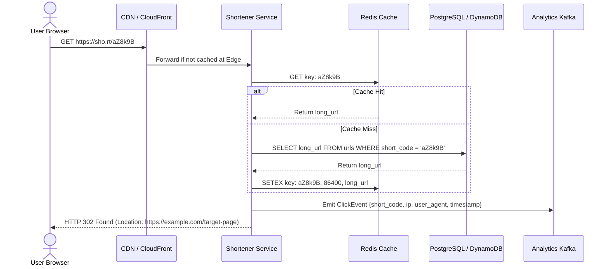
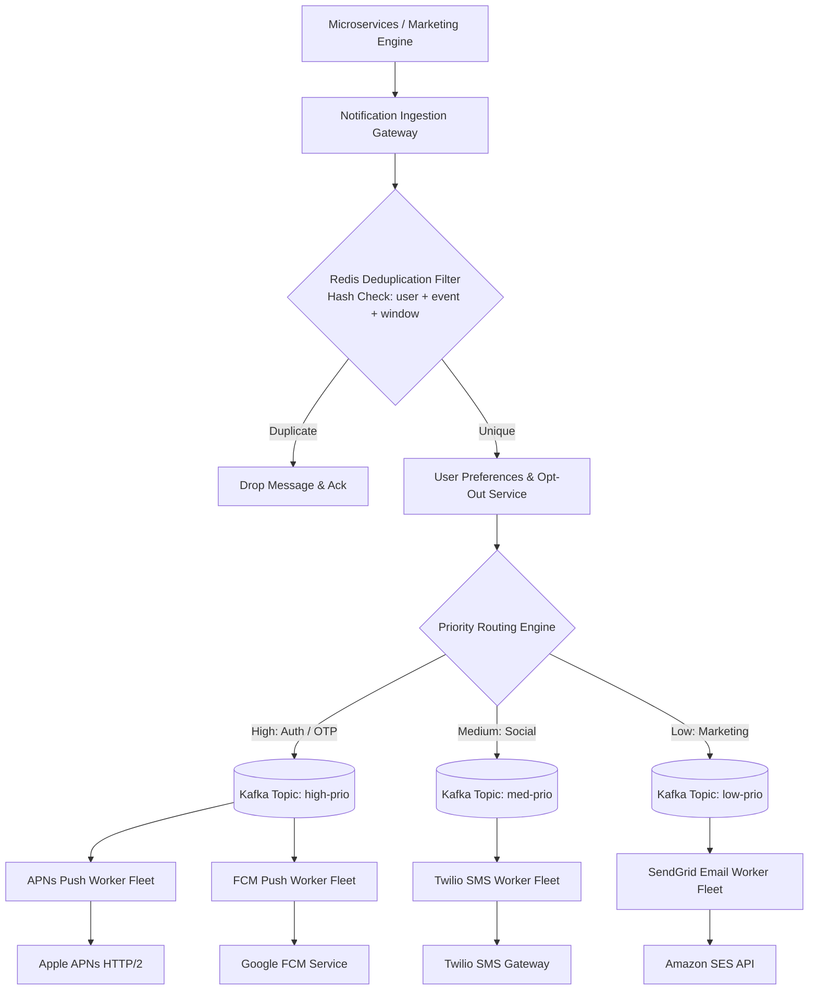
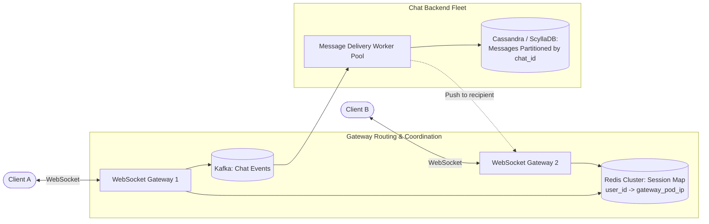

# 02. Core Distributed Components & System Design Patterns

> **Target Role**: Staff / Principal Backend & Distributed Systems Engineer  
> **Module**: 07-system-design / 02-core-distributed-components  
> **Core Focus**: Production architectures, APIs, data schemas, failure modes, and trade-offs for 14 foundational distributed system interview problems.

---

## Table of Contents
1. [Distributed Rate Limiter](#1-distributed-rate-limiter)
2. [Globally Unique ID Generator (Snowflake)](#2-globally-unique-id-generator-snowflake)
3. [High-Scale URL Shortener](#3-high-scale-url-shortener)
4. [Multi-Channel Notification System](#4-multi-channel-notification-system)
5. [Real-Time News Feed System](#5-real-time-news-feed-system)
6. [Real-Time Chat & Instant Messaging System](#6-real-time-chat--instant-messaging-system)
7. [Search Autocomplete / Typeahead Suggestion System](#7-search-autocomplete--typeahead-suggestion-system)
8. [Scalable Video Streaming Platform (YouTube / Netflix)](#8-scalable-video-streaming-platform-youtube--netflix)
9. [Cloud File Storage & Sync System (Google Drive / Dropbox)](#9-cloud-file-storage--sync-system-google-drive--dropbox)
10. [Proximity Service & Nearby Friends (Geospatial LBS)](#10-proximity-service--nearby-friends-geospatial-lbs)
11. [Mission-Critical Payment & Double-Entry Ledger System](#11-mission-critical-payment--double-entry-ledger-system)
12. [High-Concurrency Hotel & Ticket Reservation System](#12-high-concurrency-hotel--ticket-reservation-system)
13. [Real-Time Gaming Leaderboard](#13-real-time-gaming-leaderboard)
14. [Ultra-Low Latency Stock Exchange Matching Engine](#14-ultra-low-latency-stock-exchange-matching-engine)

---

# 1. Distributed Rate Limiter

### 1.1 Definition & Core Concept
A rate limiter caps the number of requests a client can execute within a specified time window. In distributed environments, it prevents Denial of Service (DoS) attacks, brute-force credential stuffing, resource starvation, and cascading microservice failures.

```
Incoming Requests ----> [API Gateway / Envoy]
                               |
                               v
                       [Redis Cluster]
                    (Atomic Lua Script:
                 Check & Decrement Tokens)
                    /                     \
        Tokens Available?              Rate Exceeded?
              |                              |
             YES                             NO
              v                              v
      [Forward to Service]            [Return 429 Too Many Requests]
                                      Header: Retry-After: 12
```

---

### 1.2 Algorithms & Internal Mechanics

1. **Token Bucket**: Tokens are added to a bucket at a fixed rate $r$ up to capacity $b$. Each request consumes 1 token. Handles bursty traffic well, but requires synchronization across distributed nodes.
2. **Leaky Bucket**: Requests enter a FIFO queue of capacity $b$ and are processed at a constant rate $r$. Smooths bursts to an even flow, but bursts may suffer elevated queuing latency.
3. **Fixed Window Counter**: Divides time into fixed windows (e.g., 1 minute). Vulnerable to traffic spikes at window boundaries ($2\times$ burst at minute changeover).
4. **Sliding Window Log**: Logs every request timestamp in a Redis Sorted Set (`ZSET`). Removes timestamps older than `now - window_size`. Accurate with no boundary spikes, but high memory footprint ($O(M)$ per user where $M$ is request volume).
5. **Sliding Window Counter**: Hybrid combining current window and previous window counters:
   $$\text{Requests} = \text{Count}_{\text{current}} + \text{Count}_{\text{prev}} \times (1 - \text{elapsed\_fraction})$$
   Memory-efficient ($O(1)$) with minimal approximation error ($< 0.05\%$).

---

### 1.3 Production Code: Redis Lua Script for Sliding Window Log

Using a Lua script guarantees atomicity across Redis commands, eliminating race conditions without distributed locks.

```lua
-- KEYS[1]: Rate limit key, e.g., "ratelimit:user:usr_9981:api"
-- ARGV[1]: Current timestamp in milliseconds (e.g., 1773294800123)
-- ARGV[2]: Window size in milliseconds (e.g., 60000 for 1 min)
-- ARGV[3]: Max allowed requests per window (e.g., 100)

local key = KEYS[1]
local now = tonumber(ARGV[1])
local window = tonumber(ARGV[2])
local max_requests = tonumber(ARGV[3])

local clear_before = now - window

-- 1. Remove all request timestamps outside the active sliding window
redis.call('ZREMRANGEBYSCORE', key, '-inf', clear_before)

-- 2. Count current remaining requests in the window
local current_requests = redis.call('ZCARD', key)

if current_requests < max_requests then
    -- 3. Add current request with timestamp as both score and unique member
    -- Append a random string or microsecond component to avoid member collisions
    local member = tostring(now) .. ":" .. tostring(redis.call('INCR', key .. ':seq'))
    redis.call('ZADD', key, now, member)
    -- Set TTL equal to window duration to auto-clean idle keys
    redis.call('PEXPIRE', key, window)
    return {1, max_requests - current_requests - 1} -- Allowed, remaining quota
else
    return {0, 0} -- Denied (Rate limit exceeded)
end
```

#### Node.js / Express Middleware Integration:
```typescript
import { Request, Response, NextFunction } from "express";
import Redis from "ioredis";

const redis = new Redis(process.env.REDIS_URL!);

export function slidingWindowRateLimiter(limit: number, windowMs: number) {
  return async (req: Request, res: Response, next: NextFunction) => {
    const clientId = req.headers["x-client-id"] || req.ip || "unknown";
    const key = `ratelimit:${clientId}:${req.baseUrl}`;
    const now = Date.now();

    try {
      // Execute atomic Lua script
      const [allowed, remaining] = (await redis.eval(
        LUA_SLIDING_WINDOW_SCRIPT,
        1,
        key,
        now.toString(),
        windowMs.toString(),
        limit.toString()
      )) as [number, number];

      res.setHeader("X-RateLimit-Limit", limit);
      res.setHeader("X-RateLimit-Remaining", Math.max(0, remaining));

      if (allowed === 1) {
        return next();
      }

      res.setHeader("Retry-After", Math.ceil(windowMs / 1000));
      return res.status(429).json({
        error: "Too Many Requests",
        message: "Rate limit exceeded. Please back off."
      });
    } catch (err) {
      // Fail-open strategy: Do not block legitimate users if Redis is down
      console.error("Rate limiter Redis failure:", err);
      return next();
    }
  };
}
```

---

### 1.4 Production Outages & Debugging

#### Outage: Redis Lua Script Blocking the Single Thread
*Context*: A high-throughput API gateway evaluated sliding window logs for 50,000 req/sec using Redis.  
*Failure*: An engineer forgot to clean up timestamps with `ZREMRANGEBYSCORE`. As user ZSETs grew past 100,000 items, `ZCARD` and `ZADD` on oversized sorted sets blocked Redis's single-threaded event loop for $> 250\text{ ms}$ per call. Redis latency spiked to 5 seconds, causing gateway health checks to fail and all API instances to restart in a crash-loop.  
*Resolution*: Fixed the Lua script to remove stale scores first, capped maximum ZSET retention, and switched high-volume endpoints to Sliding Window Counters using two simple `INCR` keys.

---

### 1.5 Trade-offs & Decision Matrix

| Rate Limiter Algorithm | Accuracy | Memory Footprint | CPU / Redis Overhead | Burst Handling |
| :--- | :--- | :--- | :--- | :--- |
| **Token Bucket** | High | Low ($O(1)$ per user) | Low | Allows bursts up to bucket capacity |
| **Leaky Bucket** | High | Medium ($O(\text{Queue Size})$) | Medium | Smooths bursts into a constant rate |
| **Fixed Window** | Poor (Boundary spikes) | Minimal ($O(1)$) | Very Low (`INCR`) | Vulnerable to $2\times$ bursts at window edge |
| **Sliding Window Log** | $100\%$ Exact | High ($O(M)$ per user) | High (`ZSET` operations) | Strictly enforced |
| **Sliding Window Counter** | $\approx 99.9\%$ Approximated | Low ($O(1)$) | Low (Two key lookups) | Well-handled |

---

### 1.6 Senior / Staff Interview Q&A
**Q: How do you handle distributed rate limiting when the central Redis cluster fails completely?**  
*Answer*:  
"In high-availability systems, rate limiting operates under a **Fail-Open with Local Fallback** design. If the Redis client detects connection timeouts ($> 20\text{ ms}$), a circuit breaker trips. The service logs an alert and falls back to a local in-memory Token Bucket (e.g., Google Guava or Node.js LRU cache) on each application instance. If a user has a quota of 1,000 RPM and we run 10 app instances, each local instance allows $\approx 100\text{ RPM}$. It is better to temporarily tolerate slightly relaxed global quotas than to take down the entire API."

---

# 2. Globally Unique ID Generator (Snowflake)

### 2.1 Definition & Core Concept
In distributed databases, autoincrementing integer IDs (`BIGSERIAL`) fail because:
1. They create a Single Point of Failure (SPOF) in the centralized database.
2. Sequential IDs leak business intelligence (e.g., competitors know exactly how many orders are placed per day).
3. They make cross-region database sharding nearly impossible due to sequence coordination latency.

UUID v4 addresses collision resistance via 122 random bits, but its lack of temporal ordering fragments B-Tree database indexes, causing high disk I/O and cache misses. **Twitter Snowflake** solves this by generating 64-bit, roughly time-ordered, distributed unique IDs without central coordination.

---

### 2.2 Snowflake 64-Bit Bitwise Layout

```
 1 Bit       41 Bits (Timestamp in ms)         10 Bits (Node ID)    12 Bits (Sequence)
+-------+-------------------------------------+------------------+----------------------+
|   0   |  Epoch Offset (e.g., 69 Years Max)  |  Datacenter ID   | Counter within 1 ms  |
| (Sign)|                                     |  + Worker ID     | (0 to 4095)          |
+-------+-------------------------------------+------------------+----------------------+
```

- **Bit 0 (1 bit)**: Reserved / Sign bit (always 0 to ensure positive 64-bit signed integers).
- **Bits 1-41 (41 bits)**: Epoch-relative timestamp in milliseconds:
  $$2^{41} - 1 = 2,199,023,255,551\text{ ms} \approx 69.7\text{ years of lifetime}$$
- **Bits 42-51 (10 bits)**: Machine / Worker Identifier ($2^{10} = 1024$ nodes total, typically 5 bits Datacenter ID + 5 bits Worker ID).
- **Bits 52-63 (12 bits)**: Sequence counter ($2^{12} = 4096$ IDs per millisecond per worker node).
- **Maximum System Throughput**: $1,024\text{ nodes} \times 4,096\text{ IDs/ms} = \mathbf{4,194,304,000\text{ IDs/second}}$.

---

### 2.3 Production Code: Thread-Safe Snowflake ID Generator in Go

```go
package snowflake

import (
	"errors"
	"fmt"
	"sync"
	"time"
)

const (
	epoch             int64 = 1704067200000 // Custom Epoch: 2024-01-01 00:00:00 UTC
	nodeBits          uint8 = 10
	sequenceBits      uint8 = 12
	maxNodeId         int64 = -1 ^ (-1 << nodeBits)         // 1023
	maxSequence       int64 = -1 ^ (-1 << sequenceBits)     // 4095
	timeShift         uint8 = nodeBits + sequenceBits       // 22 bits
	nodeShift         uint8 = sequenceBits                  // 12 bits
)

type SnowflakeGenerator struct {
	mu            sync.Mutex
	nodeId        int64
	lastTimestamp int64
	sequence      int64
}

func NewSnowflakeGenerator(nodeId int64) (*SnowflakeGenerator, error) {
	if nodeId < 0 || nodeId > maxNodeId {
		return nil, fmt.Errorf("nodeId must be between 0 and %d", maxNodeId)
	}
	return &SnowflakeGenerator{
		nodeId:        nodeId,
		lastTimestamp: -1,
		sequence:      0,
	}, nil
}

func (s *SnowflakeGenerator) NextID() (int64, error) {
	s.mu.Lock()
	defer s.mu.Unlock()

	currentTimestamp := time.Now().UnixMilli()

	// Clock Drift / NTP Backward Step Handling
	if currentTimestamp < s.lastTimestamp {
		driftMs := s.lastTimestamp - currentTimestamp
		if driftMs <= 5 {
			// Sleep off minor clock drift
			time.Sleep(time.Duration(driftMs) * time.Millisecond)
			currentTimestamp = time.Now().UnixMilli()
		} else {
			return 0, fmt.Errorf("clock moved backwards by %d ms; refusing to generate ID", driftMs)
		}
	}

	if currentTimestamp == s.lastTimestamp {
		// Sequence rollover within the same millisecond
		s.sequence = (s.sequence + 1) & maxSequence
		if s.sequence == 0 {
			// Millisecond capacity exhausted; wait for next millisecond
			for currentTimestamp <= s.lastTimestamp {
				currentTimestamp = time.Now().UnixMilli()
			}
		}
	} else {
		// Reset sequence counter for new millisecond
		s.sequence = 0
	}

	s.lastTimestamp = currentTimestamp

	// Assemble 64-bit ID using bitwise shifts
	id := ((currentTimestamp - epoch) << timeShift) |
		(s.nodeId << nodeShift) |
		s.sequence

	return id, nil
}
```

---

### 2.4 Production Outages & Debugging

#### The NTP Clock-Backwards Crash
*Context*: An identity service ran Snowflake nodes synchronized via standard `ntpd`.  
*Failure*: During an NTP synchronization step, the server clock was stepped backwards by 200 ms. The Snowflake node continued generating IDs, which collided with IDs generated 200 ms earlier. Database unique constraints were violated, rejecting all customer checkout transactions.  
*Fix*: Configure NTP to use **clock slewing** (`ntpd -x` or `chrony` with `makestep 0.1 3`) instead of stepping, ensuring the system clock slows down monotonically rather than jumping backwards. In software, if clock drift $> 5\text{ ms}$, immediately reject ID generation, fire a P1 alert, and fail over to an alternate worker node.

---

### 2.5 Trade-offs & Decision Matrix

| ID Strategy | Size | Time-Ordered? | Coordination Overhead | B-Tree Index Health |
| :--- | :--- | :--- | :--- | :--- |
| **UUID v4** | 128 bits | No (Random) | None ($O(1)$ local) | Severe fragmentation & cache eviction |
| **UUID v7** | 128 bits | Yes (Millisecond prefix) | None | Good (Monotonic append) |
| **Snowflake** | 64 bits | Yes (Millisecond prefix) | Static Node ID allocation | Optimal (Dense 8-byte B-Tree keys) |
| **DB Auto-Increment**| 64 bits | Yes | High (Central DB lock / master) | Optimal |

---

# 3. High-Scale URL Shortener

### 3.1 Definition & Core Concept
A URL shortener maps long URLs (e.g., $2\text{ KB}$) to compact aliases (e.g., `https://sho.rt/aZ8k9B`). It must deliver sub-10ms redirect latencies, withstand high read-to-write ratios ($100:1$), and support analytics tracking.

---

### 3.2 Architecture & Mechanics: 301 vs. 302 Redirects



#### 301 Moved Permanently vs. 302 Found (Temporary Redirect)
- **301 Moved Permanently**: The browser caches the destination URL locally. Subsequent clicks go directly to the target URL **without hitting the shortener backend**.
  - *Advantage*: Reduces origin server load and minimizes redirect latency.
  - *Disadvantage*: **Breaks real-time click tracking, geolocation analytics, and fraud revocation**.
- **302 Found / 307 Temporary Redirect**: The browser checks the shortener on every single click.
  - *Advantage*: Accurate click telemetry, instant link disabling for malicious phishing URLs.
  - *Standard Staff Choice*: **302 Temporary Redirect** for commercial URL shorteners (Bitly, TinyURL) where analytics and safety are non-negotiable.

---

### 3.3 Base62 Encoding vs. Hash Truncation

#### Base62 Alphabet:
`[0-9a-zA-Z]` (10 digits + 26 lowercase + 26 uppercase = 62 characters).

With a 7-character string:
$$62^7 = 3,521,614,606,208 \approx \mathbf{3.52\text{ Trillion Unique URLs}}$$
At 1,000 new URLs/second, $3.52\text{ trillion}$ IDs will not be exhausted for $\approx 111\text{ years}$.

#### Strategy 1: Hash Truncation (MD5 / SHA-256)
- Compute `SHA256(long_url + salt)` $\to$ convert to Base62 $\to$ take the first 7 characters.
- *Problem*: **Hash collisions**. If two distinct URLs produce the same first 7 characters, the system must detect the collision in the database and re-hash with an incremented salt. This can lead to multiple database round-trips.

#### Strategy 2: Distributed Counter / Snowflake ID + Base62
- Generate a globally unique 64-bit integer using a distributed ID generator (or Redis sequence cluster).
- Convert the integer directly into Base62.
- *Advantage*: **Zero collisions guaranteed by design**.

#### Production Code: Base62 Conversion in TypeScript
```typescript
const BASE62_CHARS = "0123456789abcdefghijklmnopqrstuvwxyzABCDEFGHIJKLMNOPQRSTUVWXYZ";

export function encodeBase62(numericId: bigint): string {
  if (numericId === 0n) return BASE62_CHARS[0];
  let n = numericId;
  let result = "";
  const base = 62n;

  while (n > 0n) {
    const remainder = Number(n % base);
    result = BASE62_CHARS[remainder] + result;
    n = n / base;
  }
  return result;
}

export function decodeBase62(shortCode: string): bigint {
  let result = 0n;
  const base = 62n;

  for (let i = 0; i < shortCode.length; i++) {
    const char = shortCode[i];
    const index = BigInt(BASE62_CHARS.indexOf(char));
    if (index === -1n) throw new Error(`Invalid Base62 character: ${char}`);
    result = result * base + index;
  }
  return result;
}
```

---

### 3.4 Production Outages & Debugging

#### Outage: Database Write Lock Contention on Global Counter
*Context*: A company used a single PostgreSQL table row with `UPDATE counters SET val = val + 1 RETURNING val` to generate unique sequential IDs for Base62 encoding.  
*Failure*: When an ad campaign generated 15,000 short-link creations per second, row-level locks on that single database row serialized all transactions. Postgres connection pools saturated in 3 seconds, blocking all user authentication and billing operations.  
*Resolution*: Switched to a distributed range allocation scheme: worker nodes reserve blocks of 100,000 IDs from ZooKeeper or Etcd, incrementing local memory counters without cross-node network coordination.

---

# 4. Multi-Channel Notification System

### 4.1 Definition & Core Concept
A multi-channel notification engine delivers millions of transactional, security, and promotional alerts via iOS Push (APNs), Android Push (FCM), SMS (Twilio), and Email (SendGrid/SES) with deduplication, rate limits, and user preference controls.

---

### 4.2 Architecture & High-Throughput Pipeline



---

### 4.3 Production Idempotency & User Preferences

```sql
-- Schema for Multi-Channel Notification Engine
CREATE TABLE notification_templates (
    template_id VARCHAR(64) PRIMARY KEY,
    channel VARCHAR(16) NOT NULL, -- PUSH, SMS, EMAIL
    title_template TEXT NOT NULL,
    body_template TEXT NOT NULL
);

CREATE TABLE user_notification_preferences (
    user_id BIGINT NOT NULL,
    channel VARCHAR(16) NOT NULL,
    category VARCHAR(32) NOT NULL, -- MARKETING, TRANSACTIONAL, SECURITY
    is_enabled BOOLEAN NOT NULL DEFAULT TRUE,
    quiet_hours_start TIME NULL,
    quiet_hours_end TIME NULL,
    PRIMARY KEY (user_id, channel, category)
);

CREATE TABLE notification_log (
    idempotency_key VARCHAR(128) PRIMARY KEY,
    user_id BIGINT NOT NULL,
    channel VARCHAR(16) NOT NULL,
    status VARCHAR(16) NOT NULL, -- PENDING, SENT, FAILED, THROTTLED
    created_at TIMESTAMPTZ NOT NULL DEFAULT NOW()
);
```

#### Rate Limiting Promotional Spam per User
To prevent spamming users, we apply a sliding window check: maximum 3 promotional notifications per user per 24 hours:

```python
import redis
import time

r = redis.Redis(host='localhost', port=6379, db=0)

def should_send_notification(user_id: int, category: str, max_allowed: int = 3, window_seconds: int = 86400) -> bool:
    if category == "SECURITY" or category == "TRANSACTIONAL":
        return True # Never throttle OTP or fraud alerts
        
    key = f"notif_rate:{user_id}:{category}"
    now = time.time()
    pipe = r.pipeline()
    
    pipe.zremrangebyscore(key, '-inf', now - window_seconds)
    pipe.zcard(key)
    pipe.zadd(key, {str(now): now})
    pipe.expire(key, window_seconds)
    _, count, _, _ = pipe.execute()
    
    return count < max_allowed
```

---

# 5. Real-Time News Feed System

### 5.1 Definition & Core Concept
A news feed generates a reverse-chronological or ranked stream of updates from followed entities (e.g., Facebook News Feed, Instagram, Twitter/X).

---

### 5.2 Fanout-on-Write (Push) vs. Fanout-on-Read (Pull) vs. Hybrid

```
1. FANOUT-ON-WRITE (PUSH MODEL)
   Author Posts ---> Ingest API ---> Fanout Workers ---> Push post_id into EVERY follower's Redis cache
   * Pros: Read is instantaneous (O(1) Redis ZREVRANGE).
   * Cons: Severe write amplification if author has 50M followers (Musk, Bieber).

2. FANOUT-ON-READ (PULL MODEL)
   Author Posts ---> Ingest API ---> Store in Author's Outbox only
   Reader Opens App ---> Fetch recent posts from ALL followees ---> K-Way Merge Sort in memory
   * Pros: Zero write amplification. Inactive followers waste zero storage.
   * Cons: Extreme read latency and high query scatter-gather for users following 5,000 accounts.

3. THE STAFF HYBRID SOLUTION (THE INDUSTRY STANDARD)
   - If author.follower_count < 50,000: Use Fanout-on-Write (Push to active followers' Redis ZSET).
   - If author.follower_count >= 50,000: Mark as "Celebrity". Do NOT push to followers.
   - At read time: Fetch follower's Redis timeline (pushed posts) + pull latest posts from 
     followed Celebrities' outboxes -> K-Way Merge in memory.
```

---

### 5.3 Production Code: In-Memory K-Way Merge Sort in Python

```python
import heapq
from typing import List, Dict, Any

class FeedPost:
    def __init__(self, post_id: int, author_id: int, timestamp: int, content: str):
        self.post_id = post_id
        self.author_id = author_id
        self.timestamp = timestamp
        self.content = content

    # Reverse comparator for max-heap (latest timestamp first)
    def __lt__(self, other: 'FeedPost'):
        return self.timestamp > other.timestamp

def merge_celebrity_and_user_feeds(
    cached_timeline: List[FeedPost], 
    celebrity_outboxes: List[List[FeedPost]], 
    limit: int = 20
) -> List[FeedPost]:
    """
    K-Way merge using a Min-Heap (inverted for max timestamp) to combine
    the user's pushed timeline with outboxes of followed celebrities.
    Complexity: O(N log K) where K is number of celebrity streams + 1.
    """
    heap = []
    
    # Push the first item of each stream into the heap: (FeedPost, stream_index, item_index)
    all_streams = [cached_timeline] + [outbox for outbox in celebrity_outboxes if outbox]
    
    for stream_idx, stream in enumerate(all_streams):
        if stream:
            heapq.heappush(heap, (stream[0], stream_idx, 0))
            
    aggregated_feed: List[FeedPost] = []
    
    while heap and len(aggregated_feed) < limit:
        post, stream_idx, item_idx = heapq.heappop(heap)
        aggregated_feed.append(post)
        
        # Advance in the stream that just yielded an item
        next_item_idx = item_idx + 1
        if next_item_idx < len(all_streams[stream_idx]):
            next_post = all_streams[stream_idx][next_item_idx]
            heapq.heappush(heap, (next_post, stream_idx, next_item_idx))
            
    return aggregated_feed
```

---

# 6. Real-Time Chat & Instant Messaging System

### 6.1 Definition & Core Concept
A chat system (WhatsApp, Discord, Slack) enables low-latency 1:1 and group messaging, online presence detection, read receipts, and offline message synchronization.

---

### 6.2 Architecture: WebSocket Gateways & Presence Heartbeats



#### Online Presence Tracking with Heartbeats
Clients send an in-band ping over their WebSocket connection every 30 seconds. Redis stores presence keys with a 60-second TTL:

```bash
# Gateway sets presence on ping
SET presence:user:1098 "ONLINE" EX 60

# Check presence
EXISTS presence:user:1098
```

---

### 6.3 Cassandra Schema for Strictly Ordered Chat Messages

Cassandra is ideal for chat workloads due to sequential write throughput and efficient clustering key range scans:

```sql
CREATE KEYSPACE chat_app WITH replication = {
    'class': 'NetworkTopologyStrategy', 
    'us-east-1': 3
};

CREATE TABLE chat_app.messages (
    chat_id UUID,
    message_id BIGINT, -- Snowflake ID: encodes millisecond timestamp
    sender_id BIGINT,
    content TEXT,
    media_url TEXT,
    created_at TIMESTAMP,
    PRIMARY KEY ((chat_id), message_id)
) WITH CLUSTERING ORDER BY (message_id DESC);

-- Fetch latest 50 messages in chat:
SELECT * FROM chat_app.messages 
WHERE chat_id = 7a8e2340-9f12-4c28-9d45-d81234567890 
LIMIT 50;
```

---

# 7. Search Autocomplete / Typeahead Suggestion System

### 7.1 Definition & Core Concept
Provides instant query recommendations as a user types into a search bar. Latency must remain under **$30\text{ ms}$ P99** at 100,000+ QPS.

---

### 7.2 Core Data Structure: Trie with Top-K Cached at Nodes

A standard Trie requires traversing all child nodes to collect suffixes, which is too slow at runtime ($O(V + E)$).  
**Optimization**: Precompute and cache the **Top-5 most frequent search terms directly on each Trie node**.

```
                   (root)
                  /      \
               "s"        "a"
             [star, sony]  [amazon, apple]
             /
          "st"
       [star, starbucks, steam]
```

```python
from typing import List, Dict

class AutocompleteTrieNode:
    def __init__(self):
        self.children: Dict[str, 'AutocompleteTrieNode'] = {}
        # Precomputed top queries cached directly on the node
        self.top_k_queries: List[str] = []

class AutocompleteService:
    def __init__(self):
        self.root = AutocompleteTrieNode()

    def insert(self, word: str, frequency: int):
        node = self.root
        for char in word.lower():
            if char not in node.children:
                node.children[char] = AutocompleteTrieNode()
            node = node.children[char]
            
            # Maintain top-5 queries at this prefix
            if word not in node.top_k_queries:
                node.top_k_queries.append(word)
                # In production: sort by offline precalculated query frequency
                node.top_k_queries.sort(key=lambda w: len(w), reverse=True)
                if len(node.top_k_queries) > 5:
                    node.top_k_queries.pop()

    def search_prefix(self, prefix: str) -> List[str]:
        node = self.root
        for char in prefix.lower():
            if char not in node.children:
                return []
            node = node.children[char]
        return node.top_k_queries
```

#### Offline Aggregation Pipeline:
Real-time search queries are logged to Kafka $\to$ Apache Flink aggregates query counts over a 1-hour tumbling window $\to$ daily batch jobs build an immutable Trie snapshot $\to$ Trie is serialized and loaded into the read-only memory of search suggestion servers.

---

# 8. Scalable Video Streaming Platform (YouTube / Netflix)

### 8.1 Definition & Core Concept
Ingests multi-gigabyte raw video uploads, transcodes them into multiple resolutions and bitrates, and streams them globally with adaptive bitrate (ABR) switching via CDN edge caches.

---

### 8.2 Ingestion, Transcoding, and CDN Delivery Architecture


#### Adaptive Bitrate Streaming (HLS / DASH)
The video player monitors available bandwidth in real time. If cellular reception degrades, the player requests lower-bitrate chunks without buffering.

**Master HLS Playlist (`master.m3u8`)**:
```m3u8
#EXTM3U
#EXT-X-VERSION:6

#EXT-X-STREAM-INF:BANDWIDTH=5000000,RESOLUTION=1920x1080,CODECS="avc1.640028,mp4a.40.2"
1080p/index.m3u8

#EXT-X-STREAM-INF:BANDWIDTH=2500000,RESOLUTION=1280x720,CODECS="avc1.4d401f,mp4a.40.2"
720p/index.m3u8

#EXT-X-STREAM-INF:BANDWIDTH=800000,RESOLUTION=640x360,CODECS="avc1.42e00a,mp4a.40.2"
360p/index.m3u8
```

---

# 9. Cloud File Storage & Sync System (Google Drive / Dropbox)

### 9.1 Definition & Core Concept
Enables users to upload, synchronize, and share files across devices with high durability ($11\text{ nines}$), automatic conflict resolution, and cross-user content deduplication.

---

### 9.2 Block-Level Chunking & SHA-256 Deduplication

1. **Chunking Engine**: Files are split into fixed $4\text{ MB}$ blocks (or variable chunks using Rabin Fingerprints / Content-Defined Chunking).
2. **Deduplication**: Each block is hashed using SHA-256. If another user has already uploaded a block with the identical hash, the server skips storage and simply records a pointer to the existing S3 object.
3. **Bandwidth Savings**: When a $100\text{ MB}$ document is edited with a 2-line change, only the single modified $4\text{ MB}$ block is transmitted over the network.

```sql
-- File Metadata Schema
CREATE TABLE files (
    file_id UUID PRIMARY KEY,
    owner_id BIGINT NOT NULL,
    file_name VARCHAR(255) NOT NULL,
    version INT NOT NULL DEFAULT 1,
    created_at TIMESTAMPTZ NOT NULL DEFAULT NOW()
);

CREATE TABLE file_blocks (
    file_id UUID NOT NULL REFERENCES files(file_id),
    block_index INT NOT NULL,
    block_hash CHAR(64) NOT NULL, -- SHA-256 hex string
    size_bytes INT NOT NULL,
    PRIMARY KEY (file_id, block_index)
);

CREATE TABLE storage_blocks (
    block_hash CHAR(64) PRIMARY KEY,
    s3_key VARCHAR(255) NOT NULL,
    reference_count BIGINT NOT NULL DEFAULT 1
);
```

---

# 10. Proximity Service & Nearby Friends (Geospatial LBS)

### 10.1 Definition & Core Concept
Finds nearby points of interest (restaurants, gas stations) or tracks friends' live locations within a given radius (e.g., $5\text{ km}$).

---

### 10.2 Spatial Indexing: Geohash vs. Quadtree vs. Google S2

```
+-----------------------------------------------------------------------------+
|                      SPATIAL INDEXING COMPARISON                            |
+-----------------------------------------------------------------------------+
| Index Type   | Internal Mechanism              | Best Production Use Case   |
+--------------+---------------------------------+----------------------------+
| **Geohash**  | Base32 string interleaving      | Static POIs, prefix query  |
|              | lat/long bits into a 1D string  | in standard Redis / B-Trees|
| **Quadtree** | Hierarchical 2D tree where each | Dynamic, in-memory density |
|              | node splits into 4 quadrants    | rebalancing (Uber dispatch)|
| **Google S2**| Projects Earth onto a cube with | Production industry gold   |
|              | Hilbert space-filling curves    | standard (Lyft, Foursquare)|
+-----------------------------------------------------------------------------+
```

#### Geohash Prefix Matching
Adjacent locations share common prefixes.
- Length 5: $\approx 4.9\text{ km} \times 4.9\text{ km}$ cell.
- Length 6: $\approx 1.2\text{ km} \times 0.6\text{ km}$ cell.
- Querying a radius: query the central Geohash prefix **plus its 8 surrounding neighbor cells** to eliminate boundary miss anomalies.

```ruby
# Ruby implementation: Redis Geospatial Location Updates
require 'redis'

redis = Redis.new

# Add / Update driver location
# GEOADD key longitude latitude member
redis.geoadd("driver_locations", -122.4194, 37.7749, "driver_88192")

# Query drivers within 5km of a rider
# GEORADIUS key longitude latitude radius unit WITHDIST WITHCOORD
nearby_drivers = redis.georadius(
  "driver_locations", 
  -122.4192, 
  37.7750, 
  5, 
  'km', 
  withdist: true, 
  sort: 'ASC'
)
```

---

# 11. Mission-Critical Payment & Double-Entry Ledger System

### 11.1 Definition & Core Concept
Processes financial transactions with guaranteed idempotency, exactly-once semantics, and zero discrepancy using immutable double-entry bookkeeping.

---

### 11.2 Double-Entry Bookkeeping Ledger
Money is never created or destroyed; it is moved from one account to another. Every transaction must contain **at least one debit and at least one credit**, and the sum of debits must equal the sum of credits:

$$\sum \text{Debits} = \sum \text{Credits}$$

```sql
CREATE TABLE accounts (
    account_id UUID PRIMARY KEY,
    owner_id BIGINT NOT NULL,
    currency CHAR(3) NOT NULL,
    balance NUMERIC(18, 4) NOT NULL DEFAULT 0.0000,
    created_at TIMESTAMPTZ NOT NULL DEFAULT NOW()
);

CREATE TABLE ledger_entries (
    entry_id UUID PRIMARY KEY,
    transaction_id UUID NOT NULL,
    account_id UUID NOT NULL REFERENCES accounts(account_id),
    amount NUMERIC(18, 4) NOT NULL, -- Positive for Credit, Negative for Debit
    created_at TIMESTAMPTZ NOT NULL DEFAULT NOW()
);

-- Check integrity constraint: Transaction must balance to zero
-- SELECT transaction_id, SUM(amount) FROM ledger_entries GROUP BY transaction_id HAVING SUM(amount) != 0;
```

---

### 11.3 Idempotent Payment Flow with PSP (Stripe)

```mermaid
sequenceDiagram
    autonumber
    actor User as User Checkout
    participant API as Payment Gateway
    participant DB as Postgres Ledger
    participant Stripe as Stripe PSP

    User->>API: POST /v1/payments/charge {idempotency_key: "idem_uuid_441", amount: 50.00}
    API->>DB: INSERT INTO payments (idempotency_key, status) VALUES ('idem_uuid_441', 'PENDING') ON CONFLICT DO NOTHING
    
    alt Duplicate Request Detected
        DB-->>API: Conflict (Row already exists)
        API-->>User: Return current status of previous charge
    else First Time Request
        API->>Stripe: ChargeRequest with Header: Idempotency-Key: idem_uuid_441
        Stripe-->>API: 200 OK (Charge Succeeded: ch_398f8a)
        API->>DB: BEGIN TX; UPDATE payment SET status='SUCCESS'; INSERT INTO ledger_entries...; COMMIT TX;
        API-->>User: 200 OK {status: "succeeded", payment_id: "ch_398f8a"}
    end
```

---

# 12. High-Concurrency Hotel & Ticket Reservation System

### 12.1 Definition & Core Concept
Prevents overbooking while maintaining high booking conversion rates during extreme demand surges (e.g., concert ticket sales or World Cup hotels).

---

### 12.2 Inventory Reservation State Machine & Locking Strategies

```
[Available] 
     |
  User selects seat (Reserve)
     v
[Held / Reserved (TTL 10 min)] 
   /        \
Payment    TTL Expires / User Cancels
Succeeds      \
  v            v
[Booked]   [Available]
```

#### Optimistic vs. Pessimistic Locking
- **Pessimistic Locking (`SELECT FOR UPDATE`)**:
  - Locks the database row until the transaction commits.
  - *Risk*: Deadlocks and connection starvation under high concurrency.
- **Optimistic Locking with Versioning**:
  - Verifies the version column has not changed before writing:
    ```sql
    UPDATE inventory 
    SET available_seats = available_seats - 1, version = version + 1
    WHERE concert_id = 42 AND version = 5 AND available_seats > 0;
    ```
  - If 0 rows updated, retry or alert the user that the seat was taken.
- **Redis Distributed Hold (`SETNX` + TTL)**:
  - Atomic reservation in Redis for fast rejection, backed by an async reconciliation worker to release expired locks.

---

# 13. Real-Time Gaming Leaderboard

### 13.1 Definition & Core Concept
Ranks millions of concurrent players based on score with real-time updates and sub-10ms rank lookup queries.

---

### 13.2 Architecture: Redis Sorted Sets (`ZSET`)

Redis Sorted Sets use a **Skip List and Hash Map** internally, delivering $O(\log N)$ time complexity for insertions, updates, and rank lookups.

```bash
# 1. Update user score (or add new user)
# ZADD leaderboard score member
ZADD leaderboard 4520 "player_user_102"
ZINCRBY leaderboard 150 "player_user_102"

# 2. Get 0-based rank of a user (Highest score = Rank 0)
ZREVRANK leaderboard "player_user_102"

# 3. Get Top-10 players with scores
ZREVRANGE leaderboard 0 9 WITHSCORES

# 4. Get 5 players immediately above and below a specific user
# Fetch user rank R first, then:
ZREVRANGE leaderboard (R - 5) (R + 5) WITHSCORES
```

#### Tie-Breaking Strategy
If two players have the exact same score, who ranks higher?  
*Solution*: Deduct a fractional millisecond timestamp penalty:
$$\text{Adjusted Score} = \text{Raw Score} + \left(1 - \frac{\text{Timestamp}_{\text{achieved}}}{10^{13}}\right)$$
The earlier player achieves a marginally higher floating-point score.

---

# 14. Ultra-Low Latency Stock Exchange Matching Engine

### 14.1 Definition & Core Concept
Matches buy (Bid) and sell (Ask) orders in real time using strict **Price-Time Priority (FIFO)** at microsecond latencies.

---

### 14.2 Mechanics: In-Memory Order Book & LMAX Disruptor

```
                        ORDER BOOK STRUCTURE
          ASKS (Sell Orders - Ascending Price: Cheapest First)
  Price: $100.05  --> [Order 4 (50 shares)] -> [Order 7 (100 shares)]
  Price: $100.02  --> [Order 2 (200 shares)]
  Price: $100.01  --> [Order 1 (10 shares)]
----------------------------------------------------------------- SPREAD: $0.02
  Price: $99.99   --> [Order 3 (150 shares)]
  Price: $99.95   --> [Order 5 (300 shares)] -> [Order 6 (80 shares)]
          BIDS (Buy Orders - Descending Price: Highest First)
```

1. **In-Memory Doubly Linked Lists & B-Trees**:
   - Bids organized in a reverse-sorted B-Tree / Red-Black Tree.
   - Asks organized in a sorted B-Tree.
   - At each price point, orders sit in a FIFO doubly-linked list.
   - Lookups, insertions, and cancellations operate in $O(1)$ to $O(\log P)$ where $P$ is distinct price levels.
2. **Single-Threaded Execution via Ring Buffer (LMAX Disruptor Pattern)**:
   - Locks and mutexes cause OS thread context switches ($1-5\ \mu\text{s}$ penalty).
   - The matching engine runs on **a single CPU core pinned with `taskset`**, reading incoming orders from a lock-free circular ring buffer (Disruptor) with zero lock contention.
3. **Event Sourcing & Deterministic Replay**:
   - Every matched trade and order submission is sequentially written to an append-only WAL on NVMe SSD. If the machine crashes, the engine replays the WAL from the morning checkpoint to rebuild state in $< 1\text{ second}$.
