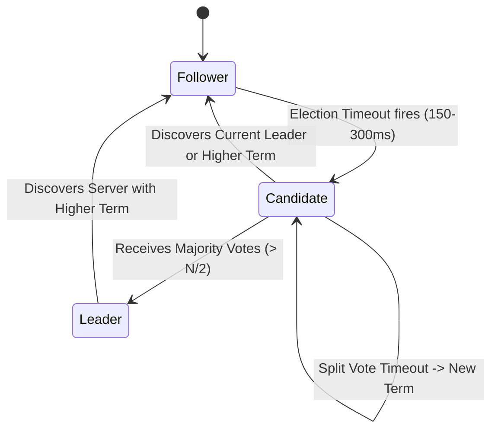
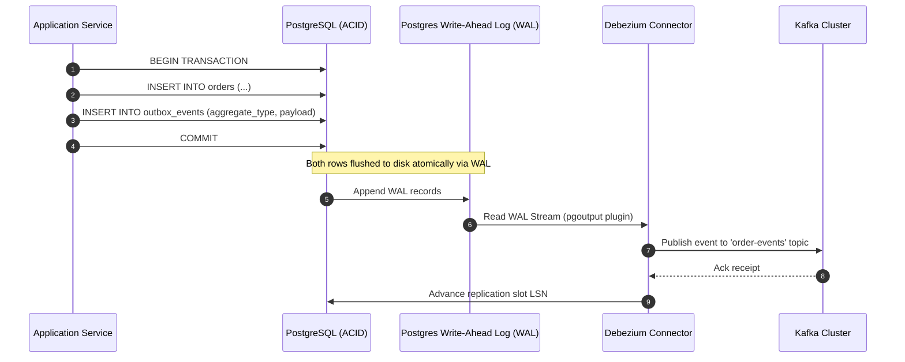

# 03. Distributed Systems Patterns & Theoretical Foundations

> **Target Role**: Staff / Principal Backend & Distributed Systems Engineer  
> **Module**: 07-system-design / 03-distributed-systems-patterns  
> **Core Focus**: CAP & PACELC Theorems, Distributed Consistency Hierarchy, Quorum Replication & Raft Consensus, CQRS Architecture, The Saga Pattern, and Transactional Outbox / CDC Patterns.

---

## Table of Contents
1. [CAP Theorem & PACELC Classification](#1-cap-theorem--pacelc-classification)
   - [1.1 Definition & Mathematical Proof](#11-definition--mathematical-proof)
   - [1.2 PACELC Extension & Real-World Taxonomy](#12-pacelc-extension--real-world-taxonomy)
   - [1.3 Database Configuration Realities (Postgres, Cassandra, DynamoDB, CockroachDB)](#13-database-configuration-realities)
   - [1.4 Production Outages from Misunderstood CAP Assumptions](#14-production-outages-from-misunderstood-cap-assumptions)
   - [1.5 Trade-offs & Staff Interview Q&A](#15-trade-offs--staff-interview-qa)
2. [Distributed Consistency Models Hierarchy](#2-distributed-consistency-models-hierarchy)
   - [2.1 The Spectrum: Linearizability to Eventual Consistency](#21-the-spectrum-linearizability-to-eventual-consistency)
   - [2.2 Client-Centric Guarantees (Read-Your-Own-Writes, Monotonic Reads)](#22-client-centric-guarantees)
   - [2.3 Production Code: Enforcing Read-Your-Own-Writes with Replication Tokens](#23-production-code-enforcing-read-your-own-writes-with-replication-tokens)
   - [2.4 Production Outages & Inconsistencies](#24-production-outages--inconsistencies)
   - [2.5 Consistency Decision Matrix & Staff Q&A](#25-consistency-decision-matrix--staff-qa)
3. [Replication Topologies & The Raft Consensus Algorithm](#3-replication-topologies--the-raft-consensus-algorithm)
   - [3.1 Single-Leader, Multi-Leader, and Leaderless Quorums ($R + W > N$)](#31-single-leader-multi-leader-and-leaderless-quorums)
   - [3.2 Raft Consensus Mechanics (Leader Election, Log Replication, Safety Invariants)](#32-raft-consensus-mechanics)
   - [3.3 Production Raft State Machine Implementation in Go](#33-production-raft-state-machine-implementation-in-go)
   - [3.4 Production Outages: Split-Brain & Phantom Commits](#34-production-outages-split-brain--phantom-commits)
   - [3.5 Consensus Trade-offs & Staff Q&A](#35-consensus-trade-offs--staff-qa)
4. [CQRS (Command Query Responsibility Segregation)](#4-cqrs-command-query-responsibility-segregation)
   - [4.1 Definition & Write-Model vs. Read-Model Separation](#41-definition--write-model-vs-read-model-separation)
   - [4.2 Architecture: Postgres Primary to Elasticsearch / Redis Read Projections](#42-architecture-postgres-primary-to-elasticsearch--redis-read-projections)
   - [4.3 Production TypeScript Projection Worker & Resync Pipeline](#43-production-typescript-projection-worker--resync-pipeline)
   - [4.4 Production Outages: Projection Drift & Poison Pills](#44-production-outages-projection-drift--poison-pills)
   - [4.5 CQRS Decision Matrix & Staff Q&A](#45-cqrs-decision-matrix--staff-qa)
5. [The Saga Pattern: Distributed Transactions Across Microservices](#5-the-saga-pattern-distributed-transactions-across-microservices)
   - [5.1 Why 2PC (Two-Phase Commit) Fails at Scale](#51-why-2pc-two-phase-commit-fails-at-scale)
   - [5.2 Choreography (Kafka Events) vs. Orchestration (Temporal / Step Functions)](#52-choreography-vs-orchestration)
   - [5.3 Compensating Transactions & Semantic Locking](#53-compensating-transactions--semantic-locking)
   - [5.4 Production Temporal Workflow Implementation](#54-production-temporal-workflow-implementation)
   - [5.5 Production Outages & Unwinding Cascading Failures](#55-production-outages--unwinding-cascading-failures)
   - [5.6 Saga Trade-offs & Staff Q&A](#56-saga-trade-offs--staff-qa)
6. [The Transactional Outbox Pattern & Change Data Capture (CDC)](#6-the-transactional-outbox-pattern--change-data-capture-cdc)
   - [6.1 The Dual-Write Problem](#61-the-dual-write-problem)
   - [6.2 Architecture: Outbox Table + Debezium CDC + Kafka Log](#62-architecture-outbox-table--debezium-cdc--kafka-log)
   - [6.3 Production SQL Migration, Trigger & Debezium Connector Configuration](#63-production-sql-migration-trigger--debezium-connector-configuration)
   - [6.4 Production Outages: WAL Disk Sinks & Replay Floods](#64-production-outages-wal-disk-sinks--replay-floods)
   - [6.5 Outbox Trade-offs & Staff Q&A](#65-outbox-trade-offs--staff-qa)

---

# 1. CAP Theorem & PACELC Classification

### 1.1 Definition & Mathematical Proof
Formulated by Eric Brewer and formally proven by Seth Gilbert and Nancy Lynch (2002), the **CAP Theorem** states that any distributed data store can simultaneously provide at most two of the following three guarantees in the presence of an asynchronous network:

1. **Consistency ($C$)**: Every read receives the most recent write or an error (Linearizability / Single-system image).
2. **Availability ($A$)**: Every non-failing node returns a non-error response for every received request (no guarantees that it contains the most recent write).
3. **Partition Tolerance ($P$)**: The system continues to operate despite an arbitrary number of messages being dropped or delayed by the network between nodes.

```
                   Network Partition Occurs (P is unavoidable)
                                  /            \
                                 /              \
            Choose Consistency (CP)            Choose Availability (AP)
                     |                                  |
         Reject or block writes               Accept writes locally on both
         on isolated minority partition.      partitions; risk stale reads 
         Preserve single source of truth.     and split-brain divergent data.
```

#### Formal Proof Intuition:
Suppose a two-node cluster ($G_1, G_2$) experiences a network partition where all network packets between $G_1$ and $G_2$ are dropped:
1. A client writes $v_1$ to node $G_1$.
2. Because of the partition, $G_1$ cannot propagate $v_1$ to $G_2$.
3. Another client requests a read from $G_2$.
4. $G_2$ has only two choices:
   - Return its local value (stale $v_0$): **Sacrifices Consistency ($C$)** to remain Available ($A$).
   - Return an error or block until the partition heals: **Sacrifices Availability ($A$)** to preserve Consistency ($C$).
5. **Conclusion**: Since physical networks cannot guarantee $100\%$ zero-loss communication, **Partition Tolerance ($P$) is non-negotiable**. The real architectural choice is **CP vs. AP**.

---

### 1.2 PACELC Extension & Real-World Taxonomy
Daniel Abadi recognized that CAP only describes system behavior **during rare network partitions**. Systems spend $99.99\%$ of their time operating normally. **PACELC** expands CAP to describe normal operation:

$$\mathbf{P} \text{artition} \to (\mathbf{A} \lor \mathbf{C}) \quad \mathbf{E} \text{lse} \to (\mathbf{L} \lor \mathbf{C})$$

> **If there is a Partition ($P$):**  
> Choose between **Availability ($A$)** or **Consistency ($C$)**.  
> **Else ($E$ - normal operation):**  
> Choose between **Latency ($L$)** or **Consistency ($C$)**.

```
+-----------------------------------------------------------------------------+
|                         PACELC TAXONOMY MATRIX                              |
+-----------------------------------------------------------------------------+
| Classification | System Examples               | Architectural Trade-off    |
+----------------+-------------------------------+----------------------------+
| **PC/EC**      | CockroachDB, Google Spanner,  | Consistent under partition;|
|                | PostgreSQL (Synchronous Rep)  | Consistent in normal state |
|                |                               | (Sacrifices write latency) |
+----------------+-------------------------------+----------------------------+
| **PC/EL**      | MongoDB (Majority Write,      | Consistent under partition;|
|                | Read from primary)            | Low latency read in normal |
+----------------+-------------------------------+----------------------------+
| **PA/EL**      | Apache Cassandra, DynamoDB,   | Available under partition; |
|                | Couchbase, Riak               | Low latency in normal state|
|                |                               | (Eventual consistency)     |
+----------------+-------------------------------+----------------------------+
```

---

### 1.3 Database Configuration Realities

#### 1. PostgreSQL (Synchronous vs. Asynchronous Replication)
PostgreSQL defaults to **PA/EL** (asynchronous replication). A primary crash may lose in-flight transactions (RPO $> 0$). To enforce **PC/EC**:
```ini
# postgresql.conf
synchronous_commit = on
synchronous_standby_names = 'FIRST 2 (standby_node_1, standby_node_2, standby_node_3)'
```
*Impact*: Writes block until at least 2 standbys acknowledge WAL flush. If network partitions prevent 2 acknowledgments, writes are rejected.

#### 2. Apache Cassandra Tunable Quorum
Cassandra defaults to **PA/EL**, but provides per-query tunable consistency:
```sql
-- Enforce Strong Consistency (Linearizable within Quorum)
-- Formula: R + W > N (e.g., N=3, W=QUORUM (2), R=QUORUM (2) -> 2 + 2 > 3)
CONSISTENCY QUORUM;
SELECT * FROM users WHERE user_id = 9812;

-- High Availability Mode (AP)
CONSISTENCY ONE;
INSERT INTO telemetry (sensor_id, temp) VALUES (42, 98.6);
```

---

### 1.4 Production Outages from Misunderstood CAP Assumptions

#### The Split-Brain Billing Double-Charge
*Context*: An e-commerce gateway deployed an AP data store (Cassandra with `LOCAL_QUORUM`) across two AWS regions (`us-east-1` and `eu-west-1`).  
*Failure*: An undersea fiber cut severed network connectivity between US and EU for 18 minutes. A user whose account balance was $\$100$ initiated a $\$90$ purchase in Europe and another $\$90$ purchase in the US simultaneously. Both local partitions accepted the writes independently. When the network healed, Cassandra used **Last-Write-Wins (LWW)** based on server timestamps. The user spent $\$180$ while having only $\$100$ balance, resulting in uncollectible financial debt.  
*Remedy*: Migrated account balances and inventory reservation to a strict **PC/EC** consensus system (CockroachDB Raft groups) with transactions spanning regions.

---

### 1.5 Trade-offs & Staff Interview Q&A

**Q: Is Amazon DynamoDB a CP or an AP system?**  
*Answer*:  
"DynamoDB is fundamentally a **PA/EL** system that provides **tunable consistency per request**.  
1. *By default*, DynamoDB reads are eventually consistent (latency $< 10\text{ ms}$, half the read cost), choosing **Availability and Latency ($PA/EL$)**.  
2. If a client sets `ConsistentRead = true`, DynamoDB queries the storage node leader to guarantee strongly consistent reads, trading off latency and partition availability to act as **$PC/EC$**.  
3. In multi-region Global Tables, DynamoDB is strictly **AP** using Last-Write-Wins (LWW) conflict resolution across regions."

---

# 2. Distributed Consistency Models Hierarchy

### 2.1 The Spectrum: Linearizability to Eventual Consistency

Distributed consistency models define the execution order and visibility guarantees of concurrent read and write operations across nodes.

```
STRICTEST (High Coordination, High Latency, Low Availability)
   |
   +--> Linearizability (Strict real-time global clock ordering)
   |
   +--> Sequential Consistency (Program order preserved; no physical clock)
   |
   +--> Causal Consistency (Causally related operations ordered; concurrent ops arbitrary)
   |
   +--> Read-Your-Own-Writes (Client-centric: author always sees their modifications)
   |
   +--> Monotonic Reads (Client-centric: reads never observe older state than previously seen)
   |
   +--> Eventual Consistency (If no new writes occur, all replicas eventually converge)
   v
LEAST STRICT (Zero Coordination, Sub-millisecond Latency, Maximum Availability)
```

1. **Linearizability (Strong Consistency)**:
   - A single global physical timeline exists.
   - If Operation $B$ begins *after* Operation $A$ completes in real-world time, Operation $B$ must see Operation $A$'s result.
   - Requires distributed consensus (Raft/Paxos) or atomic physical clocks (Google TrueTime with GPS + Rubidium oscillators).
2. **Sequential Consistency (Lamport 1979)**:
   - Operations take effect in some sequential order that respects the program order of each individual process.
   - Does not enforce global real-time ordering across separate processes.
3. **Causal Consistency**:
   - Operations that are causally related (e.g., a question followed by an answer) must be observed in the same order by all replicas.
   - Concurrent operations with no causal link may be observed in different orders.
4. **Eventual Consistency**:
   - Replicas converge to an identical value *only* after write activity ceases. No time bound is guaranteed.

---

### 2.2 Client-Centric Guarantees

When backend storage is eventually consistent, applications enforce client-centric guarantees to ensure a coherent user experience:

- **Read-Your-Own-Writes**: A user who edits their profile or submits a comment is guaranteed to see that update upon subsequent page refresh, even if other users do not see it yet.
- **Monotonic Reads**: If a user reads version $V_2$ of an item, they will never observe version $V_1$ on a subsequent request routed to a lagging replica.
- **Monotonic Writes**: Writes from a single client are serialized and applied in order.

---

### 2.3 Production Code: Enforcing Read-Your-Own-Writes with Replication Tokens

```typescript
import { Request, Response, NextFunction } from "express";
import { Pool } from "pg";

const primaryDb = new Pool({ connectionString: process.env.DATABASE_PRIMARY_URL });
const replicaDb = new Pool({ connectionString: process.env.DATABASE_REPLICA_URL });

export async function readYourOwnWritesMiddleware(req: Request, res: Response, next: NextFunction) {
  // Extract replication checkpoint token (Postgres LSN - Log Sequence Number) from cookie/header
  const lastWriteLsn = req.cookies["x-last-wal-lsn"];

  if (lastWriteLsn) {
    // Check if read replica has caught up with the client's last write
    const client = await replicaDb.connect();
    try {
      const result = await client.query<{ current_lsn: string }>(
        "SELECT pg_last_wal_replay_lsn() AS current_lsn;"
      );
      const replicaLsn = result.rows[0].current_lsn;

      // Compare LSN positions using pg_wal_lsn_diff
      const lagResult = await client.query<{ diff: number }>(
        "SELECT pg_wal_lsn_diff($1, $2) AS diff;",
        [lastWriteLsn, replicaLsn]
      );

      if (lagResult.rows[0].diff > 0) {
        // Replica is lagging behind user's last write! Route to primary to avoid stale read.
        req.scopedDb = primaryDb;
      } else {
        req.scopedDb = replicaDb;
      }
    } finally {
      client.release();
    }
  } else {
    // Pure read request from idle client; safe to query replica
    req.scopedDb = replicaDb;
  }

  next();
}

// Controller: Capture LSN on write and set cookie
export async function updateProfileController(req: Request, res: Response) {
  const client = await primaryDb.connect();
  try {
    await client.query("BEGIN;");
    await client.query("UPDATE users SET bio = $1 WHERE id = $2;", [req.body.bio, req.userId]);
    const lsnResult = await client.query<{ lsn: string }>("SELECT pg_current_wal_lsn() AS lsn;");
    await client.query("COMMIT;");

    const currentLsn = lsnResult.rows[0].lsn;
    // Set cookie so subsequent read requests know the minimum replication watermark required
    res.cookie("x-last-wal-lsn", currentLsn, { maxAge: 10000, httpOnly: true });
    return res.status(200).json({ success: true });
  } catch (err) {
    await client.query("ROLLBACK;");
    return res.status(500).json({ error: "Write failed" });
  } finally {
    client.release();
  }
}
```

---

# 3. Replication Topologies & The Raft Consensus Algorithm

### 3.1 Single-Leader, Multi-Leader, and Leaderless Quorums

```
+-----------------------------------------------------------------------------+
|                     REPLICATION TOPOLOGIES COMPARED                         |
+-----------------------------------------------------------------------------+
| Topology        | Write Path           | Conflict Handling | Failure Modes  |
+-----------------+----------------------+-------------------+----------------+
| Single-Leader   | All writes to leader;| None required on  | Leader failover|
| (Postgres/MySQL)| Replicated to standby| leader            | downtime; lag  |
+-----------------+----------------------+-------------------+----------------+
| Multi-Leader    | Writes to local DC   | Complex: CRDTs or | Split-brain;   |
| (Active-Active) | leader; async sync   | Last-Write-Wins   | cross-DC drift |
+-----------------+----------------------+-------------------+----------------+
| Leaderless      | Client writes to $W$ | Read-repair,      | Sloppy quorum  |
| (Dynamo/Cass.)  | nodes, reads from $R$| Hinted handoff    | divergence     |
+-----------------+----------------------+-------------------+----------------+
```

#### Strict Quorum Mathematics:
To guarantee that a read observes the latest write in a leaderless system with $N$ total replicas:

$$R + W > N$$

Where:
- $N$ = Replication factor (e.g., 3 nodes).
- $W$ = Number of nodes that must acknowledge a write before success is returned.
- $R$ = Number of nodes that must respond to a read query.

If $R + W > N$, the read set and write set **must overlap by Pigeonhole Principle by at least one node**. That overlapping node returns the latest timestamp/version.

---

### 3.2 Raft Consensus Mechanics

Raft is a consensus algorithm designed for state machine replication across a cluster of $2F + 1$ nodes (tolerating up to $F$ node failures).



#### The 3 Sub-Problems in Raft:
1. **Leader Election**:
   - Nodes start as **Followers**. If a follower hears no heartbeat within a randomized election timeout ($150\text{ ms} - 300\text{ ms}$), it increments its `currentTerm` and transitions to **Candidate**.
   - It votes for itself and broadcasts `RequestVote` RPCs.
   - If it collects votes from a strict majority ($\lfloor N/2 \rfloor + 1$ nodes), it becomes **Leader** and immediately starts sending periodic empty `AppendEntries` heartbeats.
2. **Log Replication**:
   - The Leader accepts client commands, appends them to its log, and sends `AppendEntries` RPCs to all followers.
   - Once an entry is replicated on a majority of nodes, the Leader marks it as **committed** and applies it to its local state machine.
   - The Leader notifies followers of the `leaderCommit` index in subsequent heartbeats.
3. **Safety Invariants**:
   - **Election Restriction**: A follower rejects a candidate's vote if the candidate's log is less up-to-date than its own:
     $$\text{Candidate.LastLogTerm} < \text{Voter.LastLogTerm} \lor (\text{Terms Equal} \land \text{Candidate.LastLogIndex} < \text{Voter.LastLogIndex})$$
   - This ensures a newly elected leader **already contains all committed entries from all previous terms**.

---

### 3.3 Production Raft State Machine Implementation in Go

```go
package raft

import (
	"sync"
	"time"
)

type NodeRole int

const (
	Follower NodeRole = iota
	Candidate
	Leader
)

type LogEntry struct {
	Index uint64
	Term  uint64
	Data  []byte
}

type RaftNode struct {
	mu        sync.Mutex
	peers     []string
	nodeId    string
	role      NodeRole

	// Persistent State
	currentTerm uint64
	votedFor    string
	log         []LogEntry

	// Volatile State on All Servers
	commitIndex uint64
	lastApplied uint64

	// Election timers
	electionTimeout  time.Duration
	heartbeatTimeout time.Duration
	lastHeartbeat    time.Time
}

type AppendEntriesArgs struct {
	Term         uint64
	LeaderId     string
	PrevLogIndex uint64
	PrevLogTerm  uint64
	Entries      []LogEntry
	LeaderCommit uint64
}

type AppendEntriesReply struct {
	Term    uint64
	Success bool
}

// Handle incoming AppendEntries RPC from Leader
func (rn *RaftNode) HandleAppendEntries(args *AppendEntriesArgs, reply *AppendEntriesReply) {
	rn.mu.Lock()
	defer rn.mu.Unlock()

	reply.Success = false
	reply.Term = rn.currentTerm

	// 1. Reply false if term < currentTerm
	if args.Term < rn.currentTerm {
		return
	}

	// If term is higher, step down as follower
	if args.Term > rn.currentTerm {
		rn.currentTerm = args.Term
		rn.role = Follower
		rn.votedFor = ""
	}

	rn.lastHeartbeat = time.Now()

	// 2. Reply false if log doesn't contain an entry at PrevLogIndex matching PrevLogTerm
	if args.PrevLogIndex > 0 {
		if uint64(len(rn.log)) < args.PrevLogIndex {
			return
		}
		if rn.log[args.PrevLogIndex-1].Term != args.PrevLogTerm {
			// Log inconsistency: truncate conflicting log entries
			rn.log = rn.log[:args.PrevLogIndex-1]
			return
		}
	}

	// 3. Append any new entries not already in the log
	for i, entry := range args.Entries {
		idx := args.PrevLogIndex + uint64(i) + 1
		if idx <= uint64(len(rn.log)) {
			if rn.log[idx-1].Term != entry.Term {
				rn.log = rn.log[:idx-1]
				rn.log = append(rn.log, entry)
			}
		} else {
			rn.log = append(rn.log, entry)
		}
	}

	// 4. Update commitIndex
	if args.LeaderCommit > rn.commitIndex {
		lastLogIndex := uint64(len(rn.log))
		if args.LeaderCommit < lastLogIndex {
			rn.commitIndex = args.LeaderCommit
		} else {
			rn.commitIndex = lastLogIndex
		}
	}

	reply.Success = true
}
```

---

# 4. CQRS (Command Query Responsibility Segregation)

### 4.1 Definition & Separation of Concerns
Standard CRUD architectures use a single unified data model for both reads and writes. As domain logic grows complex:
- Write models require **strict normalization (3NF)** to preserve ACID guarantees and prevent race conditions.
- Read models require **heavy denormalization, full-text search, and pre-aggregated joins** to deliver sub-50ms API responses.

**CQRS separates the system into two distinct pipelines:**
1. **Command Stack (Writes)**: Accepts commands, validates business rules, mutates aggregate roots, and persists normalized entities to an ACID primary database.
2. **Query Stack (Reads)**: Queries denormalized, read-optimized projection views (Elasticsearch, Redis, Read Replicas) synchronized asynchronously via domain events.

```mermaid
flowchart LR
    Client([Client API Request]) --> Router{Is Command or Query?}
    
    subgraph Command Stack (Writes)
        Router -- "POST /v1/orders" --> CommandHandler[Order Command Handler]
        CommandHandler --> PrimaryDB[(PostgreSQL Primary: Normalized)]
        PrimaryDB --> CDC[Debezium CDC / Outbox]
    end

    subgraph Event Backbone
        CDC --> Kafka[(Kafka Topic: order-events)]
    end

    subgraph Query Stack (Reads)
        Kafka --> Projector[Projection Builder Worker]
        Projector --> ReadStore[(Elasticsearch / Redis: Denormalized Views)]
        Router -- "GET /v1/orders/search" --> QueryHandler[Order Query Service]
        QueryHandler --> ReadStore
    end
```

---

### 4.2 Handling Eventual Consistency Lag in CQRS
Because query projections update asynchronously via Kafka/CDC, a client reading immediately after a write might receive stale data.

#### Mitigation Patterns:
1. **Optimistic UI Updates**: The frontend immediately updates local state upon receiving `202 Accepted` without waiting for the read projection to refresh.
2. **Read Version Token**: The command returns a version counter or LSN. The read endpoint polls or waits until the projection watermark matches or exceeds the requested version.
3. **Selective Primary Routing**: If a query requires strictly up-to-date data (e.g., account balance check before a withdrawal), route the read directly to the primary relational database.

---

# 5. The Saga Pattern: Distributed Transactions Across Microservices

### 5.1 Why 2PC (Two-Phase Commit) Fails at Scale
Traditional distributed transactions rely on the **Two-Phase Commit (2PC)** protocol (`XA Transactions`). 2PC coordinates across database nodes via a central coordinator:
1. **Phase 1 (Prepare)**: Coordinator asks all participants to acquire locks and prepare to commit.
2. **Phase 2 (Commit)**: If all agree, coordinator sends commit; otherwise rollback.

*Why 2PC is an Anti-Pattern in Modern Microservices*:
- **Blocking Protocol**: Resources remain locked from Phase 1 until Phase 2 completes. If the coordinator or network crashes during the commit window, database locks are held indefinitely.
- **Latency Amplification**: Throughput drops to the speed of the slowest participating database over the network.
- **Breaks Service Autonomy**: Violates the database-per-service encapsulation rule.

---

### 5.2 Choreography vs. Orchestration

```
+-----------------------------------------------------------------------------+
|                     SAGA ARCHITECTURES COMPARED                             |
+-----------------------------------------------------------------------------+
| Feature             | Choreography (Event-Driven) | Orchestration (State Engine) |
+---------------------+-----------------------------+------------------------------+
| **Coordination**    | Decentralized; services     | Centralized coordinator      |
|                     | react to domain events      | (Temporal, AWS Step Func)    |
| **Coupling**        | Loose; services listen to   | Services coupled to the      |
|                     | Kafka topics                | orchestrator API contract    |
| **Complexity**      | Hard to trace; cyclomatic   | Explicit state machine; easy |
|                     | event spaghetti at scale    | to debug and audit           |
| **Best Used For**   | Simple 2-3 step workflows   | Complex enterprise workflows |
|                     |                             | (5+ steps with rollbacks)    |
+-----------------------------------------------------------------------------+
```

---

### 5.3 Compensating Transactions & Semantic Locking

In a Saga, local transactions commit immediately within their individual microservices. **There is no physical rollback**. If step 4 fails, the Saga must execute **Compensating Transactions** backwards (step 3 rollback $\to$ step 2 rollback $\to$ step 1 rollback).

#### The Semantic Anomaly: Dirty Reads During a Saga
Because local transactions commit immediately, other concurrent processes can observe intermediate, uncommitted states.  
*Example*: Order service reserves inventory, but payment fails 3 seconds later. Another customer could be falsely told the item is out of stock.

*Solution*: **Semantic Locking**. Mark records with pending status flags:
```sql
UPDATE inventory SET status = 'PENDING_RESERVATION' WHERE item_id = 998;
```
If the Saga succeeds, flip status to `'CONFIRMED'`. If the Saga fails, the compensating transaction flips status back to `'AVAILABLE'`.

---

### 5.4 Production Temporal Workflow Implementation in TypeScript

```typescript
import { proxyActivities } from "@temporalio/workflow";
import type * as activities from "./saga-activities";

const { reserveInventory, processPayment, releaseInventory, refundPayment } = 
  proxyActivities<typeof activities>({
    startToCloseTimeout: "10s",
    retry: {
      maximumAttempts: 3,
      backoffCoefficient: 2,
    },
  });

export interface OrderSagaInput {
  orderId: string;
  userId: string;
  amountCents: number;
  itemId: string;
}

export async function orderFulfillmentSaga(input: OrderSagaInput): Promise<string> {
  let inventoryReserved = false;
  let paymentCompleted = false;

  try {
    // Step 1: Reserve Inventory
    await reserveInventory(input.orderId, input.itemId);
    inventoryReserved = true;

    // Step 2: Charge Payment via Stripe
    await processPayment(input.orderId, input.userId, input.amountCents);
    paymentCompleted = true;

    return "ORDER_COMPLETED";
  } catch (error) {
    // COMPENSATING TRANSACTIONS (Rollback Phase)
    if (paymentCompleted) {
      await refundPayment(input.orderId, input.amountCents);
    }
    if (inventoryReserved) {
      await releaseInventory(input.orderId, input.itemId);
    }
    
    throw new Error(`Saga Aborted: ${error instanceof Error ? error.message : "Unknown error"}`);
  }
}
```

---

# 6. The Transactional Outbox Pattern & Change Data Capture (CDC)

### 6.1 The Dual-Write Problem
When a microservice needs to update a database and publish an event to a message broker (e.g., Apache Kafka), doing both sequentially in application code creates an **irrecoverable split-brain condition**:

```typescript
// THE FATAL ANTI-PATTERN:
await db.orders.create(orderData); // Succeeds in DB
await kafka.send("order-created", orderData); // Network drops! Kafka down!
```
- If the Kafka publish fails after the DB commits, other services never learn of the order (**Lost Update**).
- If you publish to Kafka *before* the DB commits, a DB rollback leaves an invalid ghost event in Kafka (**Phantom Event**).

---

### 6.2 Architecture: Outbox Table + Debezium CDC + Kafka Log

The **Transactional Outbox Pattern** eliminates dual writes by leveraging the database's local ACID transaction. The entity update and an outbox event record are committed **within the same atomic database transaction**.



---

### 6.3 Production SQL Migration & Debezium Configuration

#### 1. PostgreSQL Outbox Schema
```sql
CREATE TABLE outbox_events (
    id UUID PRIMARY KEY DEFAULT gen_random_uuid(),
    aggregate_type VARCHAR(64) NOT NULL, -- e.g., 'Order'
    aggregate_id VARCHAR(64) NOT NULL,   -- e.g., order_id
    event_type VARCHAR(64) NOT NULL,     -- e.g., 'OrderCreated'
    payload JSONB NOT NULL,
    created_at TIMESTAMPTZ NOT NULL DEFAULT NOW()
);

-- Enable logical replication in Postgres:
-- In postgresql.conf:
-- wal_level = logical
-- max_replication_slots = 10
```

#### 2. Debezium Connector JSON Configuration
```json
{
  "name": "postgres-outbox-connector",
  "config": {
    "connector.class": "io.debezium.connector.postgresql.PostgresConnector",
    "tasks.max": "1",
    "plugin.name": "pgoutput",
    "database.hostname": "postgres-primary.internal",
    "database.port": "5432",
    "database.user": "debezium_user",
    "database.password": "${file:/secrets/db-creds.properties:password}",
    "database.dbname": "orders_service_db",
    "database.server.name": "orders_cdc",
    "table.include.list": "public.outbox_events",
    "tombstones.on.delete": "false",
    "transforms": "outbox",
    "transforms.outbox.type": "io.debezium.transforms.outbox.EventRouter",
    "transforms.outbox.route.topic.replacement": "${routedByValue}-events"
  }
}
```

---

### 6.4 Production Outages: WAL Disk Sinks & Replay Floods

#### Outage: Unchecked Replication Slot Filling Primary Disk
*Context*: A production cluster ran Debezium reading the PostgreSQL WAL via a replication slot named `debezium_slot`.  
*Failure*: Kafka crashed for 12 hours over a weekend. Because the Debezium connector could not flush messages to Kafka, it stopped advancing its replication slot LSN. PostgreSQL guarantees WAL retention for active replication slots; therefore, `pg_wal` retained every single transaction log without truncating. The primary database disk reached $100\%$ capacity. PostgreSQL shut down safely to prevent data corruption, taking the entire company offline.  
*Remedy*:
1. Configure `max_slot_wal_keep_size = 50GB` in `postgresql.conf` so Postgres drops lagging slots before running out of disk.
2. Establish P1 Datadog alerts on `pg_replication_slots.wal_status` and disk utilization.

---

### 6.5 Outbox Trade-offs & Staff Q&A

**Q: Polling Worker vs. CDC (Debezium): Which would you choose for the Outbox Pattern?**  
*Answer*:  
"For early-stage systems with low throughput ($< 500\text{ events/sec}$), a **Polling Worker** using `SELECT ... FOR UPDATE SKIP LOCKED` is operationally simpler since it requires no extra infrastructure.  
However, at Staff scale ($> 5,000\text{ events/sec}$), polling degrades database performance due to table bloat, lock churn, and continuous query overhead. **CDC via Debezium reading the native WAL** is vastly superior: it places near-zero read load on the database engine, streams changes with sub-second latency, and completely decouples event dispatch from SQL execution."
