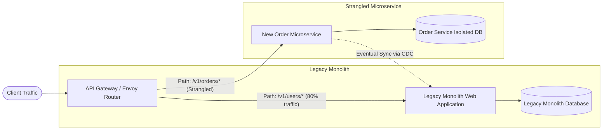
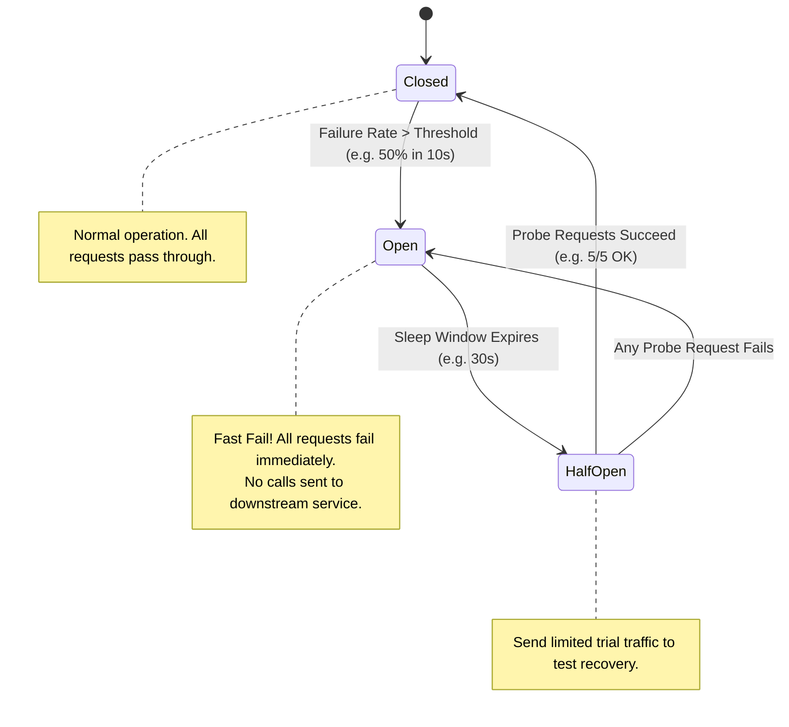
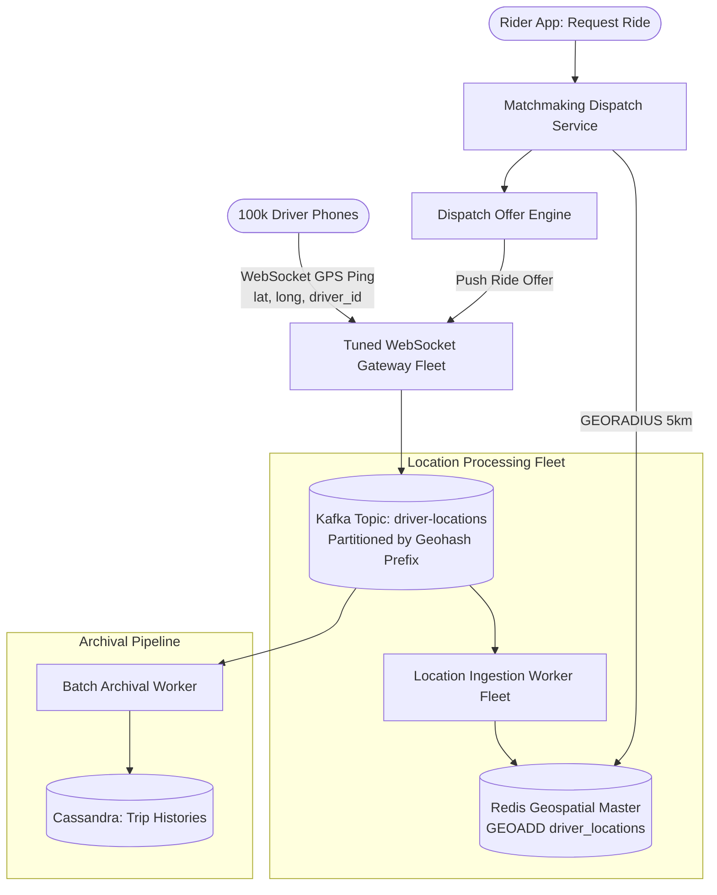
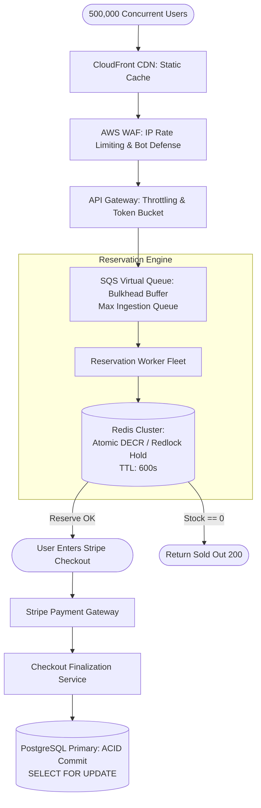

# 04. Microservices Architecture & Real-World Case Studies

> **Target Role**: Staff / Principal Backend & Distributed Systems Engineer  
> **Module**: 07-system-design / 04-microservices-and-case-studies  
> **Core Focus**: Monolith Decomposition via Strangler Fig, Domain-Driven Design (DDD) Bounded Contexts, Database-per-Service Rules, gRPC vs. Kafka vs. RabbitMQ, Operational Reliability (Envoy, Circuit Breakers, OpenTelemetry), and 3 Deep Case Studies (Uber-Lite, Ticketmaster Flash Sale, B2B Multi-Tenant SaaS).

---

## Table of Contents
1. [Monolith to Microservices Deconstruction](#1-monolith-to-microservices-deconstruction)
   - [1.1 When to Decompose: The Organizational & Scalability Threshold](#11-when-to-decompose-the-organizational--scalability-threshold)
   - [1.2 The Strangler Fig Migration Pattern](#12-the-strangler-fig-migration-pattern)
   - [1.3 Domain-Driven Design (DDD) & Bounded Contexts](#13-domain-driven-design-ddd--bounded-contexts)
   - [1.4 The Strict Database-Per-Service Rule & Distributed Monolith Anti-Pattern](#14-the-strict-database-per-service-rule--distributed-monolith-anti-pattern)
   - [1.5 Production Outages from Premature Decomposition](#15-production-outages-from-premature-decomposition)
   - [1.6 Decomposition Trade-offs & Staff Interview Q&A](#16-decomposition-trade-offs--staff-interview-qa)
2. [Inter-Service Communication: Synchronous vs. Asynchronous](#2-inter-service-communication-synchronous-vs-asynchronous)
   - [2.1 Synchronous gRPC / HTTP/2 vs. Asynchronous Message Brokers](#21-synchronous-grpc--http2-vs-asynchronous-message-brokers)
   - [2.2 RabbitMQ ("Smart Broker, Dumb Consumer") Architecture](#22-rabbitmq-smart-broker-dumb-consumer-architecture)
   - [2.3 Apache Kafka ("Dumb Broker, Smart Consumer") Log Architecture](#23-apache-kafka-dumb-broker-smart-consumer-log-architecture)
   - [2.4 Production Protobuf & gRPC Service Definitions](#24-production-protobuf--grpc-service-definitions)
   - [2.5 Message Broker Outages, Trade-offs & Staff Q&A](#25-message-broker-outages-trade-offs--staff-qa)
3. [Operational Architecture & Distributed Reliability](#3-operational-architecture--distributed-reliability)
   - [3.1 Modern API Gateways & Service Discovery (Envoy, Kong, K8s DNS)](#31-modern-api-gateways--service-discovery-envoy-kong-k8s-dns)
   - [3.2 The Circuit Breaker Pattern State Machine](#32-the-circuit-breaker-pattern-state-machine)
   - [3.3 Production Go / TypeScript Circuit Breaker Implementation](#33-production-go--typescript-circuit-breaker-implementation)
   - [3.4 Distributed Tracing: OpenTelemetry & W3C TraceContext Header Propagation](#34-distributed-tracing-opentelemetry--w3c-tracecontext-header-propagation)
   - [3.5 Operational Outages & Staff Q&A](#35-operational-outages--staff-qa)
4. [Case Study 1: Real-Time Ride-Sharing Architecture (Uber-Lite)](#4-case-study-1-real-time-ride-sharing-architecture-uber-lite)
   - [4.1 Scale, Constraints & Architecture Topology](#41-scale-constraints--architecture-topology)
   - [4.2 Ephemeral Geospatial Pipeline: Redis GEOADD & WebSockets](#42-ephemeral-geospatial-pipeline-redis-geoadd--websockets)
   - [4.3 Historical Rides Storage: Cassandra Wide-Column Schema](#43-historical-rides-storage-cassandra-wide-column-schema)
   - [4.4 Matchmaking Engine & Spatial Partitioning](#44-matchmaking-engine--spatial-partitioning)
   - [4.5 Production Outages & Architectural Review](#45-production-outages--architectural-review)
5. [Case Study 2: High-Concurrency Flash Sale (The Ticketmaster Problem)](#5-case-study-2-high-concurrency-flash-sale-the-ticketmaster-problem)
   - [5.1 Scale, Constraints & Architectural Blueprint](#51-scale-constraints--architectural-blueprint)
   - [5.2 Traffic Absorption: CloudFront, API Gateway & SQS Bulkhead](#52-traffic-absorption-cloudfront-api-gateway--sqs-bulkhead)
   - [5.3 Atomic Inventory Reservation: Redis Redlock & Atomic DECR (10-Min TTL)](#53-atomic-inventory-reservation-redis-redlock--atomic-decr-10-min-ttl)
   - [5.4 Final ACID Checkout: Postgres SELECT FOR UPDATE & Stripe Saga](#54-final-acid-checkout-postgres-select-for-update--stripe-saga)
   - [5.5 Production Outages & Flash Sale Safeguards](#55-production-outages--flash-sale-safeguards)
6. [Case Study 3: B2B Multi-Tenant SaaS (Project Management Platform)](#6-case-study-3-b2b-multi-tenant-saas-project-management-platform)
   - [6.1 Multi-Tenancy Models & Legal Data Isolation](#61-multi-tenancy-models--legal-data-isolation)
   - [6.2 PostgreSQL Row-Level Security (RLS) Implementation](#62-postgresql-row-level-security-rls-implementation)
   - [6.3 Noisy Neighbor Mitigation: Per-Tenant Redis Sliding Window Throttling](#63-noisy-neighbor-mitigation-per-tenant-redis-sliding-window-throttling)
   - [6.4 Infrastructure Architecture: ECS Fargate Serverless Deployment](#64-infrastructure-architecture-ecs-fargate-serverless-deployment)
   - [6.5 Production Outages & Security Verification](#65-production-outages--security-verification)

---

# 1. Monolith to Microservices Deconstruction

### 1.1 When to Decompose: The Organizational & Scalability Threshold
A monolithic application is the fastest path to market for early-stage products. Decomposition into microservices introduces significant operational overhead: distributed tracing, network latency, partial failures, event reconciliation, and complex deployments.

```
                     CONWAY'S LAW & SCALABILITY TIPPING POINT
+-----------------------------------------------------------------------------+
| DO NOT DECOMPOSE IF:                     | DECOMPOSE WHEN:                  |
+------------------------------------------+----------------------------------+
| - Engineering team is < 25 engineers     | - 100+ engineers across 10+ pods |
| - Single database handles current QPS    | - Deployment contention causes   |
| - Domain boundaries are still shifting   |   hours of build queues and locks|
| - Startup is in search of product-market | - Independent scaling needed     |
|   fit (PMF)                              |   (e.g., video transcode vs auth)|
+------------------------------------------+----------------------------------+
```

---

### 1.2 The Strangler Fig Migration Pattern
Named after Australian fig trees that grow around a host tree until the host dies, the **Strangler Fig Pattern** incrementally replaces parts of the monolith with microservices behind an API Gateway without a risky "big-bang" rewrite.



#### Migration Phases:
1. **Intercept**: Deploy an API Gateway (Envoy/Kong) in front of the monolith. Initially, 100% of traffic routes to the monolith.
2. **Transform**: Build the new microservice for a well-bounded domain (e.g., Orders).
3. **Dual-Write / Shadow**: Route a percentage of write traffic to both systems; compare outputs asynchronously to verify functional parity.
4. **Cutover**: Shift 100% of the target path (`/v1/orders/*`) to the new service.
5. **Strangle**: Delete obsolete code from the monolithic codebase.

---

### 1.3 Domain-Driven Design (DDD) & Bounded Contexts
Service boundaries must be drawn along **business domains**, not technical layers (e.g., UI service, database service).

- **Ubiquitous Language**: A shared vocabulary defined by domain experts and developers.
- **Bounded Context**: An explicit boundary within which a domain model applies. The word `"Order"` means something completely different to the `InventoryContext` (SKUs, weight, warehouse bin location) compared to the `BillingContext` (payment tokens, tax calculation, invoices).
- **Aggregates & Root Entities**: An Aggregate Root (e.g., `Order`) enforces all business invariants within its boundary. External services can only reference an aggregate by its unique identifier (`order_id`), never mutate its internal entities directly.

---

### 1.4 The Strict Database-Per-Service Rule & Distributed Monolith Anti-Pattern

> **The Golden Rule of Microservices**:  
> Every microservice MUST own its private database. No other service is ever permitted to query or mutate that database directly.

```
THE DISTRIBUTED MONOLITH ANTI-PATTERN (FATAL):
[Service A] ----\
[Service B] -----> [ SHARED DATABASE: 500 TABLES ] <----- [Service C]
[Service D] ----/
* Result: Schema migrations in Service A crash Service C. Shared connection pool 
  starvation in Service B takes down Service D. All the pain of microservices 
  with none of the benefits.

THE PROPER MICROSERVICES ARCHITECTURE:
[Order Service]      ---> [Order DB (PostgreSQL)]
       | (gRPC / Kafka)
[Inventory Service]  ---> [Inventory DB (Redis / DynamoDB)]
       | (gRPC / Kafka)
[Billing Service]    ---> [Billing DB (PostgreSQL / CockroachDB)]
```

---

### 1.5 Production Outages from Premature Decomposition

#### Outage: The 14-Hop Network Cascade
*Context*: A banking startup with 12 engineers split their Ruby on Rails monolith into 28 microservices running on Kubernetes.  
*Incident*: Loading a user dashboard required 14 sequential synchronous HTTP RPC calls across microservices. One service experienced a minor garbage collection pause of 800 ms. Due to unconfigured HTTP connection timeouts, requests queued up across all 14 upstream services. Thread pools across the entire cluster exhausted in 60 seconds, causing a total platform outage from a routine GC cycle.  
*Remedy*: Re-consolidated 18 chatty services back into a modular monolith with in-process function calls, slashing P99 dashboard latency from $1,200\text{ ms}$ to $35\text{ ms}$.

---

### 1.6 Decomposition Trade-offs & Staff Interview Q&A

**Q: If two microservices cannot share a database, how do you perform a cross-domain join (e.g., list all orders with user profile and shipping details)?**  
*Answer*:  
"Cross-domain joins are solved using three architectural patterns depending on latency and scale:  
1. **API Composition / Gateway Aggregation**: The API Gateway or a composite Frontend-For-Backend (BFF) calls the `OrderService`, `UserService`, and `ShippingService` concurrently in parallel via gRPC and merges the JSON response in memory.  
2. **CQRS / Materialized View via Events**: As orders and user updates occur, domain events are published to Kafka. A query projection worker consumes these topics and pre-aggregates a denormalized view in Elasticsearch or Read-Replica Postgres. Joins are eliminated at read time ($O(1)$ lookup).  
3. **Data Replication / Caching**: The Order service caches immutable user profile snapshots locally during checkout."

---

# 2. Inter-Service Communication: Synchronous vs. Asynchronous

### 2.1 Synchronous gRPC / HTTP/2 vs. Asynchronous Message Brokers

```
+-----------------------------------------------------------------------------+
|                     COMMUNICATION PATTERNS COMPARED                         |
+-----------------------------------------------------------------------------+
| Dimension       | gRPC / Protobuf            | Apache Kafka                 |
+-----------------+----------------------------+------------------------------+
| **Transport**   | HTTP/2 Multiplexed TCP     | TCP Binary Protocol          |
| **Coupling**    | Temporal coupling (Caller  | Decoupled (Producer emits    |
|                 | waits for Callee online)   | even if consumer is offline) |
| **Payload**     | Binary Protobuf (Compact)  | Binary Byte Array (Avro/Proto|
| **Latency**     | Sub-millisecond (1-3 ms)   | 5-15 ms (Batching dependent) |
| **Failure Risk**| Cascading failure cascades | Queue buffering / Backpressure|
| **Best For**    | Real-time synchronous reads| Event dispatch, state sync,  |
|                 | & internal low-latency RPC | async workflow processing    |
+-----------------------------------------------------------------------------+
```

---

### 2.2 RabbitMQ ("Smart Broker, Dumb Consumer") Architecture

- **Smart Broker**: The RabbitMQ broker manages message routing via **Exchanges** (Direct, Topic, Fanout, Headers), evaluates routing keys, tracks per-message consumer acknowledgments (`ack`/`nack`), and maintains message states.
- **Dumb Consumer**: The consumer merely opens a connection, receives a message, processes it, and sends back an ACK. RabbitMQ automatically deletes the message once acknowledged.
- **Limitation**: Messages cannot be replayed after deletion. High broker CPU load when tracking millions of unacknowledged messages.

---

### 2.3 Apache Kafka ("Dumb Broker, Smart Consumer") Log Architecture

- **Dumb Broker**: Kafka does not track which messages each consumer has read. The broker is simply an **append-only, immutable, distributed commit log** on disk.
- **Smart Consumer**: Consumers manage their own read position by committing an **Offset** integer (`offset = 10423`) back to Kafka's internal `__consumer_offsets` topic.
- **Replayability**: Consumers can rewind their offset to any timestamp within the data retention window (e.g., 7 days), enabling easy recovery from bugs and reprocessing of historical data.

```mermaid
flowchart LR
    subgraph Kafka Topic: order-events
        subgraph Partition 0
            P0_0[0] --> P0_1[1] --> P0_2[2] --> P0_3[3] --> P0_4[4]
        end
        subgraph Partition 1
            P1_0[0] --> P1_1[1] --> P1_2[2] --> P1_3[3]
        end
    end

    Producer[Order Service Producer] -->|Key: order_id<br/>MurmurHash2| KafkaTopic
    
    Partition 0 -. Offset: 2 .-> ConsumerA[Billing Service Consumer]
    Partition 0 -. Offset: 4 .-> ConsumerB[Analytics Service Consumer]
```

---

### 2.4 Production Protobuf & gRPC Service Definitions

```protobuf
syntax = "proto3";

package billing.v1;

option go_package = "github.com/company/billing/gen/v1;billingv1";

service BillingService {
  rpc ProcessPayment (PaymentRequest) returns (PaymentResponse);
  rpc StreamPaymentHistory (HistoryRequest) returns (stream PaymentEvent);
}

message PaymentRequest {
  string order_id = 1;
  string customer_id = 2;
  int64 amount_in_cents = 3;
  string currency = 4;
  string idempotency_key = 5;
}

message PaymentResponse {
  enum Status {
    STATUS_UNSPECIFIED = 0;
    STATUS_SUCCESS = 1;
    STATUS_REJECTED = 2;
    STATUS_ERROR = 3;
  }
  string payment_id = 1;
  Status status = 2;
  int64 processed_at_timestamp = 3;
  string failure_reason = 4;
}

message HistoryRequest {
  string customer_id = 1;
  int32 limit = 2;
}

message PaymentEvent {
  string payment_id = 1;
  int64 amount_in_cents = 2;
  string status = 3;
  int64 timestamp = 4;
}
```

---

# 3. Operational Architecture & Distributed Reliability

### 3.1 Modern API Gateways & Service Discovery (Envoy, Kong, K8s DNS)

```
[External Traffic] ---> [Cloud Load Balancer]
                               |
                               v
               [API Gateway Fleet: Envoy / Kong]
        (TLS Termination, JWT Validation, Global Rate Limiting)
                               |
       +-----------------------+-----------------------+
       | K8s Service Discovery | Dynamic Route Cluster |
       v                       v                       v
[Order Service: Pods]   [User Service: Pods]   [Inventory Service: Pods]
(10.244.1.12:50051)     (10.244.2.45:50051)    (10.244.3.18:50051)
```

- **Envoy Proxy**: High-performance C++ proxy used as both ingress edge gateway and sidecar mesh (Istio). Handles dynamic service discovery, circuit breaking, health checking, and zone-aware load balancing.
- **Kubernetes DNS / CoreDNS**: Resolves service names to ClusterIP virtual IPs, which `kube-proxy` translates to healthy pod IPs via `iptables` or IPVS rules.

---

### 3.2 The Circuit Breaker Pattern State Machine



---

### 3.3 Production Go Circuit Breaker Implementation

```go
package circuitbreaker

import (
	"errors"
	"sync"
	"time"
)

type State int

const (
	StateClosed State = iota
	StateHalfOpen
	StateOpen
)

var ErrCircuitOpen = errors.New("circuit breaker is OPEN; request rejected")

type CircuitBreaker struct {
	mu           sync.Mutex
	state        State
	failureCount int
	threshold    int
	timeout      time.Duration
	lastFailure  time.Time
	successCount int
}

func NewCircuitBreaker(threshold int, timeout time.Duration) *CircuitBreaker {
	return &CircuitBreaker{
		state:     StateClosed,
		threshold: threshold,
		timeout:   timeout,
	}
}

func (cb *CircuitBreaker) Execute(action func() error) error {
	cb.mu.Lock()
	now := time.Now()

	switch cb.state {
	case StateOpen:
		if now.Sub(cb.lastFailure) > cb.timeout {
			cb.state = StateHalfOpen
			cb.successCount = 0
		} else {
			cb.mu.Unlock()
			return ErrCircuitOpen
		}
	case StateHalfOpen:
		// Limit concurrency in half-open state
	}
	cb.mu.Unlock()

	// Execute protected downstream action
	err := action()

	cb.mu.Lock()
	defer cb.mu.Unlock()

	if err != nil {
		cb.failureCount++
		cb.lastFailure = time.Now()
		cb.state = StateOpen
		return err
	}

	// Action succeeded
	if cb.state == StateHalfOpen {
		cb.successCount++
		if cb.successCount >= 3 {
			// Successfully healed!
			cb.state = StateClosed
			cb.failureCount = 0
		}
	} else if cb.state == StateClosed {
		cb.failureCount = 0
	}

	return nil
}
```

---

### 3.4 Distributed Tracing: OpenTelemetry & W3C TraceContext

When a single user request spans 10 microservices, debugging errors or latency bottlenecks requires **Distributed Tracing**.  
The W3C TraceContext specification standardizes two HTTP headers:
- `traceparent`: `00-4bf92f3577b34da6a3ce929d0e0e4736-00f067aa0ba902b7-01`
  - `00`: Version
  - `4bf92f35...`: **Trace ID** (Unique across the entire distributed call graph)
  - `00f067aa...`: **Parent Span ID**
  - `01`: Trace flags (Sampled / recorded)

```typescript
// Node.js OpenTelemetry Propagation Example
import { trace, context, propagation } from "@opentelemetry/api";
import axios from "axios";

export async function callDownstreamService(url: string, payload: any) {
  const tracer = trace.getTracer("order-service");
  
  return tracer.startActiveSpan("invoke-payment-service", async (span) => {
    try {
      const headers: Record<string, string> = {};
      // Inject current trace context into HTTP headers
      propagation.inject(context.active(), headers);

      const response = await axios.post(url, payload, { headers });
      span.setAttribute("http.status_code", response.status);
      return response.data;
    } catch (err: any) {
      span.recordException(err);
      span.setStatus({ code: 2, message: err.message });
      throw err;
    } finally {
      span.end();
    }
  });
}
```

---

# 4. Case Study 1: Real-Time Ride-Sharing Architecture (Uber-Lite)

### 4.1 Scale, Constraints & Architecture Topology
- **Scale**: $100,000$ active drivers; GPS location updates pinged every $5\text{ seconds}$.
- **Write Throughput**: $100,000 / 5 = \mathbf{20,000\text{ writes/second}}$ ($60,000\text{ writes/sec}$ peak).
- **Matchmaking SLA**: Find the 10 closest available drivers within a $5\text{ km}$ radius in $< 100\text{ ms}$.



---

### 4.2 Ephemeral Geospatial Pipeline: Redis GEOADD & WebSockets

1. **Persistent WebSocket Gateway**:
   - Deployed on Kubernetes with Linux kernel network tuning (`net.core.somaxconn = 32768`, `sysctl fs.file-max = 2097152`).
   - Epoll-based gateway maintains 100k persistent TCP sockets with minimal RAM ($\approx 2\text{ MB}$ per 1,000 connections).
2. **Ephemeral Location Store**:
   - High write throughput ($20\text{k writes/sec}$) makes relational databases unusable.
   - Redis Geospatial (`GEOADD`) stores locations in an in-memory 52-bit Geohash sorted set.
   - Every 5-second update overwrites the driver's score in the sorted set ($O(\log N)$).
3. **Dispatch Radius Query**:
   ```bash
   # Matchmaking service searches 5km radius for top-10 available drivers
   GEORADIUS driver_locations -122.4194 37.7749 5 km WITHDIST WITHCOORD ASC COUNT 10
   ```

---

### 4.3 Historical Rides Storage: Cassandra Wide-Column Schema

Completed ride histories, routes, and billing receipts must never be lost, but require no ACID cross-table joins. Cassandra partitions data by `driver_id` and clusters by `trip_id`:

```sql
CREATE KEYSPACE uber_rides WITH replication = {
    'class': 'NetworkTopologyStrategy', 
    'us-east-1': 3,
    'us-west-2': 3
};

CREATE TABLE uber_rides.driver_completed_trips (
    driver_id UUID,
    trip_id TIMEUUID, -- Encodes millisecond timestamp, guarantees strict ordering
    rider_id UUID,
    pickup_latitude DOUBLE,
    pickup_longitude DOUBLE,
    dropoff_latitude DOUBLE,
    dropoff_longitude DOUBLE,
    fare_amount DECIMAL,
    route_polyline TEXT, -- Compressed GPS coordinates string
    completed_at TIMESTAMP,
    PRIMARY KEY ((driver_id), trip_id)
) WITH CLUSTERING ORDER BY (trip_id DESC);
```

---

# 5. Case Study 2: High-Concurrency Flash Sale (The Ticketmaster Problem)

### 5.1 Scale, Constraints & Architectural Blueprint
- **Scale**: Exactly $1,000$ high-demand tickets; $500,000$ concurrent fans hitting the checkout endpoint at 10:00:00 AM launch.
- **Absolute Non-Negotiable Constraint**: **ZERO OVERSELLING**. Not a single extra seat may be sold.
- **User Experience**: Users who secure a reservation get a **10-minute hold** to enter payment details. If payment fails or timeout expires, the seat automatically returns to inventory.



---

### 5.2 Atomic Inventory Reservation via Redis Lua Script

To prevent race conditions among 500k users, inventory decrement must be atomic. A Redis Lua script verifies inventory is $> 0$ and records a reservation with a 10-minute TTL:

```lua
-- KEYS[1]: Inventory count key, e.g. "inventory:concert_42:available"
-- KEYS[2]: User reservation hash, e.g. "reservations:concert_42"
-- ARGV[1]: user_id
-- ARGV[2]: hold_ttl_seconds (600)

local available = tonumber(redis.call('GET', KEYS[1]) or 0)
local user_id = ARGV[1]
local ttl = tonumber(ARGV[2])

if available > 0 then
    -- Atomically decrement inventory
    redis.call('DECR', KEYS[1])
    -- Record reservation timestamp with expiry
    redis.call('HSET', KEYS[2], user_id, redis.call('TIME')[1])
    -- Key representing individual user hold
    redis.call('SETEX', "hold:" .. KEYS[1] .. ":" .. user_id, ttl, "RESERVED")
    return 1 -- Reservation Successful
else
    return 0 -- Sold Out
end
```

---

### 5.3 Final ACID Checkout in PostgreSQL

Once Stripe confirms payment, the ticket status commits inside a PostgreSQL serializable transaction with row-level locks:

```sql
BEGIN;

-- Lock the specific seat row to eliminate any concurrent write conflict
SELECT seat_id, status 
FROM seats 
WHERE concert_id = 42 AND seat_number = 'A-12' 
FOR UPDATE;

-- Update state from RESERVED to PURCHASED
UPDATE seats 
SET status = 'PURCHASED', 
    customer_id = 'usr_98812', 
    purchased_at = NOW() 
WHERE seat_id = 'seat_42_A12' AND status = 'RESERVED';

-- Insert immutable receipt record
INSERT INTO receipts (receipt_id, seat_id, customer_id, amount, stripe_charge_id)
VALUES (gen_random_uuid(), 'seat_42_A12', 'usr_98812', 150.00, 'ch_3N98f219');

COMMIT;
```

---

# 6. Case Study 3: B2B Multi-Tenant SaaS (Project Management Platform)

### 6.1 Multi-Tenancy Models & Legal Data Isolation
Enterprise customers (banks, hospitals, defense) mandate strict data isolation.  
- **Model 1: Database-per-Tenant**: Maximum isolation; prohibitive operational cost and connection pool exhaustion at 10,000 tenants.
- **Model 2: Schema-per-Tenant**: PostgreSQL schemas; fails at 10k tenants due to catalog lock contention and slow migrations.
- **Model 3: Shared Database, Shared Schema with PostgreSQL Row-Level Security (RLS)**: Staff-level architectural choice. Optimal resource utilization with kernel-enforced data segregation.

---

### 6.2 PostgreSQL Row-Level Security (RLS) Implementation

```sql
-- 1. Create Tenants and Projects Tables
CREATE TABLE tenants (
    tenant_id UUID PRIMARY KEY DEFAULT gen_random_uuid(),
    company_name VARCHAR(255) NOT NULL,
    created_at TIMESTAMPTZ DEFAULT NOW()
);

CREATE TABLE projects (
    project_id UUID PRIMARY KEY DEFAULT gen_random_uuid(),
    tenant_id UUID NOT NULL REFERENCES tenants(tenant_id),
    name VARCHAR(255) NOT NULL,
    budget NUMERIC(12, 2) NOT NULL,
    created_at TIMESTAMPTZ DEFAULT NOW()
);

-- 2. Enable Row Level Security
ALTER TABLE projects ENABLE ROW LEVEL SECURITY;
ALTER TABLE projects FORCE ROW LEVEL SECURITY; -- Enforce even for table owner!

-- 3. Define RLS Policy using PostgreSQL Session Variables
CREATE POLICY tenant_isolation_policy ON projects
    FOR ALL
    USING (tenant_id = NULLIF(current_setting('app.current_tenant', true), '')::UUID);
```

#### Application Connection Hook (Node.js / TypeScript):
```typescript
import { Pool, PoolClient } from "pg";

const dbPool = new Pool({ connectionString: process.env.DATABASE_URL });

export async function withTenantContext<T>(
  tenantId: string, 
  work: (client: PoolClient) => Promise<T>
): Promise<T> {
  const client = await dbPool.connect();
  try {
    // Set transaction-local session variable. 
    // LOCAL guarantees variable resets automatically when transaction ends.
    await client.query("BEGIN;");
    await client.query("SET LOCAL app.current_tenant = $1;", [tenantId]);
    
    const result = await work(client);
    
    await client.query("COMMIT;");
    return result;
  } catch (error) {
    await client.query("ROLLBACK;");
    throw error;
  } finally {
    client.release();
  }
}

// Any query inside this block automatically appends WHERE tenant_id = tenantId at the DB engine level!
// A malicious developer writing "SELECT * FROM projects;" CANNOT leak other tenants' data!
```

---

### 6.3 Noisy Neighbor Mitigation: Per-Tenant Rate Limiting

If Tenant $A$ triggers an automated export script generating 20,000 req/sec, it must never degrade response times for Tenant $B$.  
**Mechanism**: API Gateway enforces a **Per-Tenant Sliding Window Counter** in Redis:
$$\text{Max Quota} = 1,000\text{ requests/minute per } \text{tenant\_id}$$

```
Incoming Request (Tenant: ACME_CORP)
          |
    [API Gateway]
          |
    Check Redis: ratelimit:tenant:ACME_CORP
          |
   > 1000 RPM?
      /      \
    YES       NO
    /          \
429 Throttled   Forward to Microservice
```

---

### 6.4 Infrastructure Architecture: ECS Fargate Serverless Deployment

```dockerfile
# Multi-stage secure build: Drop compile-time credentials & build tools
FROM node:20-alpine AS builder
WORKDIR /app
COPY package*.json tsconfig.json ./
RUN npm ci
COPY src/ ./src
RUN npm run build

# Production minimal runtime stage
FROM node:20-alpine AS runner
WORKDIR /app
ENV NODE_ENV=production
RUN addgroup -g 1001 -S nodejs && adduser -S backend -u 1001
COPY package*.json ./
RUN npm ci --only=production && npm cache clean --force
COPY --from=builder /app/dist ./dist

# Run as non-root user
USER backend
EXPOSE 3000
CMD ["node", "dist/server.js"]
```

---

### 6.5 Production Outages & Security Verification

#### Incident: Missing `SET LOCAL` Leaking Cross-Tenant Data
*Context*: An engineer wrote an asynchronous background worker that borrowed a pooled database connection without setting `app.current_tenant`.  
*Failure*: The connection retained the `tenant_id` from the previous web request transaction. The worker processed invoices for Tenant $X$ using the bank account and identity of Tenant $Y$.  
*Remedy*:
1. Always use `SET LOCAL` instead of `SET SESSION`, ensuring automatic variable destruction on `COMMIT` or `ROLLBACK`.
2. Configure a PostgreSQL connection pool reset hook:
   ```sql
   -- Automatically reset on connection return
   DISCARD ALL;
   ```
3. Implement automated integration tests with automated tenant-leak assertions across all API endpoints.
