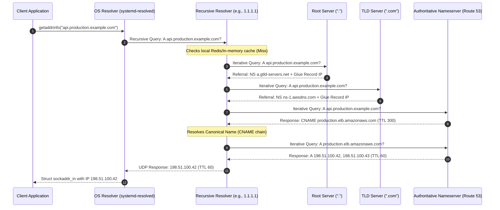
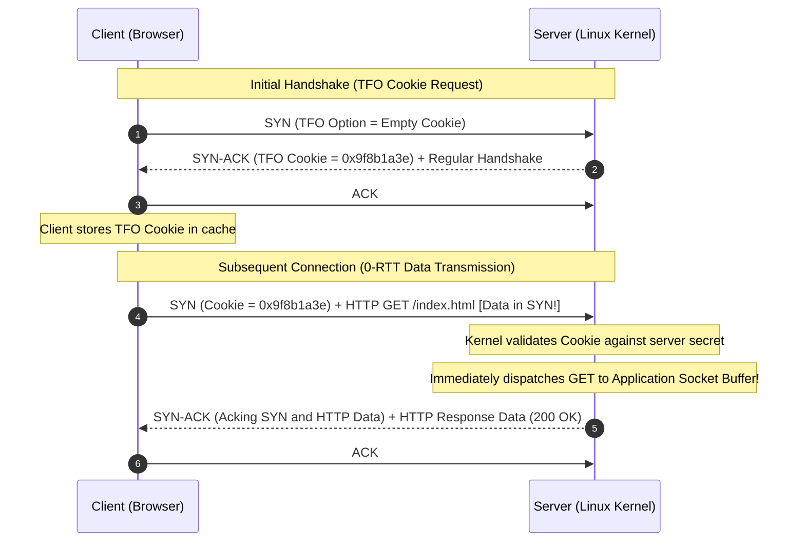
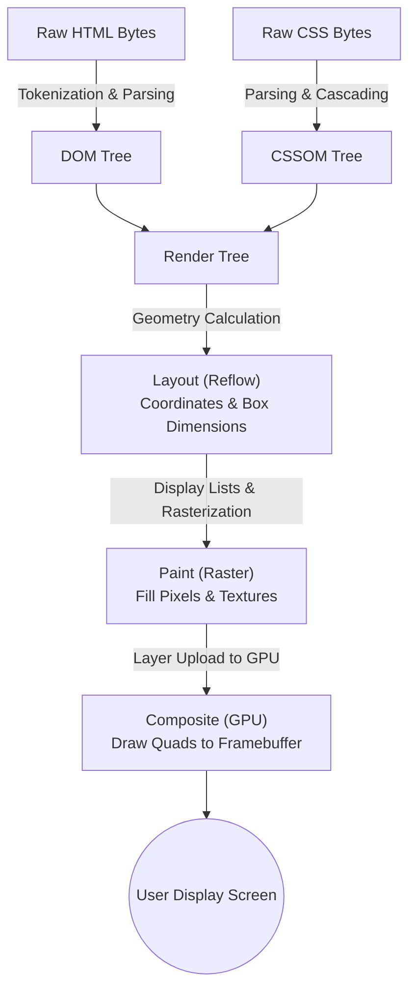

# 01. URL Request Lifecycle, Reverse Proxies & Browser Rendering Pipeline

> **Target Role**: Staff / Senior Infrastructure & Backend Engineer (Rails, Node.js/TypeScript, Distributed Systems)  
> **Module**: 09-networking-web-internals / 01-url-lifecycle-and-nginx  
> **Key Focus**: End-to-End URL Resolution, DNS Hierarchies, TCP Handshake & TFO, ALB Layer 7 Routing, NGINX Slow Client Buffering Mechanics, Epoll Event Loop, and the Browser Critical Rendering Path (CRP).

---

## Table of Contents
1. [End-to-End URL Resolution & DNS Hierarchy](#1-end-to-end-url-resolution--dns-hierarchy)
   - [1.1 Definition & Core Concept](#11-definition--core-concept)
   - [1.2 Internal Mechanics: From Keystroke to IP](#12-internal-mechanics-from-keystroke-to-ip)
   - [1.3 DNS Hierarchy & Resolution Flow](#13-dns-hierarchy--resolution-flow)
   - [1.4 Production Diagnostics & Wire Formats](#14-production-diagnostics--wire-formats)
   - [1.5 Production Outages & Failure Modes](#15-production-outages--failure-modes)
   - [1.6 Trade-offs & Architecture Decision Matrix](#16-trade-offs--architecture-decision-matrix)
   - [1.7 Senior Interview Q&A](#17-senior-interview-qa)
2. [Transport & Security Handshakes (TCP, TFO & TLS)](#2-transport--security-handshakes-tcp-tfo--tls)
   - [2.1 Definition & Core Concept](#21-definition--core-concept)
   - [2.2 TCP 3-Way Handshake & Sequence Arithmetic](#22-tcp-3-way-handshake--sequence-arithmetic)
   - [2.3 TCP Fast Open (TFO) Mechanics](#23-tcp-fast-open-tfo-mechanics)
   - [2.4 TLS 1.2 vs. TLS 1.3 Handshake Dynamics](#24-tls-12-vs-tls-13-handshake-dynamics)
   - [2.5 Kernel Tuning & SYN Flood Defense](#25-kernel-tuning--syn-flood-defense)
   - [2.6 Production Outages & Debugging](#26-production-outages--debugging)
   - [2.7 Senior Interview Q&A](#27-senior-interview-qa)
3. [Load Balancing & Reverse Proxy Internals (ALB & NGINX)](#3-load-balancing--reverse-proxy-internals-alb--nginx)
   - [3.1 Definition & Core Concept](#31-definition--core-concept)
   - [3.2 Layer 4 vs. Layer 7 Ingress Routing](#32-layer-4-vs-layer-7-ingress-routing)
   - [3.3 NGINX Architecture: Epoll Event Loop & Worker Model](#33-nginx-architecture-epoll-event-loop--worker-model)
   - [3.4 The Slow Client Buffering Problem (Puma/Node Starvation)](#34-the-slow-client-buffering-problem-pumanode-starvation)
   - [3.5 Production NGINX & Puma / Node.js Configurations](#35-production-nginx--puma--nodejs-configurations)
   - [3.6 Production Outages & Debugging](#36-production-outages--debugging)
   - [3.7 Senior Interview Q&A](#37-senior-interview-qa)
4. [Browser Rendering Pipeline & Critical Rendering Path](#4-browser-rendering-pipeline--critical-rendering-path)
   - [4.1 Definition & Core Concept](#41-definition--core-concept)
   - [4.2 Step-by-Step Pipeline Mechanics: DOM to Compositing](#42-step-by-step-pipeline-mechanics-dom-to-compositing)
   - [4.3 Critical Rendering Path Optimization Strategies](#43-critical-rendering-path-optimization-strategies)
   - [4.4 Layout Thrashing & GPU Layer Optimization](#44-layout-thrashing--gpu-layer-optimization)
   - [4.5 Production Outages & Performance Diagnostics](#45-production-outages--performance-diagnostics)
   - [4.6 Senior Interview Q&A](#46-senior-interview-qa)

---

# 1. End-to-End URL Resolution & DNS Hierarchy

### 1.1 Definition & Core Concept
When a user types `https://api.production.example.com/v1/checkout` into a browser address bar and hits Enter, the client machine must translate the human-readable Fully Qualified Domain Name (FQDN) into an IPv4 (32-bit) or IPv6 (128-bit) routable network address. 

Domain Name System (DNS) resolution is an asynchronous, hierarchical, distributed database lookup. Before any physical IP packet reaches the wire toward the remote web server, resolution traverses up to five distinct caching and lookup tiers:
1. **Browser In-Memory DNS Cache** (e.g., Chrome `chrome://net-internals/#dns`, TTL ~60s).
2. **Operating System Resolver Cache** (e.g., Linux `systemd-resolved`, `nscd`, macOS `mDNSResponder`, Windows DNS Client Service).
3. **Local Hosts File** (`/etc/hosts` or `C:\Windows\System32\drivers\etc\hosts`) evaluated via NSSwitch (`/etc/nsswitch.conf`).
4. **Recursive Resolver / ISP Caching Resolver** (e.g., Cloudflare `1.1.1.1`, Google `8.8.8.8`, or corporate intranet resolver).
5. **Authoritative DNS Hierarchy** (Root Nameservers `.` $\to$ Top-Level Domain (TLD) Nameservers `.com` $\to$ Second-Level Domain Nameservers `example.com`).

```
+----------------------------------------------------------------------------------------------------+
|                                      CLIENT RESOLUTION TIERS                                       |
+----------------------------------------------------------------------------------------------------+
  [Browser Cache] ──(Miss)──> [OS Resolver (/etc/hosts, systemd-resolved)] ──(Miss)──> [Local Router]
                                                                                               │
                                                                                            (Miss)
                                                                                               ▼
+----------------------------------------------------------------------------------------------------+
|                                    RECURSIVE RESOLVER (1.1.1.1)                                    |
+----------------------------------------------------------------------------------------------------+
    │ Iterative Query 1                                 │ Iterative Query 2             │ Query 3
    ▼                                                   ▼                               ▼
+-------------------------+     Referral (.com)     +-----------------------+   Referral  +-------------------+
| Root Nameserver (".")   | ──────────────────────> | TLD Nameserver (".com")| ─────────> | Authoritative NS  |
| 13 IP clusters (A to M) |                         | operated by VeriSign  |             | (e.g., AWS Route53|
+-------------------------+                         +-----------------------+             |  ns-123.awsdns.com)
                                                                                          +-------------------+
                                                                                                    │
                                                 Returns A Record: 198.51.100.42 (TTL=300) <────────┘
```

---

### 1.2 Internal Mechanics: From Keystroke to IP

#### 1. Browser Pre-flight & HSTS Evaluation
Before querying the network, modern browsers inspect internal storage:
- **HSTS Preload List**: Browsers maintain a hardcoded list of domains (and domains with `Strict-Transport-Security: max-age=...; preload`) that must *never* be contacted over plaintext HTTP. If `example.com` is present, the browser transforms `http://` to `https://` internally without an initial 301 network hop.
- **Browser DNS Cache**: Independent of the OS, Chromium and WebKit store recent host resolutions to avoid context-switching into the OS kernel via POSIX syscalls.

#### 2. Linux OS Name Service Switch (`nsswitch.conf`) & `getaddrinfo()`
When the browser incurs a cache miss, it invokes the C runtime library function `getaddrinfo(3)`:
```c
int getaddrinfo(const char *node, const char *service,
                const struct addrinfo *hints,
                struct addrinfo **res);
```
Under Linux (glibc), `getaddrinfo()` inspects `/etc/nsswitch.conf` (Name Service Switch configuration):
```text
# /etc/nsswitch.conf
hosts:          files mdns4_minimal [NOTFOUND=return] dns myhostname
```
1. **`files`**: Inspects `/etc/hosts`. If an IP is hardcoded for `api.production.example.com`, resolution terminates immediately.
2. **`dns`**: Reads `/etc/resolv.conf` to identify upstream nameservers:
   ```text
   nameserver 127.0.0.53
   options edns0 trust-ad
   ```
   On modern systemd-based Linux distributions, `127.0.0.53:53` represents the local D-Bus mediated loopback resolver daemon `systemd-resolved`.

---

### 1.3 DNS Hierarchy & Resolution Flow

If the OS resolver cache misses, an iterative resolution process begins across the global DNS hierarchy:



#### DNS Record Types & Glue Records
- **A & AAAA**: Maps hostname directly to IPv4 (32-bit) or IPv6 (128-bit).
- **CNAME (Canonical Name)**: Alias pointing one name to another. **Critical Rule**: RFC 1912 forbids a CNAME record from coexisting with other records (such as MX, TXT) at the root zone apex (`example.com`). Cloud providers circumvent this using synthetic alias records (e.g., AWS Route 53 `ALIAS`, Cloudflare `CNAME Flattening`), which dynamically return `A` records at query time.
- **Glue Records**: When an authoritative nameserver for a domain resides *within* that domain (e.g., nameserver for `example.com` is `ns1.example.com`), a circular dependency occurs. The parent TLD registry must store both the NS record and an accompanying `A` record (the "glue") to break the cycle.
- **EDNS0 (RFC 6891)**: Extension Mechanisms for DNS allowing UDP payloads larger than the traditional 512-byte limit (up to 4096 bytes) and carrying DNSSEC metadata and Client Subnet (`ECS`, RFC 7871) for geo-routing.

---

### 1.4 Production Diagnostics & Wire Formats

#### Step-by-Step Query Tracing with `dig`
To inspect the unvarnished DNS traversal without hitting local caches:

```bash
# Execute full iterative trace from the root zone down to authoritative server
dig +trace +nodnssec api.production.example.com

# Query with EDNS Client Subnet to simulate request routing from Tokyo IP space
dig @8.8.8.8 api.production.example.com +subnet=133.242.0.0/16 A

# Check systemd-resolved cache statistics on Linux
resolvectl statistics
resolvectl query api.production.example.com
```

#### DNS Packet Wire Structure (RFC 1035)
DNS packets sent over UDP port 53 have a fixed 12-byte header:

```text
 0  1  2  3  4  5  6  7  8  9 10 11 12 13 14 15
+--+--+--+--+--+--+--+--+--+--+--+--+--+--+--+--+
|                      ID                       |  -> Transaction ID (16 bits)
+--+--+--+--+--+--+--+--+--+--+--+--+--+--+--+--+
|QR|   Opcode  |AA|TC|RD|RA| Z|AD|CD|   RCODE   |  -> Flags: QR (0=Query, 1=Resp), RD (Recursion Desired)
+--+--+--+--+--+--+--+--+--+--+--+--+--+--+--+--+
|                    QDCOUNT                    |  -> Number of Question entries
+--+--+--+--+--+--+--+--+--+--+--+--+--+--+--+--+
|                    ANCOUNT                    |  -> Number of Answer entries
+--+--+--+--+--+--+--+--+--+--+--+--+--+--+--+--+
|                    NSCOUNT                    |  -> Number of Authority records
+--+--+--+--+--+--+--+--+--+--+--+--+--+--+--+--+
|                    ARCOUNT                    |  -> Number of Additional records
+--+--+--+--+--+--+--+--+--+--+--+--+--+--+--+--+
```
If the response size exceeds 512 bytes (or EDNS negotiated buffer size), the server sets the **`TC` (Truncation) flag**. Upon receiving `TC=1`, the client OS resolver immediately drops the UDP socket and retries the entire query over a persistent **TCP connection on port 53**.

---

### 1.5 Production Outages & Failure Modes

#### Outage Case Study: The Negative Caching (SOA MINIMUM) Trap
**Symptom**: During a production release, an infrastructure engineer accidentally deployed an invalid CNAME pointing to an unmapped host. Within 60 seconds, the engineer reverted the change. However, 50% of global API traffic remained down for 2 hours.

**Root Cause**: When a recursive resolver queries an authoritative server for a non-existent record (`NXDOMAIN`), the response is cached according to the `MINIMUM` field in the SOA (Start of Authority) record (RFC 2308):
```text
example.com. IN SOA ns1.example.com. hostmaster.example.com. (
                2026090901 ; serial
                7200       ; refresh (2 hours)
                3600       ; retry (1 hour)
                1209600    ; expire (2 weeks)
                7200       ; MINIMUM TTL / Negative Caching TTL (2 hours)
)
```
Resolvers worldwide cached the `NXDOMAIN` response for 7200 seconds (2 hours). Even though the authoritative record was corrected within 60 seconds, recursive resolvers refused to requery the authoritative nameservers until the negative cache TTL expired.

**Remediation**:
1. Before any high-risk migration, tune negative caching TTL (`SOA MINIMUM`) down to 60 seconds at least 48 hours in advance.
2. Issue targeted cache flushes against major public recursive resolvers:
   ```bash
   # Flush Cloudflare Cache
   curl -X POST "https://1.1.1.1/api/v1/purge?type=A&name=api.production.example.com"
   # Flush Google Cache
   curl "https://dns.google/resolve?name=api.production.example.com&flush_cache=true"
   ```

---

### 1.6 Trade-offs & Architecture Decision Matrix

| Strategy / Component | Advantages | Disadvantages | When to Choose |
| :--- | :--- | :--- | :--- |
| **Short DNS TTL (30s - 60s)** | Rapid failover; blue/green DNS switching; zero downtime IP cutovers. | High DNS query traffic; increased latency jitter for users; higher Route 53 query bills. | Production application backends, Kubernetes Ingress LBs. |
| **Long DNS TTL (86400s / 24h)** | Maximum caching; immune to brief authoritative DNS outages; fast user resolution. | Migration lock-in; cannot reroute traffic during DDoS or datacenter disasters. | Static asset CDNs, root apex records with stable infrastructure. |
| **Split-Horizon DNS** | Internal microservices use private IPs (`10.0.x.x`); public users get public ALB IPs. | Split brain debugging; configuration drift between internal/external zones. | Multi-tier cloud architectures (VPC private hosted zones). |
| **Anycast DNS** | Global routing to closest PoP; native DDoS absorption across global edge. | Complex BGP routing; BGP flap can cause transient rerouting. | Authoritative and recursive DNS edge infrastructure. |

---

### 1.7 Senior Interview Q&A

#### Q1: Why does a CNAME record at the zone apex (`example.com`) violate RFC specifications, and how do modern DNS providers work around it?
**Staff-Level Answer**:
Under RFC 1912 (Section 2.4), if a CNAME record exists for a node, no other data records (such as SOA, NS, MX, or TXT) may exist for that same label. A zone apex (`example.com`) *must* contain at least an SOA record and an NS record to be a valid DNS zone. Therefore, placing a standard CNAME at `example.com` creates a fundamental protocol contradiction.

Modern providers (AWS Route 53 with `ALIAS`, Cloudflare with `CNAME Flattening`) resolve this at the authoritative server runtime. When an `ALIAS` query for `example.com` arrives, the authoritative nameserver queries the underlying target (e.g., `prod-alb-1234.elb.amazonaws.com`) internally over high-speed networks, retrieves its `A` or `AAAA` records, and responds directly with synthetic `A`/`AAAA` answers to the client resolver. The client perceives it as an `A` record, strictly upholding RFC 1912 while allowing dynamic ELB alias resolution.

---

# 2. Transport & Security Handshakes (TCP, TFO & TLS)

### 2.1 Definition & Core Concept
Once the client machine resolves the IP address, it must establish a reliable, ordered, bidirectionally authenticated transport layer connection before transmitting HTTP bytes. 

For HTTPS, this entails two distinct sequential phases:
1. **TCP 3-Way Handshake (OSI Layer 4)**: Establishes kernel socket buffers, synchronizes Initial Sequence Numbers (ISNs), and negotiates Maximum Segment Size (MSS) and TCP window scaling options.
2. **TLS Handshake (OSI Layer 6/7)**: Authenticates server identity, negotiates cryptographic cipher suites, and establishes ephemeral symmetric session keys (`AES-256-GCM`).

---

### 2.2 TCP 3-Way Handshake & Sequence Arithmetic

A standard TCP connection requires one full Round-Trip Time (1-RTT) to establish socket state:

```
CLIENT (Kernel TCP Stack)                                  SERVER (Kernel TCP Stack)
      State: CLOSED                                             State: LISTEN
            │                                                         │
            │  1. [SYN] Seq=X, MSS=1460, WScale=7, SACK_PERM          │
            ├────────────────────────────────────────────────────────>│ State: SYN_RCVD
            │                                                         │ (Queued in SYN Backlog)
            │  2. [SYN-ACK] Seq=Y, Ack=X+1, MSS=1460, WScale=7        │
            │<────────────────────────────────────────────────────────┤
State: ESTABLISHED                                                    │
            │  3. [ACK] Seq=X+1, Ack=Y+1                              │
            ├────────────────────────────────────────────────────────>│ State: ESTABLISHED
            │                                                         │ (Moved to Accept Queue)
            ▼                                                         ▼
```

#### Sequence Number Math & Security
- **Initial Sequence Numbers (ISN)**: Linux generates cryptographically randomized ISNs using a SipHash PRNG combined with a 4-tuple hash (`src_ip, src_port, dst_ip, dst_port`) and a high-resolution monotonic timer. This prevents off-path TCP sequence prediction and connection hijacking attacks (RFC 6528).
- **Flag Byte Allocation**: The SYN packet consumes 1 virtual byte of sequence space. Hence, the server acknowledges `Seq=X` by requesting `Ack=X+1`.

---

### 2.3 TCP Fast Open (TFO) Mechanics

Under RFC 7413, **TCP Fast Open (TFO)** eliminates the 1-RTT delay on repeat connections by allowing data payload transmission directly inside the initial `SYN` packet.



#### Enabling TFO in Linux Kernel:
```bash
# Enable TFO for both incoming (server) and outgoing (client) connections:
# 1 = client-only, 2 = server-only, 3 = client and server enabled
sudo sysctl -w net.ipv4.tcp_fastopen=3
```

> [!CAUTION]
> **TFO Middlebox Interference**: Many legacy firewalls and enterprise middleboxes drop SYN packets containing data payloads or unknown TCP options. Clients implementing TFO must gracefully fall back to standard 3-way handshakes upon connection timeouts.

---

### 2.4 TLS 1.2 vs. TLS 1.3 Handshake Dynamics

The transition from TLS 1.2 to TLS 1.3 represents an architectural redesign of Internet transport security:

```text
TLS 1.2 Full Handshake (2-RTT)                  TLS 1.3 Full Handshake (1-RTT)
Client                         Server          Client                         Server
  │                              │               │                              │
  │─── ClientHello ─────────────>│               │─── ClientHello ─────────────>│
  │    (Supported Ciphers)       │               │    (+ Key Share: e.g., 25519)│
  │                              │               │                              │
  │<── ServerHello ──────────────│               │<── ServerHello ──────────────│
  │    (Selected Cipher)         │               │    (+ Key Share: e.g., 25519)│
  │<── Certificate ──────────────│               │    {Encrypted Certificate}   │
  │<── ServerKeyExchange (ECDHE)─│               │    {Encrypted CertificateVerify}
  │<── ServerHelloDone ──────────│               │    {Encrypted Finished}      │
  │                              │               │                              │
  │─── ClientKeyExchange ────────>│               │─── {Finished} ──────────────>│
  │─── [ChangeCipherSpec] ───────>│               │─── [Encrypted Application] ──>│
  │─── Finished ─────────────────>│               │                              │
  │                              │               │<── [Encrypted Application] ──│
  │<── [ChangeCipherSpec] ───────│               │                              │
  │<── Finished ─────────────────│               │                              │
  │                              │               │                              │
  │─── [Encrypted Application] ──>│               │                              │
  Total Latency: 2-RTT                           Total Latency: 1-RTT
```

#### Cryptographic Rationale:
1. **PFS Mandatory**: TLS 1.3 deprecated static RSA key exchange (where compromising the server's private key retroactively decrypts all past captured traffic). Only Ephemeral Diffie-Hellman algorithms (ECDHE: X25519, secp256r1) are permitted, guaranteeing **Perfect Forward Secrecy (PFS)**.
2. **Encrypted Metadata**: In TLS 1.2, certificates are sent in plaintext over the wire, leaking the domain name to network observers. In TLS 1.3, the server certificate is fully encrypted under the temporary handshake key.
3. **Speculative Key Share**: In TLS 1.3, the client anticipates the server's cipher choice and immediately sends its ephemeral public key (`Key Share`) inside the initial `ClientHello`. The server derives the shared secret in its first response, halving connection latency from 2-RTT to 1-RTT.

---

### 2.5 Kernel Tuning & SYN Flood Defense

In production high-throughput systems, thousands of clients initiate TCP handshakes simultaneously. If malicious actors transmit bursts of `SYN` packets without completing the third `ACK` step, the kernel's **SYN Backlog Table** fills up, denying service to legitimate traffic.

```text
[SYN Packet Arrives] 
         │
         ▼
Is SYN Backlog Full? ──(No)──> Allocate struct inet_request_sock in RAM
         │
       (Yes)
         ▼
Is net.ipv4.tcp_syncookies = 1?
         ├──(No)──> DROP SYN PACKET (Connection Dropped!)
         │
       (Yes)
         ▼
Compute SYN Cookie:
Hash(src_ip, src_port, dst_ip, dst_port, timestamp, secret)
Send SYN-ACK with ISN = Computed Cookie
DO NOT ALLOCATE ANY MEMORY IN KERNEL!
         │
[Client ACK Arrives with Ack=Cookie+1]
         ▼
Recompute Hash. If valid, allocate socket directly into Accept Queue!
```

#### Production Kernel Sysctl Hardening (`/etc/sysctl.d/99-networking.conf`):
```ini
# Maximum number of remembered connection requests that have not received an ACK
net.ipv4.tcp_max_syn_backlog = 65535

# Enable stateless SYN Cookie defense when backlog exceeds threshold
net.ipv4.tcp_syncookies = 1

# Maximum number of established sockets waiting in accept() queue for Puma/Node
net.core.somaxconn = 65535

# Reuse sockets in TIME_WAIT state for outgoing connections safely
net.ipv4.tcp_tw_reuse = 1

# Reduce orphan socket retries during abrupt disconnects
net.ipv4.tcp_orphan_retries = 2
net.ipv4.tcp_fin_timeout = 15
```

---

### 2.6 Production Outages & Debugging

#### Outage Scenario: The Silent Drop of `somaxconn`
**Symptom**: During a Black Friday flash sale, Puma logs indicated 15% CPU utilization, yet NGINX was logging hundreds of `502 Bad Gateway` errors:
```text
2026/09/09 12:00:01 [error] 1241#1241: *8912 connect() to unix:/run/puma/puma.sock failed (11: Resource temporarily unavailable)
```

**Diagnosis**:
The application server could not accept connections fast enough during burst spikes, causing the Linux kernel listen queue to overflow.

```bash
# Check listen backlog drops and overflows on all network interfaces:
netstat -s | grep -i listen
# Output:
#   84920 times the listen queue of a socket overflowed
#   84920 SYNs to LISTEN sockets dropped

# Inspect socket backlog state using ss:
# Send-Q indicates the listen backlog limit, Recv-Q indicates pending connections
ss -lnt '( sport = :3000 )'
# State      Recv-Q  Send-Q  Local Address:Port  Peer Address:Port
# LISTEN     129     128     0.0.0.0:3000        0.0.0.0:*
```

**Root Cause**: While `net.core.somaxconn` was increased to `65535` in sysctl, Puma was booted with the default Ruby listen backlog (`backlog: 128`):
```ruby
# config/puma.rb (FAULTY)
bind "unix:///run/puma/puma.sock" # Defaults to backlog 1024 or 128!
```
The kernel truncates socket backlogs to `min(backlog_param, net.core.somaxconn)`. Once 128 connections queued up, any subsequent `connect()` syscall from NGINX was immediately rejected with `EAGAIN` / `ECONNREFUSED`.

**Fix**:
Explicitly specify the socket backlog in both Puma and kernel settings:
```ruby
# config/puma.rb (FIXED)
bind "unix:///run/puma/puma.sock?backlog=4096"
```

---

### 2.7 Senior Interview Q&A

#### Q2: What exact sequence of events occurs in the Linux kernel when an application process calls `accept()` on a listening socket?
**Staff-Level Answer**:
The Linux kernel maintains two separate queues for every listening socket:
1. **The SYN Queue (Incomplete Connection Queue)**: Tracks connections in `SYN_RCVD` state. The kernel has received a `SYN`, responded with `SYN-ACK`, and is awaiting the client's final `ACK`. Sockets are represented as lightweight `struct inet_request_sock`.
2. **The Accept Queue (Complete Connection Queue)**: Tracks connections in `ESTABLISHED` state whose 3-way handshake is fully verified, but the application has not yet executed `accept()`.

When the client's final `ACK` arrives:
- The kernel extracts the corresponding `inet_request_sock` from the SYN queue.
- It allocates a full-weight `struct sock` (allocating transmission and reception socket buffers `sk_buff`).
- It moves the socket to the Accept Queue (bounded by `somaxconn`).
- When the user-space runtime (Puma thread or Node.js libuv event loop) invokes `accept4(fd, ...)`, the kernel pops the head `struct sock` from the Accept queue, allocates a new file descriptor (FD) in the process's file descriptor table pointing to that socket, and returns the new FD to user space.

---

# 3. Load Balancing & Reverse Proxy Internals (ALB & NGINX)

### 3.1 Definition & Core Concept
Modern web architectures place applications behind multiple tiers of reverse proxies:
- **Cloud Edge / L7 Load Balancers (AWS Application Load Balancer / GCP Cloud Armor)**: Operates at Layer 7 (HTTP/HTTPS), parsing the HTTP request line, headers, and SNI. Terminates public TLS, performs health checking, enforces path-based routing, and manages auto-scaling target groups.
- **Host-Level Reverse Proxy (NGINX / Envoy)**: Sits directly on the compute node in front of the application server (Rails Puma, Node.js Express, Python Gunicorn). Protects fragile single-threaded or thread-pool-limited application runtimes from Internet-facing socket starvation.

---

### 3.2 Layer 4 vs. Layer 7 Ingress Routing

```
Layer 4 (NLB / IPVS)                          Layer 7 (ALB / NGINX)
+-----------------------------------+         +-----------------------------------+
| Evaluates: IP + TCP Port Only     |         | Evaluates: Full HTTP Stream       |
| Direct TCP Packet Forwarding      |         | Terminates TCP & Decrypts TLS     |
| Zero TLS Decryption overhead      |         | Inspects: URL, Path, Headers, Body|
| Cannot inspect URL, Path, Cookies |         | Rewrites Headers, Gzip, ModSec WAF|
| Latency: Sub-millisecond (Kernel) |         | Latency: ~1-3ms processing delay  |
+-----------------------------------+         +-----------------------------------+
```

---

### 3.3 NGINX Architecture: Epoll Event Loop & Worker Model

NGINX does not allocate a thread or process per connection. Instead, it utilizes a master-worker architecture driven by non-blocking, asynchronous I/O multiplexing via Linux `epoll(7)`.

```text
[Master Process (root)] ── Reads Config, Binds Ports, Spawns Workers, Reloads
      │
      ├── Worker Process 1 (nginx) ──> [epoll_wait() event loop] ──> [10,000+ FDs]
      ├── Worker Process 2 (nginx) ──> [epoll_wait() event loop] ──> [10,000+ FDs]
      └── Worker Process N (CPU-pinned via worker_cpu_affinity)
```

#### The `epoll` System Call Advantage:
Unlike `select(2)` and `poll(2)` which require $O(N)$ linear scans through arrays of file descriptors on every tick, `epoll_wait(2)` operates in $O(1)$ amortized time:
1. `epoll_create1(2)` creates an in-kernel epoll instance backed by a Red-Black tree.
2. Sockets are registered via `epoll_ctl(2)` with flags `EPOLLIN | EPOLLET` (Edge-Triggered).
3. The hardware network interface card (NIC) receives an Ethernet frame, triggers an interrupt, and the kernel network stack executes the socket's callback, pushing ready FDs onto an **in-kernel doubly-linked Ready List**.
4. `epoll_wait(2)` wakes up the NGINX worker thread and returns *only* the file descriptors that have pending I/O events, consuming near-zero CPU while maintaining 100,000 idle connections.

---

### 3.4 The Slow Client Buffering Problem (Puma/Node Starvation)

This is a fundamental architecture requirement in modern production infrastructure: **Why can you never expose Puma or Node.js directly to the Internet?**

```
SCENARIO A: DIRECT EXPOSURE (NO NGINX BUFFERING)
Slow Client (3G Mobile)                     Puma App Server (16 Worker Threads)
      │                                                     │
      │─── POST /checkout (Takes 12 seconds to upload) ────>│
      │    [Chunk 1: 512 bytes]                             │ Puma Thread #1 BLOCKED!
      │    ... (Wait 2000ms) ...                            │ (Waiting for client socket)
      │    [Chunk 2: 512 bytes]                             │ Thread cannot process any
      │    ... (Wait 3000ms) ...                            │ other customer requests!
      │    [Chunk N: Finished]                              │
      ▼                                                     ▼
Result: 16 slow mobile uploaders completely exhaust all 16 Puma threads. Entire site is DOWN.

──────────────────────────────────────────────────────────────────────────────────────────

SCENARIO B: REVERSE PROXY WITH ASYNCHRONOUS BUFFERING (NGINX)
Slow Client (3G)               NGINX (epoll buffer)              Puma (Unix Domain Socket)
      │                                │                                    │
      │── POST /checkout (12 sec) ────>│ [epoll reads chunks into RAM]      │ Puma Thread #1
      │    (Takes 12s on 3G)           │ [Buffers body: 64KB in RAM]        │ is FREE running
      │                                │                                    │ other queries!
      │                                │                                    │
      │                                │ Request body 100% complete!        │
      │                                │── Blast entire body over UNIX ────>│
      │                                │   socket at 10 Gbps in 0.2ms!      │ Puma Thread #1
      │                                │                                    │ executes in 15ms
      │                                │<── Response received in 0.1ms ─────│ and is released!
      │<── NGINX streams back to 3G ───│                                    │
```

#### Why Puma and Node.js Suffer Differently:
- **Puma (Thread Pool)**: Standard Puma runs with e.g., 5-16 threads per worker. If slow clients trickle request bodies byte-by-byte over slow cellular networks, all 16 threads become occupied reading from blocking TCP sockets. **The entire server stops accepting new requests.**
- **Node.js (Event Loop)**: While Node.js uses non-blocking I/O, maintaining tens of thousands of half-open HTTP payload streams exhausts V8 heap memory (retaining Buffers and `IncomingMessage` objects), bloating garbage collection pauses and event loop lag.
- **The NGINX Solution**: NGINX absorbs the slow client upload over seconds via non-blocking epoll, buffering the payload into RAM or temporary disk cache. Only when the payload is 100% received does NGINX open a local connection to Puma/Node over a high-speed Unix domain socket (`/run/puma/puma.sock`), streaming the entire request in under a millisecond.

---

### 3.5 Production NGINX & Puma / Node.js Configurations

#### Production NGINX Reverse Proxy Configuration (`/etc/nginx/nginx.conf`):
```nginx
user nginx;
worker_processes auto;
worker_cpu_affinity auto;
worker_rlimit_nofile 65535;
pid /run/nginx.pid;

events {
    worker_connections 8192;
    use epoll;
    multi_accept on;
}

http {
    include /etc/nginx/mime.types;
    default_type application/octet-stream;

    # Performance Optimizations
    sendfile on;
    tcp_nopush on;
    tcp_nodelay on;
    server_tokens off;

    # Timeouts
    client_body_timeout 10s;
    client_header_timeout 10s;
    keepalive_timeout 65s;
    send_timeout 10s;

    # CRITICAL: Buffer Tuning for Slow Client Protection
    client_body_buffer_size 128k;
    client_max_body_size 20m;
    client_header_buffer_size 4k;
    large_client_header_buffers 4 8k;

    # Upstream Puma via Unix Domain Socket
    upstream puma_backend {
        server unix:/run/puma/puma.sock fail_timeout=0;
        keepalive 32; # Cache up to 32 idle connections to Puma
    }

    server {
        listen 80;
        listen [::]:80;
        server_name api.production.example.com;

        # Enforce HTTPS redirect
        return 301 https://$host$request_uri;
    }

    server {
        listen 443 ssl http2;
        listen [::]:443 ssl http2;
        server_name api.production.example.com;

        ssl_certificate /etc/ssl/certs/api_bundle.crt;
        ssl_certificate_key /etc/ssl/private/api.key;
        ssl_session_timeout 1d;
        ssl_session_cache shared:SSL:50m;
        ssl_session_tickets off;
        ssl_protocols TLSv1.2 TLSv1.3;
        ssl_ciphers ECDHE-ECDSA-AES128-GCM-SHA256:ECDHE-RSA-AES128-GCM-SHA256:ECDHE-ECDSA-AES256-GCM-SHA384;
        ssl_prefer_server_ciphers off;

        location / {
            # PROXY BUFFERING MECHANICS
            proxy_buffering on;
            proxy_buffer_size 8k;          # Buffer for upstream response headers
            proxy_buffers 64 8k;           # 512KB allocated in RAM per request
            proxy_busy_buffers_size 16k;   # Maximum size of buffers sent to client while still reading
            proxy_temp_file_write_size 64k;
            proxy_max_temp_file_size 50m;  # Spill to disk if response > 512KB

            # Upstream Connection Headers
            proxy_http_version 1.1;
            proxy_set_header Connection ""; # Enable keepalive to upstream
            proxy_set_header Host $http_host;
            proxy_set_header X-Real-IP $remote_addr;
            proxy_set_header X-Forwarded-For $proxy_add_x_forwarded_for;
            proxy_set_header X-Forwarded-Proto $scheme;

            # Upstream Pass
            proxy_pass http://puma_backend;
            proxy_redirect off;

            # Proxy Timeouts
            proxy_connect_timeout 2s;
            proxy_read_timeout 15s;
            proxy_send_timeout 10s;
        }
    }
}
```

#### Production Puma Configuration (`config/puma.rb`):
```ruby
# config/puma.rb
# Concurrency configuration
threads_count = ENV.fetch("RAILS_MAX_THREADS", 5).to_i
threads threads_count, threads_count

# Cluster mode: allocate 1 worker per CPU core
workers ENV.fetch("WEB_CONCURRENCY", 4).to_i

# Bind to Unix Domain Socket with expanded listen backlog
bind "unix:///run/puma/puma.sock?backlog=4096&umask=0111"

# Production environment
environment ENV.fetch("RAILS_ENV") { "production" }

# Preload code before forking workers to maximize Copy-on-Write (CoW) memory savings
preload_app!

on_worker_boot do
  # Disconnect and reconnect ActiveRecord pool per worker process
  ActiveRecord::Base.establish_connection if defined?(ActiveRecord)
end
```

---

### 3.6 Production Outages & Debugging

#### The Ephemeral Port Exhaustion Outage (`502 Bad Gateway`)
**Symptom**: A high-throughput Node.js microservice cluster routed through an NGINX reverse proxy communicating via `http://127.0.0.1:3000` crashed during a traffic spike. NGINX error logs:
```text
2026/09/09 14:15:22 [crit] 3412#3412: *58912 connect() to 127.0.0.1:3000 failed (99: Cannot assign requested address) while connecting to upstream
```

**Diagnosis**:
NGINX was connecting to Node.js over TCP loopback (`127.0.0.1`). Because NGINX defaulted to HTTP/1.0 upstream without persistent connections, each request opened and closed a fresh TCP socket:
```bash
# Check sockets in TIME_WAIT state:
ss -s
# Output:
# TCP: 58230 (estab 120, closed 58110, orphaned 0, timewait 57980)

# Check system ephemeral port range:
sysctl net.ipv4.ip_local_port_range
# Output:
# net.ipv4.ip_local_port_range = 32768 60999 (Only 28,231 available ports!)
```
The application completely exhausted all ephemeral local ports. Every port was trapped in the 60-second `TIME_WAIT` kernel cycle, making it impossible to assign an outgoing port.

**Remediation**:
1. **Switch to Unix Domain Sockets**: Replaces the entire TCP loopback stack with kernel memory pointers (`unix:/run/node/app.sock`), eliminating IP ports, TCP handshakes, and `TIME_WAIT` overhead entirely.
2. **Enable Upstream Keepalive**: If TCP must be used, configure `keepalive 100;` inside the `upstream` block and set `proxy_http_version 1.1;` and `proxy_set_header Connection "";` to pool and reuse backend TCP connections.

---

### 3.7 Senior Interview Q&A

#### Q3: Why is a Unix Domain Socket faster than a TCP Loopback (`127.0.0.1`) connection between NGINX and Puma, and what are its operational trade-offs?
**Staff-Level Answer**:
A TCP loopback connection (`127.0.0.1`) still traverses the full kernel network stack: it calculates TCP checksums, executes TCP state machine transitions (SYN, ACK, FIN), manages congestion windows, tracks sequence numbers, and allocates socket buffers (`sk_buff`). 

A **Unix Domain Socket (UDS)** bypasses the network stack entirely. It is a POSIX IPC mechanism implemented inside the VFS (Virtual File System) layer as a pair of memory ring buffers in kernel space. Data written by NGINX is copied directly from user space into kernel space and made available to the Puma process immediately, reducing CPU context switches and packetization overhead. Benchmarks show UDS yields ~15-25% lower latency and 20% higher request throughput than TCP loopback.

**Operational Trade-offs**:
- **Host Bound**: UDS can only communicate between processes residing on the *same* physical host or container sharing a mounted volume.
- **Permissions**: The socket file is subject to Unix file permissions (`umask`), requiring matching UID/GID configuration between the `nginx` and `app` system users.
- **Stale Socket Files**: If the app server crashes violently without clean signal handling (`SIGTERM`), the leftover `.sock` file in `/run/` can prevent subsequent boot until manually unlinked.

---

# 4. Browser Rendering Pipeline & Critical Rendering Path

### 4.1 Definition & Core Concept
Once the browser receives the raw byte stream of an HTML document from the server via HTTP, the browser rendering engine (e.g., Blink in Chromium, WebKit in Safari, Gecko in Firefox) converts text markup into physical pixels on the user's screen.

The **Critical Rendering Path (CRP)** is the sequential set of operations the browser executes to render the initial view:
$$\text{Raw Bytes} \longrightarrow \text{Tokens} \longrightarrow \text{Nodes} \longrightarrow \text{DOM / CSSOM} \longrightarrow \text{Render Tree} \longrightarrow \text{Layout} \longrightarrow \text{Paint} \longrightarrow \text{Composite}$$

Optimizing the CRP directly minimizes metrics like First Contentful Paint (FCP), Largest Contentful Paint (LCP), and Cumulative Layout Shift (CLS).

---

### 4.2 Step-by-Step Pipeline Mechanics: DOM to Compositing



#### 1. DOM Tree Construction (Incremental Parsing)
- The networking layer feeds chunks of HTML bytes to the tokenizer.
- The HTML parser converts bytes $\to$ characters $\to$ tokens (e.g., `StartTag: <html>`, `StartTag: <body>`, `Character: Hello`, `EndTag: </body>`).
- Tokens are converted into Node objects with properties, linked into a parent-child tree.
- **Speculative Parsing**: When the main thread blocks on a synchronous `<script src="...">`, a secondary background "Preload Scanner" parses ahead in the raw HTML stream to discover and parallelize downloads for external resources (`.css`, `.js`, images).

#### 2. CSSOM Tree Construction (Render-Blocking)
- Unlike HTML, CSS **cannot be parsed incrementally**. Because of CSS cascading rules (where an override at line 500 can invalidate a rule at line 1), the browser must parse 100% of the CSS styles before calculating node styles.
- **CSS is render-blocking**: The browser will refuse to render any content until all external stylesheets are completely downloaded and parsed into the CSSOM.

#### 3. The Render Tree
- Combines the DOM and CSSOM trees.
- Traverses every visible node from the root.
- **Nodes Omitted from Render Tree**:
  - Non-visual tags: `<head>`, `<script>`, `<style>`, `<meta>`.
  - Elements styled with `display: none;` (and all their child descendants).
- *Note*: Elements styled with `visibility: hidden;` or `opacity: 0;` **are** retained in the Render Tree because they still occupy physical spatial geometry in the layout.

#### 4. Layout (Reflow)
- Computes the exact geometric position (X, Y coordinates) and bounding dimensions (width, height) of every node within the device viewport.
- Outputs the "Box Model" geometry. Layout is an expensive, recursive operation; changing the geometry of a single element can invalidate the entire document layout.

#### 5. Paint (Rasterization)
- Converts visual Render Tree nodes into drawing instructions (called **Paint Records** or Display Lists).
- Traverses layers in stacking order (background color $\to$ borders $\to$ text $\to$ outlines).
- Raster engines (like Google's Skia C++ library) execute the paint records, turning vector geometry and font glyphs into raw bitmap pixel arrays in memory.

#### 6. Compositing (GPU Acceleration)
- Modern browsers divide a web page into multiple independent rasterized layers (e.g., scrolling containers, fixed navigation bars, `<canvas>`, `<video>`, and elements marked with `transform: translateZ(0)` or `will-change`).
- The layers are uploaded to GPU VRAM as textures.
- The **Compositor Thread** instructs the GPU hardware to composite (flatten) the layers together onto the screen buffer without involving the CPU main thread.

---

### 4.3 Critical Rendering Path Optimization Strategies

```html
<!DOCTYPE html>
<html lang="en">
<head>
  <meta charset="UTF-8">
  <meta name="viewport" content="width=device-width, initial-scale=1.0">
  <title>High-Performance Checkout</title>

  <!-- 1. DNS Prefetch & Preconnect to critical 3rd-party origins -->
  <link rel="preconnect" href="https://assets.cdn.example.com" crossorigin>
  <link rel="dns-prefetch" href="https://telemetry.example.com">

  <!-- 2. Inline Critical Above-the-Fold CSS directly in <head> -->
  <style>
    body { margin: 0; font-family: -apple-system, BlinkMacSystemFont, sans-serif; }
    .hero { height: 100vh; display: flex; align-items: center; justify-content: center; }
  </style>

  <!-- 3. Preload high-priority hero image (improves LCP) -->
  <link rel="preload" href="https://assets.cdn.example.com/hero.avif" as="image" type="image/avif">

  <!-- 4. Defer Non-Critical CSS via media query or rel=preload -->
  <link rel="preload" href="/css/non-critical.css" as="style" onload="this.onload=null;this.rel='stylesheet'">
  <noscript><link rel="stylesheet" href="/css/non-critical.css"></noscript>

  <!-- 5. Script Loading Attributes: async vs defer -->
  <!-- ASYNC: Downloads in background, EXECUTES IMMEDIATELY upon arrival (Interrupts HTML parsing!) -->
  <script async src="https://telemetry.example.com/analytics.js"></script>

  <!-- DEFER: Downloads in background, GUARANTEES execution AFTER DOM parsing finishes, preserves order -->
  <script defer src="/js/app-bundle.js"></script>
</head>
<body>
  <div class="hero">
    
  </div>
</body>
</html>
```

#### Comparison of Script Loading Behaviors:
```text
Regular Script:
HTML Parsing  ──[Blocked]──────────────────────> HTML Parsing ──> DOMContentLoaded
                └── Download ──> Execute ──┘

Async Script (<script async>):
HTML Parsing  ──────────────────[Blocked]─────> HTML Parsing ──> DOMContentLoaded
                └── Download ──> Execute ──┘

Defer Script (<script defer>):
HTML Parsing  ─────────────────────────────────────────────────> DOMContentLoaded
                └── Download (Background) ──┘                   └── Execute ──┘
```

---

### 4.4 Layout Thrashing & GPU Layer Optimization

#### Layout Thrashing (Forced Synchronous Layout)
When JavaScript reads a geometric property (e.g., `offsetWidth`, `clientHeight`, `offsetTop`) immediately after writing a style modification, the browser cannot defer layout calculation to the end of the frame. It is forced to recalculate the entire page layout synchronously on the main thread:

```javascript
// BAD: Layout Thrashing (O(N) synchronous reflows)
function resizeAllBoxesBad(boxes) {
  for (let i = 0; i < boxes.length; i++) {
    // Reading offsetWidth forces the browser to run a complete Layout step right NOW!
    const targetWidth = boxes[i].offsetWidth + 10;
    // Writing style invalidates layout immediately
    boxes[i].style.width = targetWidth + 'px';
  }
}

// GOOD: Read/Write Batching (FastDom pattern - 1 Layout step)
function resizeAllBoxesGood(boxes) {
  // Phase 1: Batch all DOM Reads
  const newWidths = boxes.map(box => box.offsetWidth + 10);

  // Phase 2: Batch all DOM Writes (Scheduled in requestAnimationFrame)
  requestAnimationFrame(() => {
    boxes.forEach((box, i) => {
      box.style.width = newWidths[i] + 'px';
    });
  });
}
```

#### Compositing vs Layout Property Matrix:
To achieve smooth 60 FPS (16.6ms frame budget) or 120 FPS animations, animate **only properties handled by the Compositor Thread**:

| CSS Property | Triggers Layout? | Triggers Paint? | Triggers Composite Only? | Performance Cost |
| :--- | :--- | :--- | :--- | :--- |
| `width`, `height`, `margin`, `top`, `left` | **YES** | **YES** | No | Extremely Expensive (CPU Reflow) |
| `background-color`, `color`, `box-shadow` | No | **YES** | No | Moderate (CPU Rasterization) |
| `transform: translate3d(x, y, 0)`, `scale()` | **No** | **No** | **YES** | **Near Zero (GPU Hardware Accelerated)** |
| `opacity: 0` to `1` | **No** | **No** | **YES** | **Near Zero (GPU Texture Blending)** |

---

### 4.5 Production Outages & Performance Diagnostics

#### Outage Case Study: The Cumulative Layout Shift (CLS) Revenue Drop
**Symptom**: After deploying a new promotional banner on an e-commerce checkout page, conversion rates dropped 8% and Google Search rankings plummeted due to Core Web Vitals penalties (`CLS = 0.42`, target `< 0.1`).

**Root Cause**:
Images and dynamic promotional banners were embedded without explicit width/height dimensions:
```html
<!-- FAULTY: Zero-dimension dynamic image -->

```
1. During initial HTML parsing, the browser assigned a height of `0px` to the image container.
2. The browser rendered the checkout buttons directly below the header.
3. Once the 2MB image completed downloading 800ms later, the browser re-ran Layout, shifting the checkout button down by 350 pixels.
4. Users attempting to click the button accidentally clicked promotional links or experienced jarring visual jumps.

**Fix**:
1. Always define explicit aspect ratios or bounding dimensions in HTML/CSS:
   ```html
   
   ```
2. Reserve container space for dynamic asynchronous widgets using CSS `min-height` or skeleton placeholders.

---

### 4.6 Senior Interview Q&A

#### Q4: Walk through the exact rendering steps that occur when a user clicks a button that executes `document.body.appendChild(div)` followed by reading `div.offsetTop`.
**Staff-Level Answer**:
1. **Event Dispatch**: The user input event triggers the JavaScript callback on the V8 engine main thread.
2. **DOM Modification**: `appendChild(div)` creates a new node in the C++ DOM tree structure. The browser marks the layout state as "dirty" (`needsLayout = true`).
3. **Forced Synchronous Layout**: Normally, style recalculation and layout are batched and deferred until the end of the current microtask/event-loop tick. However, calling `div.offsetTop` demands an exact physical pixel coordinate that cannot be known without calculating the box model.
4. **Immediate Style Recalculation**: The rendering engine pauses JavaScript execution and calculates CSS selectors and cascading rules for the new DOM node and its parents.
5. **Immediate Layout Execution**: The engine computes geometric layout coordinates for the dirty tree immediately on the main thread, freezing JavaScript until layout finishes.
6. **Value Return**: The computed vertical pixel offset is returned to JavaScript.
7. **Frame Completion**: Once the script execution context finishes, the rendering engine schedules the normal paint and composite steps to rasterize the new element and push the GPU textures to the display hardware.
