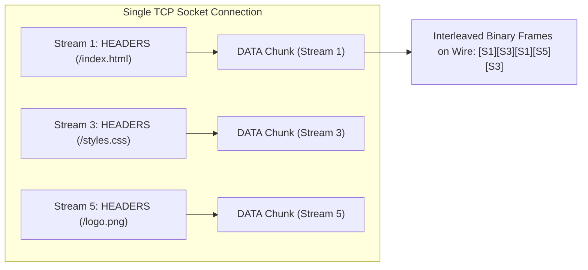
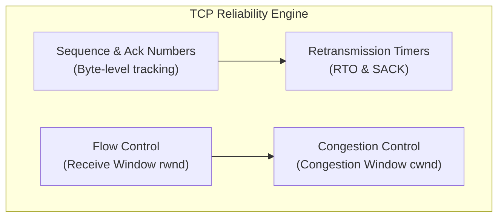
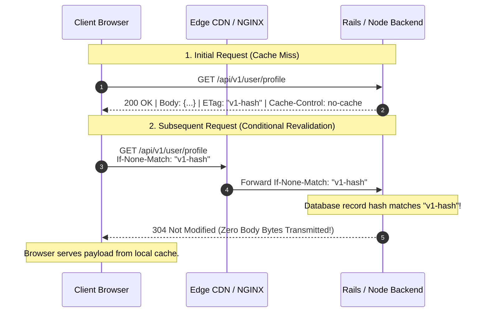
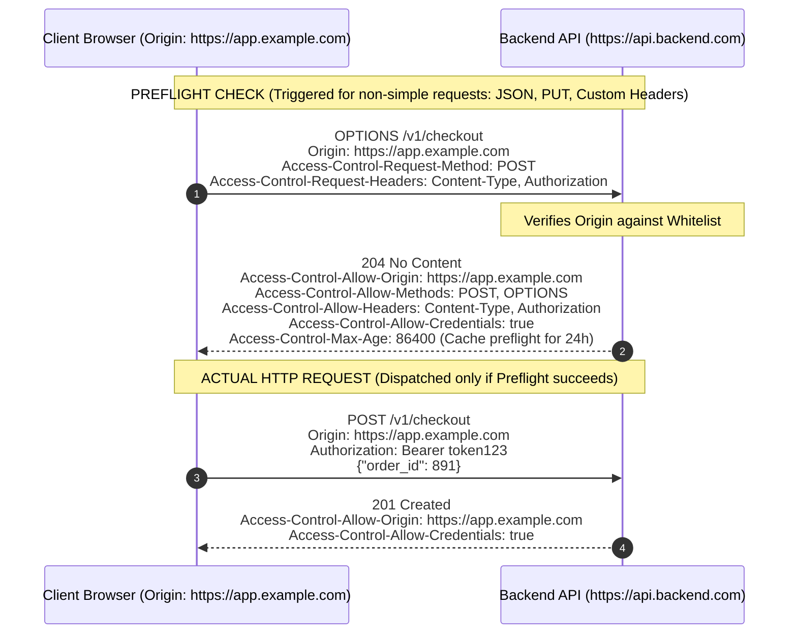

# 02. HTTP Protocols, Transport Mechanics, Status Codes & Headers

> **Target Role**: Staff / Senior Backend & Systems Engineer (Rails, Node.js/TypeScript, Distributed Systems)  
> **Module**: 09-networking-web-internals / 02-http-protocols-and-headers  
> **Key Focus**: HTTP Evolution (HTTP/1.1 $\to$ HTTP/2 $\to$ HTTP/3 & QUIC), TCP vs. UDP Production Realities, Congestion Control (CUBIC vs. BBR), Status Code Semantics, Cache-Control Directives, Conditional ETags, and CORS Security Architecture.

---

## Table of Contents
1. [HTTP Evolution: HTTP/1.1 to HTTP/3 & QUIC](#1-http-evolution-http11-to-http3--quic)
   - [1.1 Definition & Core Concept](#11-definition--core-concept)
   - [1.2 HTTP/1.1: Mechanics & Head-of-Line (HoL) Blocking](#12-http11-mechanics--head-of-line-hol-blocking)
   - [1.3 HTTP/2: Binary Framing, Multiplexing & HPACK Compression](#13-http2-binary-framing-multiplexing--hpack-compression)
   - [1.4 HTTP/3 & QUIC: Eliminating Packet-Level HoL Blocking](#14-http3--quic-eliminating-packet-level-hol-blocking)
   - [1.5 Protocol Binary Wire Formats & Frame Anatomy](#15-protocol-binary-wire-formats--frame-anatomy)
   - [1.6 Production Failure Modes & Cellular Edge Outages](#16-production-failure-modes--cellular-edge-outages)
   - [1.7 Protocol Comparison & Decision Matrix](#17-protocol-comparison--decision-matrix)
   - [1.8 Senior Interview Q&A](#18-senior-interview-qa)
2. [TCP vs. UDP in Production Systems](#2-tcp-vs-udp-in-production-systems)
   - [2.1 Definition & Core Concept](#21-definition--core-concept)
   - [2.2 TCP Reliability Engine & Congestion Control (CUBIC vs. BBR)](#22-tcp-reliability-engine--congestion-control-cubic-vs-bbr)
   - [2.3 Flow Control & Sliding Window Mechanics](#23-flow-control--sliding-window-mechanics)
   - [2.4 UDP Architecture & Kernel Socket Buffer Dynamics](#24-udp-architecture--kernel-socket-buffer-dynamics)
   - [2.5 Production Kernel Tuning & Diagnostics](#25-production-kernel-tuning--diagnostics)
   - [2.6 Workload Decision Matrix (When to Use TCP vs. UDP)](#26-workload-decision-matrix-when-to-use-tcp-vs-udp)
   - [2.7 Senior Interview Q&A](#27-senior-interview-qa)
3. [Status Codes Architectural Breakdown](#3-status-codes-architectural-breakdown)
   - [3.1 Definition & Core Concept](#31-definition--core-concept)
   - [3.2 2xx Success Semantics (200, 201, 204)](#32-2xx-success-semantics-200-201-204)
   - [3.3 3xx Redirection Matrix (301 vs. 302 vs. 307 vs. 308)](#33-3xx-redirection-matrix-301-vs-302-vs-307-vs-308)
   - [3.4 4xx Client Error Semantics (401 vs. 403, 409, 422, 429)](#34-4xx-client-error-semantics-401-vs-403-409-422-429)
   - [3.5 5xx Server & Gateway Errors (500 vs. 502 vs. 503 vs. 504)](#35-5xx-server--gateway-errors-500-vs-502-vs-503-vs-504)
   - [3.6 Production Error Contract (RFC 7807 Problem Details)](#36-production-error-contract-rfc-7807-problem-details)
   - [3.7 Senior Interview Q&A](#37-senior-interview-qa)
4. [Production Headers: Caching, ETags & CORS Security](#4-production-headers-caching-etags--cors-security)
   - [4.1 Definition & Core Concept](#41-definition--core-concept)
   - [4.2 Cache-Control Directives & Revalidation Mechanics](#42-cache-control-directives--revalidation-mechanics)
   - [4.3 Strong vs. Weak ETags & Mid-Air Collision Prevention](#43-strong-vs-weak-etags--mid-air-collision-prevention)
   - [4.4 Cross-Origin Resource Sharing (CORS) Mechanics](#44-cross-origin-resource-sharing-cors-mechanics)
   - [4.5 Production Implementation (Express & Rails Middleware)](#45-production-implementation-express--rails-middleware)
   - [4.6 Production Outages & Security Pitfalls](#46-production-outages--security-pitfalls)
   - [4.7 Senior Interview Q&A](#47-senior-interview-qa)

---

# 1. HTTP Evolution: HTTP/1.1 to HTTP/3 & QUIC

### 1.1 Definition & Core Concept
The Hypertext Transfer Protocol (HTTP) has evolved over three decades from a simplistic, plaintext, single-request ASCII exchange into a high-throughput, multiplexed, encrypted binary transport. Each evolutionary step addressed transport-layer inefficiencies inherent to the underlying physical networks.

```
+─────────────────────────────────────────────────────────────────────────────+
|                                 APPLICATION                                 |
|                               (HTTP Semantics)                              |
+──────────────────────────────────────┬──────────────────────────────────────+
|               HTTP/1.1               |                HTTP/2                |                HTTP/3                |
|           Plaintext ASCII            |         Binary Framing Layer         |        QUIC Framing Layer            |
+──────────────────────────────────────┴──────────────────────────────────────+──────────────────────────────────────+
|                     TLS 1.2 / 1.3                   |                      | Built-in TLS 1.3                     |
+─────────────────────────────────────────────────────┤                      | Transport & Crypto handshake         |
|                          TCP                        |                      +──────────────────────────────────────+
|               Byte-Stream, Congestion Control       |                      |                 QUIC                 |
|             Kernel-level Packet Ordering & Ack      |                      | UDP-based Independent Packet Streams |
+─────────────────────────────────────────────────────┴──────────────────────+──────────────────────────────────────+
|                                              IP (IPv4 / IPv6)                                                      |
+────────────────────────────────────────────────────────────────────────────────────────────────────────────────────+
```

---

### 1.2 HTTP/1.1: Mechanics & Head-of-Line (HoL) Blocking

Introduced in RFC 2616 (and refined in RFC 7230–7235), HTTP/1.1 introduced **Persistent Connections (`Connection: keep-alive`)**, allowing multiple request/response transactions across a single established TCP connection rather than terminating the socket after every file transfer.

#### 1. The Head-of-Line (HoL) Blocking Bottleneck
In HTTP/1.1, responses **must be delivered in the exact order requests were received**. If a client initiates:
1. `GET /api/slow-report` (takes 4000ms on backend)
2. `GET /css/styles.css` (takes 1ms)
3. `GET /js/bundle.js` (takes 2ms)

Even though `styles.css` and `bundle.js` are ready immediately, the server cannot transmit their bytes until the 4-second `slow-report` finishes streaming. The head of the queue blocks all subsequent responses.

```
HTTP/1.1 TCP Stream (Sequential):
Client ──[Req 1: /slow-report]──>[Req 2: /styles.css]──>[Req 3: /bundle.js]──>
Server ──[Resp 1 (4000ms)...]───────────────────────────>[Resp 2]──>[Resp 3]──>
         ▲
         └─ BLOCKS Resp 2 & Resp 3 from sending for 4 seconds!
```

#### 2. The Browser Workaround: 6 Connections Per Domain
Because of HoL blocking, web browsers enforced an arbitrary limit of **6 concurrent TCP connections per origin hostname**. This gave rise to operational workarounds:
- **Domain Sharding**: Hosting static assets across `assets1.example.com`, `assets2.example.com`, multiplying TCP handshakes and TLS handshakes by $N$.
- **Asset Bundling & Sprite Sheets**: Combining hundreds of images and JavaScript modules into giant monolith files to reduce HTTP request count.
- **Pipelining Failure**: HTTP/1.1 specified "Pipelining" (sending multiple requests without waiting for the prior response), but buggy enterprise proxies and middleboxes corrupted response orders or dropped connections, forcing browsers to disable pipelining by default.

---

### 1.3 HTTP/2: Binary Framing, Multiplexing & HPACK Compression

RFC 7540 revolutionized the web by replacing plaintext ASCII strings (`GET / HTTP/1.1\r\n`) with a **Binary Framing Layer** operating over a single persistent TCP connection.



#### 1. Streams, Messages, and Frames
- **Stream**: A bidirectional flow of bytes within an active connection, carrying one request and response message. Streams have a 31-bit integer identifier (Client-initiated streams are odd-numbered: 1, 3, 5; Server-initiated streams are even-numbered).
- **Frame**: The smallest atomic unit of communication in HTTP/2. Each frame contains a 9-byte header indicating frame length, type (e.g., `HEADERS`, `DATA`, `SETTINGS`, `RST_STREAM`, `WINDOW_UPDATE`), flags, and the Stream ID it belongs to.
- **Multiplexing**: Frames from dozens of distinct streams are interleaved across a single TCP socket simultaneously. A slow database query on Stream 1 no longer delays image bytes from streaming on Stream 3.

#### 2. HPACK Header Compression (RFC 7541)
HTTP/1.1 headers are bloated (often 1KB–2KB per request carrying identical User-Agents, Cookies, and Accept headers). HTTP/2 uses **HPACK**:
- **Static Table**: A hardcoded table of 61 common header name/value pairs (e.g., Index 2 = `GET /`, Index 7 = `:scheme: https`).
- **Dynamic Table**: A rolling in-memory FIFO table shared between client and server that tracks previously transmitted headers during that connection. If a client transmits `Cookie: session=abc` once, subsequent requests transmit only a 1-byte pointer to the dynamic table index.
- **Huffman Coding**: String literals are compressed using a static Huffman code tuned to standard HTTP text frequencies.

#### 3. Stream Prioritization & Dependency Trees
Clients can assign each stream a priority weight (1 to 256) and designate dependencies. For example, critical CSS can be assigned dependency parentage over background analytics images, ensuring the server allocates transmission window capacity to visual layout blocks first.

---

### 1.4 HTTP/3 & QUIC: Eliminating Packet-Level HoL Blocking

While HTTP/2 eliminated application-layer HoL blocking, it introduced a worse problem at the transport layer: **TCP Packet-Level Head-of-Line Blocking**.

```
SCENARIO: 2% PACKET LOSS ON A 4G/5G CELLULAR NETWORK

HTTP/2 OVER TCP:
[Frame Stream 1] [Frame Stream 3] [Frame Stream 5 (LOST!)] [Frame Stream 7] [Frame Stream 9]
                                           │
                                           ▼
TCP Stack detects missing packet!
Kernel TCP receive buffer FREEZES delivery to user space for ALL streams (1, 3, 7, 9)
until Stream 5 packet is retransmitted and acknowledged (1 RTT delay)!
Entire website halts for all resources.

──────────────────────────────────────────────────────────────────────────────────────────

HTTP/3 OVER QUIC (UDP):
[Packet Stream 1] [Packet Stream 3] [Packet Stream 5 (LOST!)] [Packet Stream 7] [Packet Stream 9]
                                           │
                                           ▼
QUIC recognizes independent stream boundaries!
Streams 1, 3, 7, and 9 are delivered to the application IMMEDIATELY.
ONLY Stream 5 waits for retransmission! Zero head-of-line blocking across unaffected streams.
```

#### Key QUIC Innovations (RFC 9000):
1. **UDP Transport Layer**: Moves the transport engine from the unmodifiable OS kernel space to user-space libraries (e.g., Cloudflare `quiche`, Google `cronet`, Microsoft `msquic`), enabling rapid protocol updates without waiting for Linux kernel releases.
2. **Built-in TLS 1.3**: Cryptographic handshakes and transport parameter negotiation occur simultaneously in a single round trip (1-RTT or 0-RTT). Transport headers (packet numbers, flags) are encrypted, preventing ISP middlebox tampering.
3. **Connection Migration via Connection IDs (CID)**:
   - Traditional TCP identifies a connection by the **4-tuple**: `(Source IP, Source Port, Destination IP, Destination Port)`. When a user walks out of their house and transitions from home Wi-Fi (`192.168.1.50`) to Cellular LTE (`100.64.12.8`), their IP changes. In TCP, the socket is destroyed, dropping all active downloads, WebSockets, and video streams.
   - QUIC introduces a cryptographically random **64-bit Connection ID (CID)** embedded in the UDP header. When the client IP changes, the client transmits a UDP packet from the new IP using the *same CID*. The server verifies the cryptographic token and seamlessly migrates the connection without dropping a single active stream.

---

### 1.5 Protocol Binary Wire Formats & Frame Anatomy

#### HTTP/2 Frame Header (9 Bytes):
```text
 0                   1                   2                   3
 0 1 2 3 4 5 6 7 8 9 0 1 2 3 4 5 6 7 8 9 0 1 2 3 4 5 6 7 8 9 0 1
+-+-+-+-+-+-+-+-+-+-+-+-+-+-+-+-+-+-+-+-+-+-+-+-+-+-+-+-+-+-+-+-+
|                 Length (24 bits)              |
+-+-+-+-+-+-+-+-+-+-+-+-+-+-+-+-+-+-+-+-+-+-+-+-+---------------+
|   Type (8)    |   Flags (8)   |
+-+-+-+-+-+-+-+-+-+-+-+-+-+-+-+-+---------------+---------------+
|R|                 Stream Identifier (31 bits)                 |
+-+-+-+-+-+-+-+-+-+-+-+-+-+-+-+-+-+-+-+-+-+-+-+-+---------------+
|                     Frame Payload (0...Length)              ...
+-+-+-+-+-+-+-+-+-+-+-+-+-+-+-+-+-+-+-+-+-+-+-+-+---------------+
```

#### Diagnostic Commands for HTTP Protocols:
```bash
# Force HTTP/1.1 and display wire headers
curl -v --http1.1 https://api.production.example.com/v1/health

# Inspect HTTP/2 Stream Multiplexing and HPACK decompression
curl -v --http2 https://api.production.example.com/v1/health

# Query over HTTP/3 (QUIC over UDP Port 443)
curl -v --http3 https://cloudflare-quic.com

# Dump raw QUIC UDP traffic via tcpdump
sudo tcpdump -i eth0 -nnvvv -X 'udp port 443'
```

---

### 1.6 Production Failure Modes & Cellular Edge Outages

#### 1. The HTTP/2 Performance Inversion on High-Loss Networks
**Symptom**: After enabling HTTP/2 globally, mobile users in developing countries or on congested cellular connections reported 35% slower page loads compared to HTTP/1.1.

**Root Cause**: Under HTTP/1.1, the browser opened 6 separate TCP connections. If packet loss was 3%, a dropped packet on Connection 1 only froze that one socket; the remaining 5 connections continued streaming data. 
Under HTTP/2, all traffic is consolidated into a single TCP connection. A single dropped packet freezes the kernel TCP sliding window for *all* multiplexed assets simultaneously.

**Remediation**: Deploy HTTP/3 with QUIC at the edge CDN tier. QUIC allows parallel streams over UDP, isolating loss recovery strictly to the affected stream.

#### 2. The HPACK Bomb (Denial of Service)
**Mechanism**: An attacker exploits the dynamic table mechanism by injecting high-entropy headers that repeatedly reference the maximum allowable dynamic table space. By sending tiny frames that decompress into hundreds of megabytes of identical string allocations, the attacker exhausts server memory and crashes worker runtimes.

**Defense in NGINX**:
```nginx
# Restrict dynamic table size and max header field length
http2_max_field_size 16k;
http2_max_header_size 32k;
http2_max_requests 10000;
```

---

### 1.7 Protocol Comparison & Decision Matrix

| Metric / Dimension | HTTP/1.1 | HTTP/2 | HTTP/3 (QUIC) |
| :--- | :--- | :--- | :--- |
| **Transport Layer** | TCP | TCP | **UDP (QUIC)** |
| **Framing** | Text (ASCII lines) | Binary Frames | Binary Frames |
| **Multiplexing** | No (HoL Blocking) | **Yes (Single TCP connection)** | **Yes (Independent UDP streams)** |
| **Packet-Level HoL Immunity**| Partial (via 6 sockets) | **No (Severe single TCP bottleneck)** | **Yes (Full immunity)** |
| **Header Compression** | None (Plaintext cookies repeated) | **HPACK (Static/Dynamic table)** | **QPACK (Out-of-order dynamic table)**|
| **Connection Handshake** | 1-RTT TCP + 1-2 RTT TLS | 1-RTT TCP + 1-2 RTT TLS | **1-RTT Combined (0-RTT Resumption)** |
| **Connection Migration** | Impossible (4-tuple socket dies) | Impossible (4-tuple socket dies) | **Seamless (via 64-bit Connection ID)**|
| **Server Push** | No | Supported (Deprecated in Chrome) | Supported (Rarely used) |

---

### 1.8 Senior Interview Q&A

#### Q1: Why was HTTP/2 Server Push deprecated and removed from major browsers like Google Chrome?
**Staff-Level Answer**:
HTTP/2 Server Push was designed to allow servers to proactively send assets (e.g., `styles.css`) before the client parsed the HTML and requested them. However, in production it introduced severe architectural flaws:
1. **Cache Ignorance**: The server lacks direct knowledge of the client's local disk/memory cache state. It frequently pushed multi-megabyte assets that the browser already had cached, wasting cellular bandwidth.
2. **Bandwidth Contention**: Pushed resources competed with the initial HTML response for transport window capacity, delaying Time To First Byte (TTFB) and First Contentful Paint (FCP).
3. **Complexity & Implementation Bugs**: Handling race conditions between client-initiated requests and in-flight server push frames led to browser bugs and memory leaks.
4. **Replacement**: It has been replaced in production by the `103 Early Hints` HTTP status code (RFC 8297) combined with `<link rel="preload">`, which informs the browser to fetch assets speculatively while allowing the browser's native cache engine to decide whether a fetch is necessary.

---

# 2. TCP vs. UDP in Production Systems

### 2.1 Definition & Core Concept
At the Transport Layer (OSI Layer 4), applications choose between two foundational protocols:
- **Transmission Control Protocol (TCP - RFC 793)**: A connection-oriented, reliable, ordered byte-stream protocol providing end-to-end error checking, flow control, and network congestion control.
- **User Datagram Protocol (UDP - RFC 768)**: A minimal, connectionless, unreliable datagram protocol providing port multiplexing and lightweight checksumming with zero connection state and zero transmission guarantees.

---

### 2.2 TCP Reliability Engine & Congestion Control (CUBIC vs. BBR)

TCP achieves reliability over unreliable physical IP networks via four mathematical control loops:



#### Congestion Control Evolution: Loss-Based vs. Model-Based
When packets traverse routers with overflowing queues, routers drop packets. How the sender adjusts its transmission rate (`cwnd` - Congestion Window) defines the congestion control algorithm:

```
Loss-Based: TCP CUBIC (Linux Default)
Rate
 │         /\            /\
 │        /  \          /  \
 │       /    \        /    \    Increases cwnd until packet drop occurs!
 │      /      \      /      \   Fills router memory buffers (BUFFERBLOAT).
 └─────/────────\────/────────\─────> Time
                 ▲ Drops rate by 30-50% upon packet drop!

──────────────────────────────────────────────────────────────────────────────────────────

Model-Based: Google BBR (Bottleneck Bandwidth and RTT)
Rate
 │    ┌─────────────────────────── Max Bandwidth Delivery
 │   / 
 │  /  Calculates physical bottleneck bandwidth (BtlBw) and min RTT (RTprop).
 └──/─────────────────────────────> Time
     Paces packets precisely to avoid filling router queues!
     Keeps buffers empty, eliminating bufferbloat and latency spikes.
```

#### Why Production Systems Migrate to BBR:
- **TCP CUBIC**: Treats *packet loss* as the primary indicator of congestion. On modern high-speed long-distance links (e.g., transatlantic fibers or cellular networks), random packet drops occur due to radio interference, not congestion. CUBIC aggressively slashes its transmission window, resulting in catastrophic throughput collapse.
- **TCP BBR (v1/v2/v3)**: Ignores packet drops as the sole congestion signal. It continuously models the physical bottleneck bandwidth (`BtlBw`) and round-trip propagation delay (`RTprop`). It paces packet transmissions to maximize pipe utilization while keeping intermediate router queues empty.

---

### 2.3 Flow Control & Sliding Window Mechanics

While Congestion Control protects the *network*, **Flow Control** protects the *receiving host* from buffer overflow:
- The receiver advertises its available buffer space via the **Receive Window (`rwnd`)** field in the TCP header.
- **Window Scaling (RFC 7323)**: The original TCP header allocated only 16 bits for window size ($65,535\text{ bytes}$). Modern gigabit networks require megabyte buffers. The `Window Scale` option allows scaling factors up to $2^{14}$, enabling buffers up to 1 Gigabyte.
- **Zero-Window Probing (ZWP)**: If an application process (e.g., a slow Rails worker) fails to read from the socket buffer, `rwnd` drops to 0. The sender immediately stops transmitting data and begins firing periodic 1-byte "Zero Window Probe" packets. Only when the application reads from the socket does the receiver emit an updated `rwnd > 0` window update.

---

### 2.4 UDP Architecture & Kernel Socket Buffer Dynamics

UDP has an 8-byte fixed header:
```text
 0      7 8     15 16    23 24    31
+--------+--------+--------+--------+
|   Source Port   | Destination Port|
+--------+--------+--------+--------+
|     Length      |    Checksum     |
+--------+--------+--------+--------+
|          Data Payload ...         |
+-----------------------------------+
```

#### Kernel Socket Buffer Mechanics:
When a high-volume UDP burst arrives at the network interface card:
1. The NIC copies frames into DMA memory and raises a hardware interrupt.
2. The kernel network driver services the interrupt via NAPI and allocates an `sk_buff` structure.
3. The datagram is enqueued directly into the UDP socket's receive buffer (`SO_RCVBUF`).
4. **The Drop Hazard**: If the user-space daemon (e.g., StatsD, DNS daemon) is blocked in garbage collection or CPU contention and fails to invoke `recvfrom(2)`, the in-kernel socket buffer fills up. **Any subsequent datagram is silently discarded by the kernel without sending an ICMP error or informing the sender.**

---

### 2.5 Production Kernel Tuning & Diagnostics

#### Enabling TCP BBR on Linux:
```bash
# Verify available congestion control algorithms
sysctl net.ipv4.tcp_available_congestion_control
# Output: reno cubic bbr

# Enable TCP BBR and Fair Queueing (FQ pacing scheduler required by BBR)
sudo sysctl -w net.core.default_qdisc=fq
sudo sysctl -w net.ipv4.tcp_congestion_control=bbr

# Persist in /etc/sysctl.d/99-bbr.conf
echo "net.core.default_qdisc=fq" | sudo tee -a /etc/sysctl.d/99-bbr.conf
echo "net.ipv4.tcp_congestion_control=bbr" | sudo tee -a /etc/sysctl.d/99-bbr.conf
sudo sysctl --system
```

#### Diagnosing UDP Packet Buffer Overflows:
```bash
# Check system-wide UDP receive buffer errors and dropped packets
netstat -su | grep -E "buffer errors|receive errors"
# Output:
#   148210 packet receive errors
#   148210 receive buffer errors

# Expand kernel UDP receive and send memory buffers
sudo sysctl -w net.core.rmem_max=26214400  # 25 MB max receive buffer
sudo sysctl -w net.core.rmem_default=8388608 # 8 MB default
sudo sysctl -w net.core.wmem_max=26214400  # 25 MB max send buffer
```

---

### 2.6 Workload Decision Matrix (When to Use TCP vs. UDP)

```
                       TRANSPORT PROTOCOL SELECTION
                                    │
           Does the workload require 100% data guarantee,
           loss recovery, and sequential ordering?
                                    │
                     ┌──────────────┴──────────────┐
                    YES                            NO
                     │                             │
                     ▼                             ▼
               USE TCP / QUIC              Is low-latency jitter
            ┌───────────────────┐          preferred over dropped packets?
            │ REST APIs         │                  │
            │ Databases (SQL)   │          ┌───────┴───────┐
            │ SSH / SFTP        │         YES              NO
            │ Financial Ledgers │          │               │
            └───────────────────┘          ▼               ▼
                                       USE UDP        USE BATCH TCP
                                ┌───────────────────┐ ┌──────────────┐
                                │ Live Video / VoIP │ │ Async Backup │
                                │ Online Gaming     │ │ Log Shipping │
                                │ DNS Lookups       │ └──────────────┘
                                │ StatsD Metrics    │
                                └───────────────────┘
```

---

### 2.7 Senior Interview Q&A

#### Q2: What causes a socket to enter the `TIME_WAIT` state, what is its mathematical duration ($2 \times \text{MSL}$), and why can removing it with `SO_LINGER(0)` cause silent data corruption?
**Staff-Level Answer**:
The endpoint that performs the **active close** (initiating the `FIN` handshake) transitions into `TIME_WAIT` after transmitting the final `ACK` of the connection termination sequence.

`TIME_WAIT` serves two mandatory protocol functions:
1. **Ensuring the final ACK is received**: If the final `ACK` is lost in transit, the peer retransmits its `FIN`. If the closing host did not maintain `TIME_WAIT`, it would respond with an `RST`, forcing an unclean connection abort on the peer.
2. **Draining stale duplicate segments from the Internet**: Packets can be delayed by intermediate routers. `TIME_WAIT` lasts for $2 \times \text{MSL}$ (Maximum Segment Lifetime, standardized as $2 \times 60\text{s} = 120\text{s}$, though Linux hardcodes this to 60 seconds). This guarantees all delayed segments belonging to that 4-tuple expire in transit.

If an engineer forcefully disables `TIME_WAIT` using `SO_LINGER` with a timeout of 0 (which terminates the connection immediately with an `RST` packet):
- An ephemeral port is instantly returned to the OS allocation pool.
- A new connection can be opened immediately on that exact same 4-tuple (`src_ip:src_port` $\to$ `dst_ip:dst_port`).
- If an old delayed duplicate TCP segment from the previous connection finally arrives, the receiving application's TCP stack will accept the old segment as part of the *new* stream if its sequence number falls within the new sliding window, **silently corrupting application memory or database records**.

---

# 3. Status Codes Architectural Breakdown

### 3.1 Definition & Core Concept
HTTP response status codes (RFC 7231 / RFC 9110) provide standardized semantic contracts between servers, intermediaries (CDNs, reverse proxies, WAFs), and clients. 

Correct status code semantics determine browser caching behaviors, idempotency guarantees, indexing behavior in search engines, and automated retry policies in distributed microservice architectures.

---

### 3.2 2xx Success Semantics (200, 201, 204)

- **`200 OK`**: Standard response for successful requests carrying a representation payload.
- **`201 Created`**: The request succeeded and led to the creation of a new resource. **Mandatory Contract**: The server *should* emit a `Location: https://api.example.com/v1/orders/8912` header pointing to the newly allocated resource identifier.
- **`204 No Content`**: The request succeeded, and the server intentionally returns **zero payload bytes**. Commonly used for `DELETE` operations or `PUT`/`PATCH` updates where the client state does not require a fresh view of the entity. Crucially, the browser **must not navigate away** or change its document view upon receiving 204.

---

### 3.3 3xx Redirection Matrix (301 vs. 302 vs. 307 vs. 308)

The distinction between legacy redirects and modern redirects centers on **HTTP Method Preservation**:

```
Client sends: POST /orders
               │
      Redirect Received?
               │
    ┌──────────┴──────────┐
    ▼                     ▼
Legacy (301 / 302)    Modern (307 / 308)
    │                     │
Rewrites POST to GET! Retains original POST verb!
Drops Request Body!   Preserves payload & headers!
    │                     │
    ▼                     ▼
Executes:             Executes:
GET /new-orders       POST /new-orders
```

| Status Code | Name | Browser Caching Behavior | Method Transformation Behavior | Primary Use Case |
| :--- | :--- | :--- | :--- | :--- |
| **301** | Moved Permanently | **Heuristically cached indefinitely** in browser disk cache | Rewrites `POST` $\to$ `GET` (RFC violation standardized by history) | Permanent domain change, HTTP $\to$ HTTPS upgrade |
| **302** | Found (Temporary) | Not cached unless explicit `Cache-Control` | Rewrites `POST` $\to$ `GET` | PRG (Post-Redirect-Get) web form pattern |
| **307** | Temporary Redirect| Not cached unless explicit `Cache-Control` | **Guarantees HTTP method & body preservation** | API microservice temporary routing, auth gateways |
| **308** | Permanent Redirect| **Cached indefinitely** | **Guarantees HTTP method & body preservation** | Permanent REST API endpoint relocation |

> [!WARNING]
> **The 301 Browser Cache Trap**: A `301 Moved Permanently` response is aggressively cached by desktop and mobile browsers directly in local storage with indefinite expiration. If you deploy a mistaken 301 redirect in production, **reverting your backend server code will not fix it for existing users**. Their browsers will execute the redirect locally from disk without ever hitting your server again. Use `307` or `302` during migrations, and only switch to `301`/`308` once stable.

---

### 3.4 4xx Client Error Semantics (401 vs. 403, 409, 422, 429)

- **`401 Unauthorized` vs. `403 Forbidden`**:
  - **401 Unauthorized**: Actually means **Unauthenticated**. The client identity is missing, expired, or invalid. The response **must** include a `WWW-Authenticate` header challenge (e.g., `WWW-Authenticate: Bearer realm="api"`).
  - **403 Forbidden**: The server knows *who* the client is, but the client does **not possess the necessary permissions/roles** to access the requested resource. Retrying with the same credentials will fail.
- **`404 Not Found` vs. `410 Gone`**:
  - `404`: The resource may exist in the future or the path is unknown.
  - `410`: The resource intentionally deleted and will never return. Search engine spiders (Googlebot) permanently remove `410` URLs from their index immediately, whereas `404` URLs are retried for weeks.
- **`409 Conflict`**: The request could not be completed due to a conflict with the current state of the target resource. Standard in **optimistic concurrency control** (e.g., version stamp mismatches in database transactions).
- **`422 Unprocessable Content` (RFC 4918 / RFC 9110)**: The syntax is valid JSON/XML, but contains semantic validation errors (e.g., `email` field is missing an `@` symbol or `age < 0`).
- **`429 Too Many Requests` (RFC 6585)**: The client has exceeded rate limits. High-throughput architectures must return `Retry-After: <seconds>` alongside custom rate-limiting telemetry headers (`X-RateLimit-Limit`, `X-RateLimit-Remaining`, `X-RateLimit-Reset`).

---

### 3.5 5xx Server & Gateway Errors (500 vs. 502 vs. 503 vs. 504)

Understanding the distinction between upstream proxy errors is vital for on-call triage:

```
[Browser / Client] ──> [Cloudflare / ALB] ──> [NGINX Proxy] ──> [Puma / Node Application]
                             │                      │                       │
                             │                      ▼                       ▼
                             │                 502 Bad Gateway         500 Internal Error
                             │                 Upstream socket died,   Uncaught Exception
                             │                 crashed, or refused     thrown in app code
                             │
                             ▼
                      504 Gateway Timeout
                      NGINX / ALB waited for
                      proxy_read_timeout (60s)
                      and upstream never finished
```

- **`500 Internal Server Error`**: The application code received the request, attempted execution, and threw an unhandled exception or runtime crash (e.g., `NoMethodError`, `NullPointerException`).
- **`502 Bad Gateway`**: The reverse proxy (NGINX/ALB) contacted the upstream process (Puma/Node.js), but received an **invalid or empty response**, or the upstream socket closed abruptly (e.g., Out of Memory OOM killer terminated the Puma worker, or port was not open).
- **`503 Service Unavailable`**: The server is currently incapable of handling the request due to deliberate maintenance or temporary queue overload. When shedding load, servers should return `503` with a `Retry-After: 30` header.
- **`504 Gateway Timeout`**: The reverse proxy established a connection to the upstream application, sent the request, but the upstream application took longer than the configured timeout (`proxy_read_timeout`) to transmit a response. Typically caused by unindexed database table locks or slow external third-party API calls.

---

### 3.6 Production Error Contract (RFC 7807 Problem Details)

Production APIs should avoid arbitrary error schemas. Adopt **RFC 7807 (`application/problem+json`)**:

```json
{
  "type": "https://api.example.com/errors/insufficient-funds",
  "title": "Insufficient Funds",
  "status": 409,
  "detail": "Your current account balance is $14.20, but the checkout total requires $30.00.",
  "instance": "/v1/transactions/tx_9981a2",
  "invalid_params": [
    {
      "name": "amount",
      "reason": "Exceeds available balance"
    }
  ]
}
```

---

### 3.7 Senior Interview Q&A

#### Q3: A microservice returns a `502 Bad Gateway` to an AWS Application Load Balancer (ALB). What are the three most probable infrastructure causes and how do you isolate them?
**Staff-Level Answer**:
A `502 Bad Gateway` on an ALB signifies that the load balancer attempted to communicate with the registered target EC2/ECS container, but the TCP exchange failed or the upstream emitted an RFC-invalid HTTP byte sequence.

**The Three Most Probable Causes**:
1. **Target Abruptly Closed the TCP Connection (TCP RST)**: The application runtime crashed mid-request due to an OS Out-Of-Memory (OOM) `SIGKILL` or native segfault.
   - *Isolation*: Inspect `dmesg -T` or `journalctl -k` on the host for `oom-killer: gfp_mask=...` or inspect Docker exit code `137`.
2. **Keep-Alive Timeout Mismatch**: The application server's keep-alive timeout is configured shorter than the load balancer's idle timeout. The ALB attempts to reuse an existing persistent TCP socket right as the application server transmits a `FIN` packet.
   - *Isolation*: Examine ALB CloudWatch metric `HTTPCode_ELB_502_Count`. Ensure the upstream server keep-alive timeout (e.g., Puma/Node `keepAliveTimeout = 65000ms`) is strictly greater than the ALB idle timeout (default `60000ms`).
3. **Target Response Header Exceeded Buffer Size**: The upstream application emitted a response containing headers (e.g., massive Set-Cookie or tracing headers) that exceed the ALB's maximum allowable header size limit (typically 16KB).
   - *Isolation*: Inspect ALB access logs for `elb_status_code=502` with `target_status_code=-`.

---

# 4. Production Headers: Caching, ETags & CORS Security

### 4.1 Definition & Core Concept
HTTP headers constitute the metadata control plane of the web. They dictate how intermediaries and browsers cache content, validate resource freshness, and govern browser security boundaries through the **Same-Origin Policy (SOP)**.

---

### 4.2 Cache-Control Directives & Revalidation Mechanics

The `Cache-Control` header (RFC 7234 / RFC 9111) controls the caching lifecycle across two distinct entities:
1. **Private Caches**: The end-user's local browser storage.
2. **Shared Caches**: Intermediary edge CDN PoPs, ISP proxies, and corporate forward proxies.

```
                  CACHE DIRECTIVE EVALUATION ENGINE
                                  │
                       Is resource cacheable?
                                  │
                  ┌───────────────┴───────────────┐
                 YES                              NO
                  │                               │
       Does it contain sensitive          Cache-Control: no-store
       user-specific PII/tokens?          (Never write to disk or RAM)
                  │
        ┌─────────┴─────────┐
       YES                  NO
        │                   │
  Cache-Control:       Cache-Control:
  private, max-age=0   public, max-age=31536000, immutable
  (Browser only)       (Edge CDNs + Browsers cache forever)
```

#### Directive Breakdown:
- **`no-store`**: Absolute prohibition. Neither browsers nor CDNs may persist any part of the request or response to disk or memory caches. Required for credit card numbers, auth tokens, and HIPAA data.
- **`no-cache`**: **Misunderstood directive**. It does *not* mean "do not cache". It means the cache **may store the resource**, but **must revalidate with the origin server** (via `If-None-Match` or `If-Modified-Since`) before serving it to the client.
- **`public` vs. `private`**:
  - `public`: Any intermediary cache (Cloudflare, Fastly, corporate proxy) may store the response.
  - `private`: Only the final user's browser may cache it; edge CDNs must pass requests through.
- **`s-maxage=<seconds>`**: Overrides `max-age` exclusively for public shared caches (CDNs). Allows you to tell Cloudflare to cache an asset for 24 hours (`s-maxage=86400`) while telling the user's browser to cache for only 5 minutes (`max-age=300`).
- **`stale-while-revalidate=<seconds>`**: Instructs the client/CDN to immediately serve an expired (stale) cached asset while asynchronously triggering a background fetch to the origin server to refresh the cache. Eliminates latency spikes for end users.
- **`immutable`**: Indicates that the response body will **never change** during its lifetime (standard for asset-hashed files like `bundle.a8f9c2.js`). Prevents the browser from sending unnecessary 304 revalidation checks when users hit Refresh.

---

### 4.3 Strong vs. Weak ETags & Mid-Air Collision Prevention

An **ETag (Entity Tag)** is an opaque identifier assigned by a web server to represent a specific version of a resource:
- **Strong ETag (`ETag: "686897696a7c-1b"`)**: Guarantees byte-for-byte identity. If even a single byte changes, the ETag changes.
- **Weak ETag (`ETag: W/"686897696a7c-1b"`)**: Guarantees semantic equivalence. The visual representation is identical, even if byte formatting or whitespace differs.



#### Preventing Mid-Air Collisions via `If-Match`:
ETags also solve the **lost update problem** in concurrent distributed environments:
```bash
# User A fetches document version 5
curl -i https://api.example.com/v1/docs/12
# Response: ETag: "version-5"

# User B updates document to version 6...

# User A attempts to update document based on their stale version 5:
curl -X PUT https://api.example.com/v1/docs/12 \
     -H 'If-Match: "version-5"' \
     -d '{"title": "Conflicting Update"}'

# Server compares If-Match with current database version ("version-6"):
# Rejects request immediately with:
# HTTP/1.1 412 Precondition Failed
```

---

### 4.4 Cross-Origin Resource Sharing (CORS) Mechanics

The **Same-Origin Policy (SOP)** is a foundational browser security mechanism: a web script executing under `https://app.example.com:443` cannot read HTTP responses or manipulate DOM contexts belonging to `https://api.another-domain.com:443` (different origin = protocol, domain, or port mismatch).

**CORS (RFC 6454)** is the protocol mechanism that allows a server to explicitly relax SOP restrictions:



#### Critical CORS Security Rules:
1. **The Credential Wildcard Ban**: If `Access-Control-Allow-Credentials: true` is set (permitting cookies and authorization headers), **`Access-Control-Allow-Origin` CANNOT be `*`**. Browsers will reject the response immediately. The server must dynamically echo back the exact calling origin if it exists on an approved whitelist.
2. **Simple vs. Preflighted Requests**:
   - **Simple Request** (No Preflight): Uses `GET`, `HEAD`, or `POST` with standard headers (`Accept`, `Accept-Language`, `Content-Language`, `Content-Type: application/x-www-form-urlencoded`, `multipart/form-data`, or `text/plain`).
   - **Preflighted Request**: Any request using `PUT`, `DELETE`, `PATCH`, custom headers (e.g., `X-Request-ID`, `Authorization`), or `Content-Type: application/json`. Triggers an initial `OPTIONS` flight.

---

### 4.5 Production Implementation (Express & Rails Middleware)

#### Production TypeScript Express CORS Hardening:
```typescript
import express, { Request, Response, NextFunction } from 'express';
import cors, { CorsOptions } from 'cors';

const app = express();

const ALLOWED_ORIGINS = new Set([
  'https://app.production.com',
  'https://admin.production.com'
]);

const corsOptions: CorsOptions = {
  origin: (origin, callback) => {
    // Allow non-browser requests (e.g., cURL, server-to-server microservices)
    if (!origin) return callback(null, true);
    
    if (ALLOWED_ORIGINS.has(origin)) {
      callback(null, true);
    } else {
      callback(new Error(`CORS policy violation: Origin ${origin} unauthorized.`));
    }
  },
  methods: ['GET', 'POST', 'PUT', 'PATCH', 'DELETE', 'OPTIONS'],
  allowedHeaders: ['Content-Type', 'Authorization', 'X-Requested-With', 'X-Idempotency-Key'],
  credentials: true,
  maxAge: 86400 // Cache preflight response in browser for 24 hours
};

app.use(cors(corsOptions));
```

---

### 4.6 Production Outages & Security Pitfalls

#### The `Origin: null` Vulnerability & Data Leak
**Vulnerability**: An application configured its CORS middleware to permit requests where `Origin === "null"` to support local file testing (`file:///`).

**Attack Vector**:
An attacker hosts a malicious website that opens an invisible `<iframe>` running a sandboxed execution context:
```html
<iframe sandbox="allow-scripts allow-forms" src="https://attacker.com/exploit.html"></iframe>
```
Under browser specs, sandboxed iframes serialize their `Origin` header as the literal string `"null"`. The vulnerable API permitted `"null"`, reflected it in `Access-Control-Allow-Origin: null`, and set `Access-Control-Allow-Credentials: true`. The attacker silently read sensitive customer JSON payloads across origins.

**Remediation**:
Never whitelist `"null"` in production CORS handlers. Reject all origins that do not match a strict HTTPS domain whitelist.

---

### 4.7 Senior Interview Q&A

#### Q4: Why does a web browser block a JavaScript client from reading an API response when CORS validation fails, even though the backend server successfully processed the request and committed database changes?
**Staff-Level Answer**:
This highlights the fundamental purpose of the Same-Origin Policy: **SOP is a client-side browser enforcement mechanism, not a server-side firewall**.

When JavaScript executes `fetch('https://api.other.com/transfer')`:
1. If the request is a "Simple Request" (e.g., a standard POST with form encoding), the browser transmits the payload directly to the remote server.
2. The server receives the bytes, executes business logic, updates the database, and returns `200 OK`.
3. The response arrives at the client's network stack. The browser inspects the response headers for `Access-Control-Allow-Origin`.
4. If that header is missing or does not match the page origin, **the browser deliberately hides the response data from the JavaScript runtime** and raises a console CORS error.

The server already executed the transaction. The SOP exists to prevent hostile websites from *reading* confidential responses (like balance sheets, internal emails, or CSRF tokens) from authenticated third-party domains on behalf of an unwitting user.
