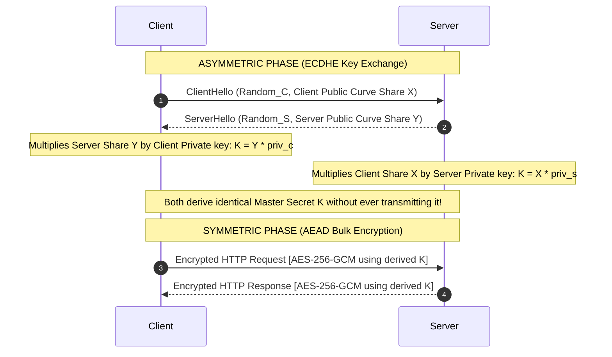
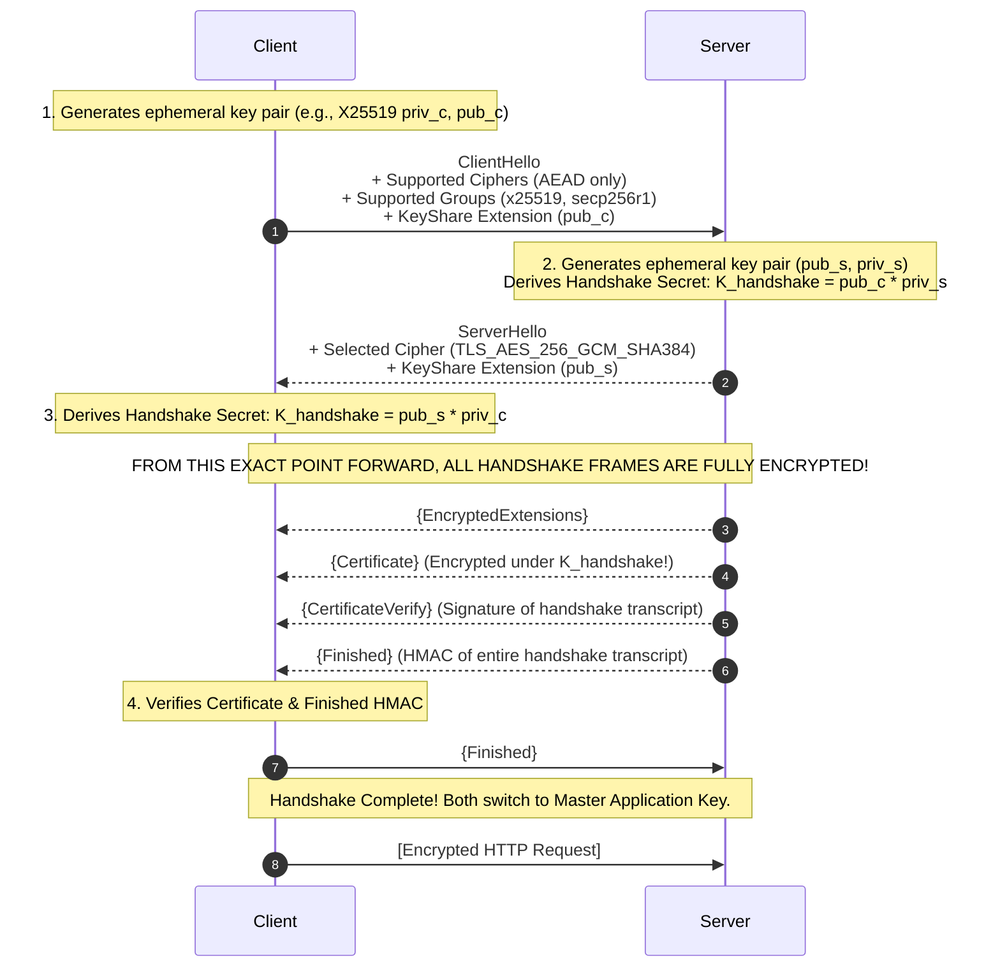
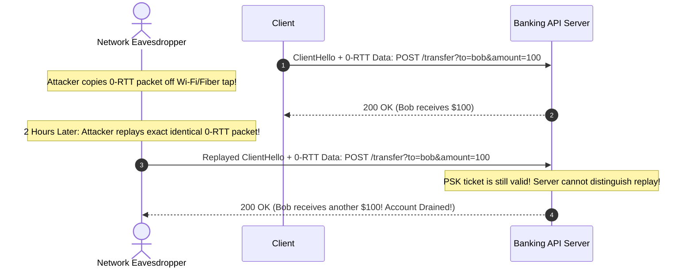
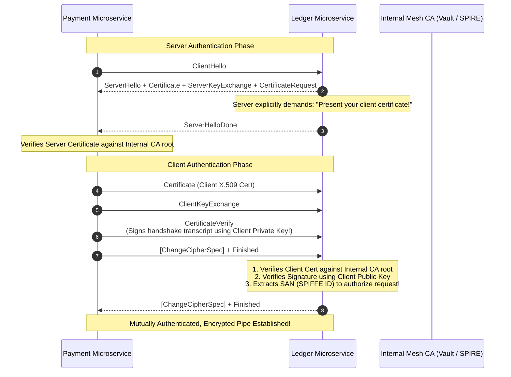

# 03. HTTPS, TLS Internals & Zero-Trust Transport Security

> **Target Role**: Staff / Senior Security & Infrastructure Engineer (Distributed Systems, Cloud Platforms, Network Security)  
> **Module**: 09-networking-web-internals / 03-https-tls-and-security  
> **Key Focus**: Symmetric vs. Asymmetric Cryptography, AEAD Ciphers & AES-NI Acceleration, X.509 PKI Chains, Certificate Transparency, OCSP Stapling, TLS 1.3 1-RTT / 0-RTT Handshakes (Replay Attacks), Perfect Forward Secrecy (PFS), and Mutual TLS (mTLS) with SPIFFE/SPIRE.

---

## Table of Contents
1. [Cryptographic Foundations & Hybrid Key Exchange](#1-cryptographic-foundations--hybrid-key-exchange)
   - [1.1 Definition & Core Concept](#11-definition--core-concept)
   - [1.2 Symmetric vs. Asymmetric Mathematics](#12-symmetric-vs-asymmetric-mathematics)
   - [1.3 AEAD Mechanics (AES-256-GCM vs. ChaCha20-Poly1305) & AES-NI](#13-aead-mechanics-aes-256-gcm-vs-chacha20-poly1305--aes-ni)
   - [1.4 The Hybrid Cryptographic Session Architecture](#14-the-hybrid-cryptographic-session-architecture)
   - [1.5 Production Hardware Benchmarks & OpenSSL Diagnostics](#15-production-hardware-benchmarks--openssl-diagnostics)
   - [1.6 Failure Modes & GCM Nonce Reuse Catastrophes](#16-failure-modes--gcm-nonce-reuse-catastrophes)
   - [1.7 Cryptographic Decision Matrix](#17-cryptographic-decision-matrix)
   - [1.8 Senior Interview Q&A](#18-senior-interview-qa)
2. [Public Key Infrastructure (PKI), Certificate Chains & OCSP Stapling](#2-public-key-infrastructure-pki-certificate-chains--ocsp-stapling)
   - [2.1 Definition & Core Concept](#21-definition--core-concept)
   - [2.2 The X.509 Chain of Trust & Cryptographic Verification Math](#22-the-x509-chain-of-trust--cryptographic-verification-math)
   - [2.3 Certificate Revocation: CRL vs. OCSP vs. OCSP Stapling (RFC 6066)](#23-certificate-revocation-crl-vs-ocsp-vs-ocsp-stapling-rfc-6066)
   - [2.4 Certificate Transparency (CT) Logs & Merkle Proofs](#24-certificate-transparency-ct-logs--merkle-proofs)
   - [2.5 Production NGINX SSL Configuration](#25-production-nginx-ssl-configuration)
   - [2.6 Real-World Outages: The Expired Root CA Trap](#26-real-world-outages-the-expired-root-ca-trap)
   - [2.7 Senior Interview Q&A](#27-senior-interview-qa)
3. [TLS 1.3 Deep Dive & 0-RTT Replay Vulnerabilities](#3-tls-13-deep-dive--0-rtt-replay-vulnerabilities)
   - [3.1 Definition & Core Concept](#31-definition--core-concept)
   - [3.2 The 1-RTT Handshake Sequence Mechanics](#32-the-1-rtt-handshake-sequence-mechanics)
   - [3.3 Perfect Forward Secrecy (PFS) & The Deprecation of Static RSA](#33-perfect-forward-secrecy-pfs--the-deprecation-of-static-rsa)
   - [3.4 0-RTT Early Data Resumption & The Replay Attack Attack Vector](#34-0-rtt-early-data-resumption--the-replay-attack-attack-vector)
   - [3.5 Packet Traces & Wireshark / TShark Analysis](#35-packet-traces--wireshark--tshark-analysis)
   - [3.6 TLS Version Decision Matrix](#36-tls-version-decision-matrix)
   - [3.7 Senior Interview Q&A](#37-senior-interview-qa)
4. [Mutual TLS (mTLS) & Zero-Trust Microservice Identity](#4-mutual-tls-mtls--zero-trust-microservice-identity)
   - [4.1 Definition & Core Concept](#41-definition--core-concept)
   - [4.2 Two-Way Cryptographic Handshake Mechanics](#42-two-way-cryptographic-handshake-mechanics)
   - [4.3 SPIFFE & SPIRE Architecture (X.509 SVID)](#43-spiffe--spire-architecture-x509-svid)
   - [4.4 Production Implementation (Go mTLS Server & Client)](#44-production-implementation-go-mtls-server--client)
   - [4.5 Production Outages: The Internal CA Expiration Cascade](#45-production-outages-the-internal-ca-expiration-cascade)
   - [4.6 Zero-Trust Architecture Decision Matrix](#46-zero-trust-architecture-decision-matrix)
   - [4.7 Senior Interview Q&A](#47-senior-interview-qa)

---

# 1. Cryptographic Foundations & Hybrid Key Exchange

### 1.1 Definition & Core Concept
Modern Internet security relies on a **Hybrid Cryptographic Architecture**. 

Asymmetric encryption (public-key cryptography) provides mathematical identity verification and secure key agreement without requiring a shared pre-existing secret, but is computationally expensive ($O(N^3)$ modular arithmetic). Symmetric encryption (shared secret cryptography) is computationally lightweight and capable of encrypting gigabits per second in hardware ($O(N)$ stream operations), but requires both endpoints to possess an identical key beforehand.

Transport Layer Security (TLS) combines both: asymmetric cryptography (ECDHE) negotiates an ephemeral symmetric key during the initial handshake, after which high-speed symmetric AEAD ciphers (AES-256-GCM) encrypt all application payload bytes.

---

### 1.2 Symmetric vs. Asymmetric Mathematics

```
+─────────────────────────────────────────────────────────────────────────────────────────+
|                                    ASYMMETRIC (KEY EXCHANGE)                            |
|  - Key Pairs: Public Key (Encryption/Verify) + Private Key (Decryption/Sign)            |
|  - Algorithms: ECDHE (Elliptic Curve Diffie-Hellman), RSA (Legacy)                       |
|  - Hard Problem: Discrete Logarithm over Elliptic Curves (y^2 = x^3 + ax + b mod p)     |
|  - Computational Cost: ~0.5ms - 2.0ms of CPU time per handshake                        |
+─────────────────────────────────────────────────────────────────────────────────────────+
                                             │
                         Derives Shared Secret Session Key
                                             │
                                             ▼
+─────────────────────────────────────────────────────────────────────────────────────────+
|                                  SYMMETRIC (BULK DATA TRANSFER)                          |
|  - Single Shared Key: Same 128-bit or 256-bit key used for encryption and decryption    |
|  - Algorithms: AES-256-GCM, ChaCha20-Poly1305                                           |
|  - Structure: Block cipher operating via substitution-permutation networks + GHASH     |
|  - Computational Cost: Nanoseconds per KB (Dedicated CPU AES-NI instructions)          |
+─────────────────────────────────────────────────────────────────────────────────────────+
```

---

### 1.3 AEAD Mechanics (AES-256-GCM vs. ChaCha20-Poly1305) & AES-NI

Legacy TLS configurations separated encryption from integrity (e.g., AES-CBC for confidentiality + HMAC-SHA256 for integrity). This separation caused famous side-channel attacks like the **Lucky Thirteen** and **POODLE** padding oracle exploits.

TLS 1.3 exclusively mandates **Authenticated Encryption with Associated Data (AEAD)**:

```text
Plaintext Payload ──┐
                    ├──> [ AES-256-GCM Engine ] ──> Ciphertext
Initialization Vector (IV) / Nonce ──┤                      │
Additional Authenticated Data (AAD) ──┘                      ▼
(Unencrypted Headers: SeqNum, TLS Type)          Authentication Tag (16 Bytes)
```

#### 1. AES-256-GCM (Galois/Counter Mode)
- Combines CTR (Counter Mode) encryption with Galois field polynomial multiplication (`GHASH`) for message authentication.
- **Hardware Acceleration (Intel/AMD AES-NI & ARMv8 Cryptography Extensions)**: Modern server CPUs contain dedicated silicon instructions (`AESENC`, `AESENCLAST`, `PCLMULQDQ`) that execute AES rounds in hardware registers in 1–2 CPU cycles per byte.

#### 2. ChaCha20-Poly1305 (RFC 8439)
- Designed by Daniel J. Bernstein as an alternative to AES for environments without dedicated hardware instructions (e.g., low-power IoT devices, older mobile ARM CPUs).
- Built entirely on 32-bit addition, XOR, and constant rotation (ARX operations), guaranteeing strict **constant-time execution** immune to CPU cache-timing side-channel attacks.

---

### 1.4 The Hybrid Cryptographic Session Architecture



---

### 1.5 Production Hardware Benchmarks & OpenSSL Diagnostics

#### Benchmark CPU Throughput (AES-NI Hardware vs. Software ChaCha20):
```bash
# Benchmark AES-256-GCM with hardware acceleration
openssl speed -evp aes-256-gcm

# Benchmark ChaCha20-Poly1305
openssl speed -evp chacha20-poly1305

# Verify AES-NI CPU instruction support on Linux
grep -m1 -E "aes" /proc/cpuinfo
# Output: flags : ... fpu vme de pse tsc msr pae mce cx8 apic sep mtrr pge mca cmov pat pse36 clflush mmx fxsr sse sse2 ss ht syscall nx pdpe1gb rdtscp lm constant_tsc rep_good nopl xtopology nonstop_tsc cpuid tsc_known_freq pni pclmulqdq dtes64 monitor ds_cpl vmx smx est tm2 ssse3 sdbg fma cx16 xtpr pdcm pcid sse4_1 sse4_2 x2apic movbe popcnt tsc_deadline_timer aes xsave ...
```

#### Production OpenSSL Handshake Inspection:
```bash
# Connect and dump the negotiated cipher, protocol version, and cert details
openssl s_client -connect api.production.example.com:443 -tls1_3 -servername api.production.example.com
```

---

### 1.6 Failure Modes & GCM Nonce Reuse Catastrophes

> [!CAUTION]
> **The Nonce Reuse Catastrophe in AES-GCM**:
> In AES-GCM, the Initialization Vector (Nonce) must **NEVER be repeated with the same symmetric key**.
> 
> If two distinct messages $P_1$ and $P_2$ are encrypted using the same Key and Nonce:
> $$C_1 = P_1 \oplus \text{AES}_K(\text{Counter}_1)$$
> $$C_2 = P_2 \oplus \text{AES}_K(\text{Counter}_1)$$
> An eavesdropper can XOR the ciphertexts together:
> $$C_1 \oplus C_2 = P_1 \oplus P_2$$
> Furthermore, the GHASH polynomial authentication key $H$ can be algebraically solved with high probability from the two authentication tags, allowing the attacker to **forge authenticated ciphertexts** and completely compromise the channel.

---

### 1.7 Cryptographic Decision Matrix

| Cipher Suite / Algorithm | Security Level | Hardware Acceleration | CPU Overhead | Use Case |
| :--- | :--- | :--- | :--- | :--- |
| **TLS_AES_256_GCM_SHA384** | Quantum-resistant symmetric (256-bit) | Intel AES-NI, ARMv8 Crypto | Near zero (<2% CPU) | Modern enterprise servers, banking, microservices. |
| **TLS_CHACHA20_POLY1305_SHA256**| High (256-bit) | Pure software ARX (No AES-NI needed) | Low (~5% CPU) | Mobile clients lacking hardware AES silicon. |
| **ECDHE with X25519** | 128-bit equivalent security | Montgomery ladder arithmetic | Fast (~0.4ms) | Standard TLS 1.3 Key Exchange. |
| **RSA-4096 (Key Exchange)** | High (Deprecating) | Modular exponentiation | **Extremely Slow (~12ms)**| **BANNED in TLS 1.3**; only valid for legacy cert signatures. |

---

### 1.8 Senior Interview Q&A

#### Q1: Why did TLS 1.3 completely remove support for RSA Key Exchange while continuing to allow RSA for Digital Signatures?
**Staff-Level Answer**:
In static RSA key exchange (standard in TLS 1.0–1.2):
1. The client generates a random Pre-Master Secret.
2. The client encrypts this secret directly with the server’s static public RSA key (extracted from its X.509 certificate) and sends it over the wire.
3. The server decrypts it using its static private key.

**The Flaw: Lack of Perfect Forward Secrecy (PFS)**. If an adversary records encrypted network traffic over fiber-optic taps today and stores petabytes of ciphertext, and three years later the company's server is decommissioned or its private key is subpoenaed or leaked via Heartbleed, **the adversary can retroactively decrypt 100% of historical recorded sessions**.

In contrast, when RSA is used exclusively for **Digital Signatures**, the private key is only used to sign the ephemeral Diffie-Hellman parameters during the handshake to prove server identity. The actual symmetric encryption keys are derived from transient, ephemeral key pairs (`ECDHE`) that are wiped from RAM immediately after the handshake. Even if the server's long-term RSA private key is leaked in the future, past sessions remain cryptographically undecryptable.

---

# 2. Public Key Infrastructure (PKI), Certificate Chains & OCSP Stapling

### 2.1 Definition & Core Concept
Public Key Infrastructure (PKI) solves the **Man-in-the-Middle (MitM) problem**: How does a client know that a public key received over the Internet genuinely belongs to `api.production.example.com` and not an intervening eavesdropper?

PKI relies on an asymmetric trust hierarchy defined by the **ITU-T X.509 standard**. Trusted third parties called **Certificate Authorities (CAs)** digitally sign public keys to attest to their ownership.

---

### 2.2 The X.509 Chain of Trust & Cryptographic Verification Math

A standard TLS certificate path consists of three distinct layers:

```text
[ Root CA Certificate (e.g., ISRG Root X1) ]
  - Issuer: ISRG Root X1 (Self-Signed)
  - Subject: ISRG Root X1
  - Embedded directly inside OS / Browser Root Trust Store (/etc/ssl/certs)
       │
       │ Signs Intermediate Cert using Root Private Key
       ▼
[ Intermediate CA Certificate (e.g., R3 / Let's Encrypt Authority) ]
  - Issuer: ISRG Root X1
  - Subject: R3
  - Transmitted by web server during TLS Handshake
       │
       │ Signs Leaf Cert using Intermediate Private Key
       ▼
[ Leaf / End-Entity Certificate (api.production.example.com) ]
  - Issuer: R3
  - Subject: api.production.example.com
  - SAN (Subject Alternative Name): api.production.example.com
  - Contains: Server's Public Key (X25519 or RSA)
```

#### Cryptographic Verification Math:
To verify the Leaf certificate:
1. The client hashes the Leaf certificate's canonical fields: $H = \text{SHA-256}(\text{LeafBody})$.
2. The client extracts the **Issuer Signature** from the Leaf certificate ($S$).
3. The client retrieves the Intermediate CA's **Public Key** ($K_{\text{intermediate}}$).
4. The client computes: $D = S^{e} \pmod n$ (for RSA) or verifies the curve point (for ECDSA).
5. If $D == H$, the Leaf certificate is cryptographically authentic and unmodified.
6. The client recursively repeats this process up the chain until it reaches a **Root CA present in the local OS Trust Store** (`/etc/ssl/certs/ca-certificates.crt`).

---

### 2.3 Certificate Revocation: CRL vs. OCSP vs. OCSP Stapling (RFC 6066)

If a server's private key is leaked, the certificate must be revoked before its expiration date.

```
1. CRL (Certificate Revocation List - Legacy)
   Client downloads massive multi-megabyte list of all revoked serial numbers from CA.
   Latency: Seconds. High failure rate.

2. OCSP (Online Certificate Status Protocol - RFC 6960)
   Browser sends HTTP query to CA's OCSP server for every HTTPS page load:
   "Is serial #8912 valid?"
   Flaws:
     - Adds 150ms-500ms network latency to TLS handshake.
     - PRIVACY LEAK: CA logs every domain the user visits in real-time!
     - Soft-Fail: If CA OCSP server is down, browsers ignore the failure (bypassing security).

3. OCSP STAPLING (RFC 6066 - Production Standard)
   The WEB SERVER queries the CA's OCSP responder asynchronously every 1-2 hours.
   Server caches the cryptographically signed, timestamped OCSP response.
   Server "staples" this signed proof directly into the TLS CertificateStatus handshake message!
   Benefits:
     - Zero client-side DNS/HTTP latency overhead.
     - Zero privacy leaks to the CA.
     - Hard verification: Client receives cryptographic proof directly from the handshake.
```

---

### 2.4 Certificate Transparency (CT) Logs & Merkle Proofs

Prior to Certificate Transparency (RFC 6962), rogue or compromised CAs (such as DigiNotar in 2011) secretly issued fraudulent wildcards for `*.google.com` to intercept state-sponsored traffic.

Today, all publicly trusted CAs **must append every issued certificate to public, append-only, cryptographically auditable Merkle Tree logs**:
- The CT Log returns a **Signed Certificate Timestamp (SCT)** to the CA.
- The SCT is embedded directly inside the X.509 certificate extension.
- Chrome and Safari reject any TLS certificate that lacks at least two valid SCT proofs from independent CT logs.
- Domain owners run automated watchers that monitor CT logs; if a rogue CA issues an unauthorized certificate for `example.com`, the team receives an alert within minutes.

---

### 2.5 Production NGINX SSL Configuration

```nginx
# /etc/nginx/conf.d/tls-hardened.conf

server {
    listen 443 ssl http2;
    listen [::]:443 ssl http2;
    server_name api.production.example.com;

    # Full chain containing Leaf + Intermediate Certs
    ssl_certificate /etc/letsencrypt/live/api.production.example.com/fullchain.pem;
    ssl_certificate_key /etc/letsencrypt/live/api.production.example.com/privkey.pem;

    # Supported Protocols: Restrict exclusively to modern secure protocols
    ssl_protocols TLSv1.2 TLSv1.3;

    # Cipher Suites (Server order preferred for TLS 1.2)
    ssl_ciphers ECDHE-ECDSA-AES128-GCM-SHA256:ECDHE-RSA-AES128-GCM-SHA256:ECDHE-ECDSA-AES256-GCM-SHA384:ECDHE-RSA-AES256-GCM-SHA384:ECDHE-ECDSA-CHACHA20-POLY1305:ECDHE-RSA-CHACHA20-POLY1305;
    ssl_prefer_server_ciphers off;

    # Ephemeral Diffie-Hellman Parameter (2048-bit prime)
    ssl_dhparam /etc/ssl/certs/dhparam.pem;

    # TLS Session Caching (Eliminates repeated asymmetric key exchanges)
    ssl_session_timeout 1d;
    ssl_session_cache shared:SSL:50m;
    ssl_session_tickets off; # Prevents forward secrecy leaks if ticket key is not rotated

    # OCSP STAPLING CONFIGURATION (RFC 6066)
    ssl_stapling on;
    ssl_stapling_verify on;
    ssl_trusted_certificate /etc/letsencrypt/live/api.production.example.com/chain.pem;
    resolver 1.1.1.1 8.8.8.8 valid=300s;
    resolver_timeout 5s;

    # Security Headers
    add_header Strict-Transport-Security "max-age=63072000; includeSubDomains; preload" always;
    add_header X-Content-Type-Options nosniff always;
    add_header X-Frame-Options DENY always;
}
```

#### Verifying OCSP Stapling via CLI:
```bash
openssl s_client -connect api.production.example.com:443 -tls1_3 -status < /dev/null | grep -A 17 "OCSP Response Data:"
```

---

### 2.6 Real-World Outages: The Expired Root CA Trap

#### Case Study: The Let's Encrypt DST Root CA X3 Expiration (Sept 30, 2021)
**Symptom**: On September 30, 2021, millions of embedded devices, smart TVs, older Android devices (Android < 7.1.1), OpenSSL 1.0.2 clients, and Kubernetes microservices suddenly failed to connect to Let's Encrypt-secured APIs, logging `certificate has expired` errors.

**Root Cause**:
Let's Encrypt originally cross-signed their intermediate certificates (`R3`) with an older, widely trusted root called **IdentTrust DST Root CA X3**. On Sept 30, 2021, DST Root CA X3 reached its natural expiration date.
While modern browsers evaluated the alternate path leading to the newer `ISRG Root X1` certificate, legacy OpenSSL 1.0.2 client stacks parsed certificate chains using a naive, non-backtracking verification algorithm:
1. OpenSSL encountered the expired `DST Root CA X3` in its local trust store.
2. It stopped evaluating further, immediately declaring the entire certificate chain expired, ignoring the fact that `ISRG Root X1` was also present and fully valid.

**Remediation for Systems Engineers**:
1. Remove expired roots manually from Linux servers:
   ```bash
   sudo sed -i '/DST_Root_CA_X3/d' /etc/ca-certificates.conf
   sudo update-ca-certificates --fresh
   ```
2. For containerized applications, base Docker images on modern alpine/debian distros containing up-to-date `ca-certificates` packages.

---

### 2.7 Senior Interview Q&A

#### Q2: What is the security purpose of Subject Alternative Names (SAN) in X.509 certificates, and why is the Common Name (CN) field deprecated?
**Staff-Level Answer**:
Historically, X.509 certificates stored the destination hostname inside the `Common Name (CN)` field of the Subject distinguished name (e.g., `CN=example.com`).

**Why CN Was Deprecated (RFC 2818 / RFC 6125)**:
1. **Ambiguity & Multi-Tenancy**: The CN field is a single text string. It cannot cleanly express multiple distinct domains, wildcard subdomains, and IP addresses simultaneously without fragile parsing heuristics.
2. **Type Safety**: CN is an arbitrary string field, whereas **SAN (`subjectAltName`)** is a structured ASN.1 sequence supporting explicit data types: `dNSName`, `iPAddress`, `uniformResourceIdentifier`, and `directoryName`.
3. **Security Enforcement**: Browsers (Chromium, Firefox) completely deprecated CN fallback in 2017. If a certificate contains a valid CN but lacks an explicit SAN entry matching the requested hostname, modern TLS clients immediately terminate the connection with `ERR_CERT_COMMON_NAME_INVALID`.

---

# 3. TLS 1.3 Deep Dive & 0-RTT Replay Vulnerabilities

### 3.1 Definition & Core Concept
Standardized in RFC 8446 in August 2018, **TLS 1.3** stripped away two decades of legacy cryptographic baggage. It achieved two monumental goals:
1. **Performance**: Handshake latency cut from 2-RTT to **1-RTT** for fresh connections, and **0-RTT** for resumed sessions.
2. **Security by Design**: Complete eradication of vulnerable cryptographic primitives (static RSA key exchange, CBC-mode ciphers, SHA-1, MD5, RC4, renegotiation).

---

### 3.2 The 1-RTT Handshake Sequence Mechanics



---

### 3.3 Perfect Forward Secrecy (PFS) & The Deprecation of Static RSA

In TLS 1.3, every connection MUST execute an **Ephemeral Diffie-Hellman key exchange (ECDHE)**. 

The ephemeral private keys `priv_c` and `priv_s` exist exclusively in memory for the duration of the handshake computation. Once the master secret is derived, the private keys are zeroed in RAM. 

Even if an attacker gains physical possession of the server's hard drives and extracts the long-term certificate private key, they cannot mathematically reconstruct past session keys because the ephemeral parameters were never persisted to disk.

---

### 3.4 0-RTT Early Data Resumption & The Replay Attack Attack Vector

TLS 1.3 allows clients that previously connected to a server to send application data inside the very first packet of a resumed session (**0-RTT Early Data**), using a **Pre-Shared Key (PSK)** derived from the prior connection:

```
0-RTT HANDSHAKE FLOW:
Client                                               Server
  │                                                     │
  │─── ClientHello (PSK Ticket) ───────────────────────>│
  │─── 0-RTT Early Data: POST /api/v1/transfer_funds ──>│ Server processes request
  │    (Encrypted using cached PSK!)                    │ and transfers $1000!
  │                                                     │
  │<── ServerHello + Finished ──────────────────────────│
```

#### The Replay Attack Vulnerability:
Unlike a standard handshake that uses fresh random nonces in both directions, 0-RTT Early Data is **inherently vulnerable to network replay attacks**:



#### Production Defense Rules for 0-RTT:
1. **Never Allow 0-RTT for Non-Idempotent Verbs**: Restrict 0-RTT exclusively to safe, idempotent HTTP methods (`GET`, `HEAD`). Block `POST`, `PUT`, `DELETE`, and `PATCH` at the reverse proxy tier.
2. **NGINX Configuration**:
   ```nginx
   ssl_early_data on;
   proxy_set_header Early-Data $ssl_early_data;

   # Block non-safe methods in early data
   location / {
       if ($ssl_early_data = "1") {
           # Reject if method is not GET/HEAD
           set $deny_early 1;
       }
       if ($request_method ~ ^(GET|HEAD)$) {
           set $deny_early 0;
       }
       if ($deny_early) {
           return 425 Too Early; # RFC 8470: Client must retry after 1-RTT completes!
       }
       proxy_pass http://backend;
   }
   ```
3. **Single-Use Ticket Caching**: Redis-backed distributed anti-replay caches with short sliding windows (RFC 8446 Section 8).

---

### 3.5 Packet Traces & Wireshark / TShark Analysis

#### Inspecting Encrypted Handshake Frames with `tshark`:
```bash
# Capture and display TLS 1.3 handshake extensions
tshark -i eth0 -f "tcp port 443" -Y "tls.handshake" -T fields \
  -e frame.number \
  -e tls.handshake.type \
  -e tls.handshake.version \
  -e tls.handshake.extensions_key_share_group
```

---

### 3.6 TLS Version Decision Matrix

| Dimension | TLS 1.2 | TLS 1.3 |
| :--- | :--- | :--- |
| **Full Handshake Latency** | 2-RTT (Two full network round-trips) | **1-RTT (50% latency reduction)** |
| **Resumption Latency** | 1-RTT (Session Tickets) | **0-RTT (Early Data)** |
| **Forward Secrecy (PFS)** | Optional (Configurable to insecure static RSA) | **Mandatory (Hardcoded to ECDHE)** |
| **Vulnerable Ciphers** | Supported (RC4, 3DES, CBC, MD5, SHA-1) | **Completely Removed** |
| **Certificate Encryption** | Plaintext on the wire (Leaked domain identity) | **Fully Encrypted** |
| **Supported AEAD Ciphers** | 37+ complex cipher combinations | **5 Curated, Mathematically Proven Ciphers** |

---

### 3.7 Senior Interview Q&A

#### Q3: How does the `425 Too Early` HTTP status code safeguard web backends against TLS 1.3 0-RTT replay attacks?
**Staff-Level Answer**:
Under RFC 8470, the `425 Too Early` status code provides an explicit protocol handshake contract between intermediaries (load balancers/proxies) and origin application servers.

When a client transmits early data over 0-RTT:
1. The reverse proxy sets the `Early-Data: 1` header forwarding the request to the upstream application.
2. If the upstream service identifies that the target endpoint performs a state-mutating operation (e.g., executing a database write, initiating a payment, or updating user state), the server rejects the request with `425 Too Early`.
3. The web browser or HTTP client library intercepts the 425 response internally. It **does not present an error to the end user**. Instead, the client waits for the TLS 1.3 1-RTT handshake to finalize successfully, and automatically retransmits the HTTP request safely over the guaranteed, replay-protected channel.

---

# 4. Mutual TLS (mTLS) & Zero-Trust Microservice Identity

### 4.1 Definition & Core Concept
Standard TLS is **one-way**: the client verifies the identity of the server, but the server does not cryptographically authenticate the client at the transport layer (relying instead on application-layer tokens or API keys).

**Mutual TLS (mTLS)** enforces **two-way cryptographic authentication**:
Both the client and the server possess an X.509 certificate and private key. During the handshake, both parties verify each other’s certificates against a trusted private Certificate Authority. 

mTLS is the cornerstone of **Zero-Trust Microservice Architecture**: even if an attacker gains entry to the internal VPC network, they cannot transmit packets to internal microservices without possessing a cryptographically signed identity certificate.

---

### 4.2 Two-Way Cryptographic Handshake Mechanics



---

### 4.3 SPIFFE & SPIRE Architecture (X.509 SVID)

In dynamic cloud environments running Kubernetes, IP addresses are ephemeral. IP-based firewalls fail to scale. The CNCF project **SPIFFE (Secure Production Identity Framework for Everyone)** standardizes microservice identities via URIs:

```text
spiffe://production.company.internal/ns/finance/sa/payment-service
└──────┬────────────────────────────┘ └──────────┬─────────────────┘
    Trust Domain                           Workload Identity
```

#### SPIRE Architecture:
1. **SPIRE Server**: Acts as the Private CA, maintaining identity registration records.
2. **SPIRE Agent**: Daemon running on each physical node/EC2 instance.
3. **Workload API**: Unix Domain Socket exposed to containers. When a container boots, it queries the local socket. The SPIRE Agent inspects Linux kernel process metadata (`/proc/<pid>/cgroup`, UID, namespaces) to attest its identity, issuing a short-lived (e.g., 1 hour) **X.509 SVID (SPIFFE Verifiable Identity Document)** that auto-rotates before expiration.

---

### 4.4 Production Implementation (Go mTLS Server & Client)

#### Production mTLS Server in Go (`server.go`):
```go
package main

import (
	"crypto/tls"
	"crypto/x509"
	"fmt"
	"io"
	"log"
	"net/http"
	"os"
)

func main() {
	// 1. Load Server's certificate and private key
	serverCert, err := tls.LoadX509KeyPair("server.crt", "server.key")
	if err != nil {
		log.Fatalf("Failed to load server cert/key: %v", err)
	}

	// 2. Load Internal CA root certificate to verify incoming clients
	caCert, err := os.ReadFile("internal-ca.crt")
	if err != nil {
		log.Fatalf("Failed to load internal CA: %v", err)
	}
	caCertPool := x509.NewCertPool()
	caCertPool.AppendCertsFromPEM(caCert)

	// 3. Configure TLS with Mutual Authentication MANDATORY
	tlsConfig := &tls.Config{
		Certificates: []tls.Certificate{serverCert},
		ClientCAs:    caCertPool,
		ClientAuth:   tls.RequireAndVerifyClientCert, // Enforce client cert!
		MinVersion:   tls.VersionTLS13,
	}

	server := &http.Server{
		Addr:      ":8443",
		TLSConfig: tlsConfig,
		Handler: http.HandlerFunc(func(w http.ResponseWriter, r *http.Request) {
			// Extract client certificate SAN / SPIFFE ID
			if len(r.TLS.PeerCertificates) == 0 {
				http.Error(w, "Missing client cert", http.StatusForbidden)
				return
			}
			clientCert := r.TLS.PeerCertificates[0]
			spiffeID := clientCert.URIs[0].String()

			// Enforce RBAC based on cryptographic identity
			if spiffeID != "spiffe://prod.internal/ns/finance/sa/payment-service" {
				http.Error(w, "Unauthorized SPIFFE ID", http.StatusUnauthorized)
				return
			}

			fmt.Fprintf(w, "Access granted to verified identity: %s\n", spiffeID)
		}),
	}

	log.Println("Secure mTLS server listening on :8443")
	log.Fatal(server.ListenAndServeTLS("", ""))
}
```

#### Production mTLS Client in Go (`client.go`):
```go
package main

import (
	"crypto/tls"
	"crypto/x509"
	"fmt"
	"io"
	"log"
	"net/http"
	"os"
)

func main() {
	// 1. Load Client's certificate & key
	clientCert, err := tls.LoadX509KeyPair("client.crt", "client.key")
	if err != nil {
		log.Fatalf("Failed loading client key pair: %v", err)
	}

	// 2. Load CA cert to verify Server
	caCert, err := os.ReadFile("internal-ca.crt")
	if err != nil {
		log.Fatalf("Failed loading internal CA: %v", err)
	}
	caCertPool := x509.NewCertPool()
	caCertPool.AppendCertsFromPEM(caCert)

	// 3. Construct HTTP Transport with client certificate
	tlsConfig := &tls.Config{
		Certificates: []tls.Certificate{clientCert},
		RootCAs:      caCertPool,
		MinVersion:   tls.VersionTLS13,
	}

	client := &http.Client{
		Transport: &http.Transport{
			TLSClientConfig: tlsConfig,
		},
	}

	resp, err := client.Get("https://localhost:8443")
	if err != nil {
		log.Fatalf("mTLS Request Failed: %v", err)
	}
	defer resp.Body.Close()

	body, _ := io.ReadAll(resp.Body)
	fmt.Printf("Server Response: %s", string(body))
}
```

---

### 4.5 Production Outages: The Internal CA Expiration Cascade

#### Outage Case Study: The Expired Service Mesh Intermediate CA
**Symptom**: At 03:00 UTC, every internal service-to-service API call across an enterprise Kubernetes cluster running Istio failed simultaneously. Services could not communicate with databases, caches, or adjacent pods. Total system outage.

**Root Cause**:
The internal HashiCorp Vault / cert-manager root CA had issued an intermediate signing certificate with a 1-year expiration date. Because telemetry alarms were only tracking public domain SSL certificates (via port 443 external monitors), no one noticed the internal mesh CA expiring. 

When the intermediate cert expired, every Envoy sidecar proxy failed certificate path validation during the mTLS handshake, terminating all microservice TCP connections with `certificate verify failed: certificate has expired`.

**Remediation & Architecture Hardening**:
1. **Automated Continuous Rotation**: Employ automated short-lived certificate lifecycles (e.g., SVIDs rotated every 12 hours via SPIRE).
2. **Control Plane Expiration Alerts**: Export Prometheus metrics monitoring internal certificate days-to-expiration (`x509_cert_expiry_timestamp`) with alerts triggering at 30, 14, and 7 days.
3. **Dual-Root Trust Anchors**: During root or intermediate certificate rotations, maintain both old and new CA certificates in the trust store simultaneously for at least 30 days to facilitate seamless transition.

---

### 4.6 Zero-Trust Architecture Decision Matrix

| Dimension | Perimeter Security (VPC / Security Groups) | Traditional API Keys / JWT | Mutual TLS (mTLS) with SPIFFE |
| :--- | :--- | :--- | :--- |
| **Trust Model** | "Castle and Moat" (Inside network is trusted) | Application-Layer bearer tokens | **Zero-Trust (Cryptographic identity per workload)**|
| **Compromise Blast Radius** | High (Breach of one host compromises all) | Moderate (Stolen JWT allows replay until expiry) | **Minimal (Private key never leaves host memory)** |
| **Tamper Resistance** | Low (Vulnerable to IP spoofing, SSRF) | Moderate (Payload exposed if TLS terminated early) | **High (End-to-end transport layer encryption)** |
| **Computational Overhead** | Zero CPU overhead | Low (JWT signature parsing) | Small (~1ms handshake; eliminated via keep-alive) |
| **Operational Complexity** | Low | Low to Moderate | High (Requires PKI automation: Vault/SPIRE/Istio) |

---

### 4.7 Senior Interview Q&A

#### Q4: In an mTLS-enabled service mesh, how do you handle end-to-end user identity and authorization across multiple downstream microservice hops?
**Staff-Level Answer**:
A common architectural pitfall is confusing **workload identity** with **user identity**:
- **mTLS handles Workload Identity (Layer 4/Transport)**: It proves that Pod A (`payment-service`) is authorized to connect to Pod B (`ledger-service`). It prevents rogue network actors from intercepting or injecting packets into the transport stream.
- **JWT / OIDC handles User Identity (Layer 7/Application)**: It carries the end-user's identity (`sub: "user_9812"`), permissions, and tenant scopes.

**The Production Multi-Hop Pattern**:
1. The Edge API Gateway authenticates the user's session and generates a cryptographically signed, short-lived internal JWT (stamping user ID, roles, and trace context).
2. As the request traverses the microservice topology (`Gateway` $\to$ `OrderService` $\to$ `InventoryService`), each hop establishes an **mTLS connection** to authenticate the machine identity and encrypt the wire.
3. Simultaneously, the internal JWT is passed in the `Authorization: Bearer <token>` header across each hop.
4. Downstream microservices evaluate both:
   - *Transport Authorization*: Does the client certificate SPIFFE ID have permission to call this endpoint?
   - *Business Authorization*: Does the claims payload in the JWT permit this user to modify this specific resource?
