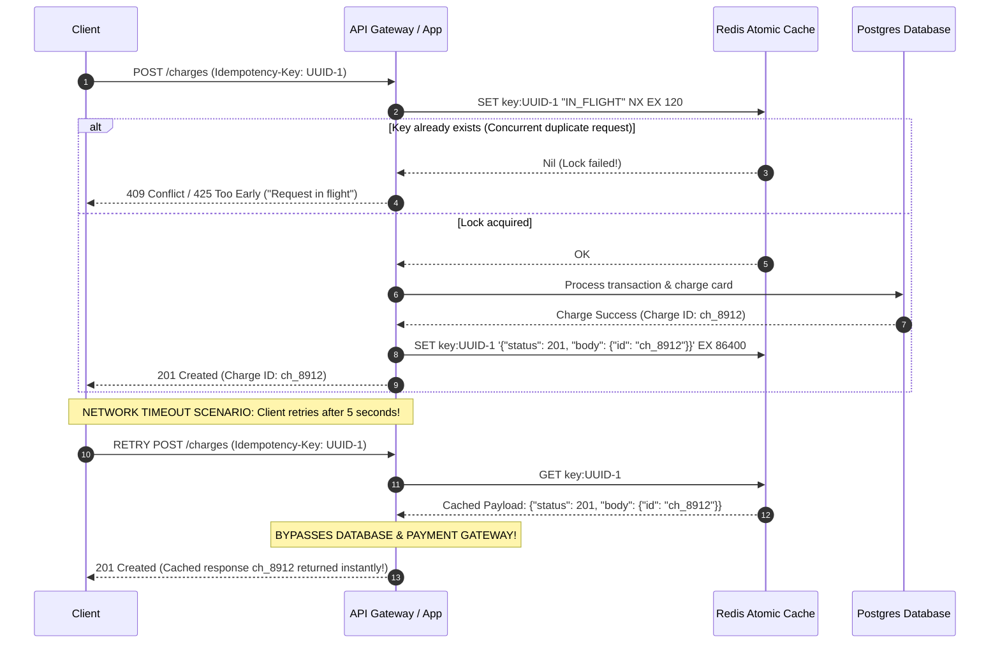
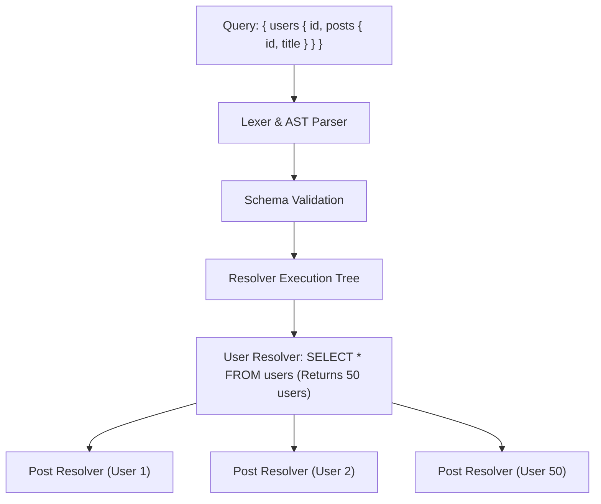

# 04. Real-Time Protocols, CDN Edge Infrastructure & High-Scale API Design

> **Target Role**: Staff / Senior Backend & Systems Architect (Rails, Node.js/TypeScript, Distributed Systems, High-Scale APIs)  
> **Module**: 09-networking-web-internals / 04-realtime-and-api-design  
> **Key Focus**: CDN Edge & Anycast BGP, Tag-Based Cache Purging, WebSockets vs. SSE vs. gRPC, LLM Token Streaming, Idempotency Keys, Keyset/Cursor Pagination ($O(\log N)$ vs. $O(N)$), API Versioning, and GraphQL DataLoader N+1 Mitigation.

---

## Table of Contents
1. [CDN Edge Infrastructure & Cache Invalidation at Scale](#1-cdn-edge-infrastructure--cache-invalidation-at-scale)
   - [1.1 Definition & Core Concept](#11-definition--core-concept)
   - [1.2 Anycast BGP Routing & Edge Points of Presence (PoPs)](#12-anycast-bgp-routing--edge-points-of-presence-pops)
   - [1.3 Origin Shielding & Cache Stampede Protection](#13-origin-shielding--cache-stampede-protection)
   - [1.4 Invalidation Mechanics: URL Purge vs. Surrogate Keys vs. Content Hashing](#14-invalidation-mechanics-url-purge-vs-surrogate-keys-vs-content-hashing)
   - [1.5 Production CDN Headers & CLI Purge Pipelines](#15-production-cdn-headers--cli-purge-pipelines)
   - [1.6 Failure Modes & Thundering Herd Outages](#16-failure-modes--thundering-herd-outages)
   - [1.7 Senior Interview Q&A](#17-senior-interview-qa)
2. [Real-Time Communication: WebSockets vs. SSE vs. gRPC](#2-real-time-communication-websockets-vs-sse-vs-grpc)
   - [2.1 Definition & Core Concept](#21-definition--core-concept)
   - [2.2 WebSockets: HTTP 101 Upgrade, Framing & Redis Pub/Sub Backplane](#22-websockets-http-101-upgrade-framing--redis-pubsub-backplane)
   - [2.3 Server-Sent Events (SSE): Unidirectional Streaming & LLM Token Delivery](#23-server-sent-events-sse-unidirectional-streaming--llm-token-delivery)
   - [2.4 gRPC: HTTP/2 Binary Protocol Buffers & Streaming Contracts](#24-grpc-http2-binary-protocol-buffers--streaming-contracts)
   - [2.5 Production Code Implementations (TypeScript & Python)](#25-production-code-implementations-typescript--python)
   - [2.6 Real-Time Protocol Decision Matrix](#26-real-time-protocol-decision-matrix)
   - [2.7 Senior Interview Q&A](#27-senior-interview-qa)
3. [RESTful API Design, Idempotency & High-Scale Pagination](#3-restful-api-design-idempotency--high-scale-pagination)
   - [3.1 Definition & Core Concept](#31-definition--core-concept)
   - [3.2 Natural vs. Synthetic Idempotency (`Idempotency-Key` Pattern)](#32-natural-vs-synthetic-idempotency-idempotency-key-pattern)
   - [3.3 Pagination at Scale: Offset Pagination Anti-Pattern ($O(N)$) vs. Keyset / Cursor Pagination ($O(\log N)$)](#33-pagination-at-scale-offset-pagination-anti-pattern-on-vs-keyset--cursor-pagination-olog-n)
   - [3.4 Production SQL Benchmarks & Cursor Encoding Engine](#34-production-sql-benchmarks--cursor-encoding-engine)
   - [3.5 API Versioning & Zero-Downtime Deprecation Workflows](#35-api-versioning--zero-downtime-deprecation-workflows)
   - [3.6 Senior Interview Q&A](#36-senior-interview-qa)
4. [GraphQL Architecture & DataLoader N+1 Mitigation](#4-graphql-architecture--dataloader-n1-mitigation)
   - [4.1 Definition & Core Concept](#41-definition--core-concept)
   - [4.2 Internal Mechanics: AST Parsing & The Resolver Execution Tree](#42-internal-mechanics-ast-parsing--the-resolver-execution-tree)
   - [4.3 The N+1 Database Execution Problem](#43-the-n1-database-execution-problem)
   - [4.4 DataLoader Batching Mechanics via Event-Loop Microtasks](#44-dataloader-batching-mechanics-via-event-loop-microtasks)
   - [4.5 Production Hardening: Query Depth & Cost Complexity Analyzers](#45-production-hardening-query-depth--cost-complexity-analyzers)
   - [4.6 Production Code: TypeScript DataLoader & Schema Limiter](#46-production-code-typescript-dataloader--schema-limiter)
   - [4.7 REST vs. GraphQL Decision Matrix](#47-rest-vs-graphql-decision-matrix)
   - [4.8 Senior Interview Q&A](#48-senior-interview-qa)

---

# 1. CDN Edge Infrastructure & Cache Invalidation at Scale

### 1.1 Definition & Core Concept
A **Content Delivery Network (CDN)** is a globally distributed network of proxy servers deployed across hundreds of **Points of Presence (PoPs)** at the edge of the Internet, geographically proximate to end users. 

CDNs dramatically accelerate delivery by terminating TCP/TLS handshakes within milliseconds of the client and caching static assets (JavaScript, CSS, images) and dynamic API responses to offload origin application infrastructure.

---

### 1.2 Anycast BGP Routing & Edge Points of Presence (PoPs)

CDNs route global users to the nearest physical datacenter using **Anycast Border Gateway Protocol (BGP)**:

```
                                  ANYCAST BGP ROUTING
                              Shared IP: 198.51.100.1
                                         │
                 ┌───────────────────────┼───────────────────────┐
                 ▼                       ▼                       ▼
          [Tokyo Edge PoP]      [Frankfurt Edge PoP]     [Virginia Edge PoP]
           AS-Path: 2 hops        AS-Path: 1 hop          AS-Path: 3 hops
                 ▲
                 │ (Closest BGP path based on autonomous system routing)
        [User in Kyoto, Japan]
```

- **Unicast vs. Anycast**: In traditional Unicast, an IP address maps to exactly one physical network interface. In **Anycast**, multiple physical server clusters across different continents advertise the **exact same IP address** to upstream Tier-1 Internet Service Providers using BGP.
- **Path Selection**: Internet routers naturally forward the client's packets along the shortest BGP Autonomous System (AS) path, directing users to the nearest PoP with zero DNS geo-lookup overhead. If a PoP fails or suffers a fiber cut, upstream BGP withdrawal automatically reroutes traffic to the next closest healthy PoP in seconds.

---

### 1.3 Origin Shielding & Cache Stampede Protection

When hundreds of CDN edge PoPs (e.g., 250+ locations globally) experience simultaneous cache expirations, every PoP queries the origin server concurrently. This causes a **Cache Stampede (Thundering Herd)** that can immediately overwhelm backend databases.

```
WITHOUT ORIGIN SHIELD:
[Tokyo PoP] ───────(Miss)──────┐
[London PoP] ──────(Miss)──────┼──> [ORIGIN APPLICATION SERVER]
[Sydney PoP] ──────(Miss)──────┤    (Receives 250 concurrent DB-heavy requests!)
[Frankfurt PoP] ───(Miss)──────┘

─────────────────────────────────────────────────────────────────────────────

WITH ORIGIN SHIELD (Hierarchical Tiering):
[Tokyo PoP] ──(Miss)──┐
[Sydney PoP] ─(Miss)──┴──> [ORIGIN SHIELD (Centralized CDN PoP)]
[London PoP] ─(Miss)──┬──> [e.g., AWS CloudFront Shield / Fastly Shield]
[Frankfurt] ──(Miss)──┘               │
                                      │ Exactly 1 Origin Request!
                                      ▼
                         [ORIGIN APPLICATION SERVER]
```

The **Origin Shield** acts as a centralized secondary caching tier located in the same AWS region / datacenter as the origin server. Edge PoPs query the Origin Shield; only if the Shield misses does a single request touch the backend infrastructure.

---

### 1.4 Invalidation Mechanics: URL Purge vs. Surrogate Keys vs. Content Hashing

Cache invalidation is notoriously difficult at scale. Production systems implement three primary patterns:

```
+───────────────────────────────────────────────────────────────────────────────────────────+
|                               CACHE INVALIDATION ARCHITECTURES                            |
+───────────────────────────────────────────────────────────────────────────────────────────+
| 1. Content Hashing (Asset Busting)                                                        |
|    - Asset: /assets/bundle.a8f9c2d1.js                                                    |
|    - Header: Cache-Control: public, max-age=31536000, immutable                           |
|    - Invalidation: Never purged! Deploying updates produces a new filename hash.          |
+───────────────────────────────────────────────────────────────────────────────────────────+
| 2. Single URL Purge (API / Manual)                                                        |
|    - Command: PURGE https://cdn.example.com/api/v1/products/891                           |
|    - Flaw: Inefficient when one database update affects hundreds of list/detail views.   |
+───────────────────────────────────────────────────────────────────────────────────────────+
| 3. Surrogate Keys / Cache Tags (High-Scale Production Standard)                           |
|    - Response Header: Surrogate-Key: product-891 brand-nike category-shoes               |
|    - Purge Command: PURGE Key: product-891                                                |
|    - Result: Edge CDN invalidates all product pages, search results, and category grids   |
|      referencing that product globally in <150ms!                                         |
+───────────────────────────────────────────────────────────────────────────────────────────+
```

---

### 1.5 Production CDN Headers & CLI Purge Pipelines

#### Emitting Surrogate Keys in Ruby on Rails:
```ruby
# app/controllers/products_controller.rb
class ProductsController < ApplicationController
  def show
    @product = Product.find(params[:id])
    
    # Instruct CDN to cache for 1 hour, browser for 5 minutes
    response.headers["Cache-Control"] = "public, max-age=300, s-maxage=3600, stale-while-revalidate=60"
    
    # Tag response with granular surrogate keys for instant targeted purging
    response.headers["Surrogate-Key"] = "product-#{@product.id} brand-#{@product.brand_id} store-catalog"
    
    render json: @product
  end
end
```

#### Programmatic Tag Invalidation via Fastly / Cloudflare API:
```bash
# Purge all edge cached representations tagged with product-891 in Fastly:
curl -X POST "https://api.fastly.com/service/SERVICE_ID/purge/product-891" \
     -H "Fastly-Key: $FASTLY_API_TOKEN" \
     -H "Accept: application/json"

# Cloudflare Cache Tag Purge:
curl -X POST "https://api.cloudflare.com/client/v4/zones/ZONE_ID/purge_cache" \
     -H "Authorization: Bearer $CF_API_TOKEN" \
     -H "Content-Type: application/json" \
     -d '{"tags": ["product-891"]}'
```

---

### 1.6 Failure Modes & Thundering Herd Outages

#### Outage Scenario: The Black Friday Tag Purge Storm
**Symptom**: An inventory sync job updated 5,000 product prices simultaneously. The worker emitted 5,000 individual tag purge API calls to the CDN within 10 seconds. The CDN immediately purged the entire product catalog, and backend databases collapsed under 100% CPU utilization.

**Root Cause**:
Purging the cache tags removed the cached content instantaneously, exposing the raw origin database to incoming Black Friday traffic without a warm cache layer.

**Remediation**:
1. **Soft Purging (`stale-while-revalidate`)**: Configure the CDN to execute a **Soft Purge** rather than an instant hard delete. When soft-purged, the CDN marks the content as stale: it continues serving the stale cached page to users while asynchronously dispatching a single background fetch to the origin to refresh the cache.
2. **Request Collapsing (Coalescing)**: Ensure the CDN and NGINX have request collapsing enabled (`proxy_cache_use_stale updating;`). If 1,000 requests arrive for an expired page, only 1 request is forwarded to the origin; the remaining 999 wait and receive the refreshed result from the first request.

---

### 1.7 Senior Interview Q&A

#### Q1: How do Surrogate Keys (Cache Tags) differ from standard URL purging, and how does a CDN implement tag lookups in $O(1)$ time across millions of cached objects?
**Staff-Level Answer**:
Standard URL purging requires knowing every discrete URI where a piece of data appears (e.g., `/products/12`, `/products/12?currency=USD`, `/categories/shoes?page=2`, `/search?q=running`). In a large e-commerce platform, a single product update touches thousands of dynamic URLs, making comprehensive URL purging impossible.

**Surrogate Keys (RFC 5073)** solve this by associating arbitrary tags with the cached object at ingest time via the `Surrogate-Key` (Fastly) or `Cache-Tag` (Cloudflare) HTTP response header.

**Internal CDN Implementation**:
CDNs maintain an in-memory distributed inverted index (implemented via distributed hash tables or radix trees):
- **Primary Index**: `Hash(URL + Vary Headers) -> Cached Object Pointer`.
- **Secondary Tag Index**: `Hash(Tag) -> Set of Cached Object Keys`.

When a purge request for `Key: product-12` arrives:
1. The CDN hashes the tag and locates the set of associated object keys in $O(1)$ memory time.
2. Instead of walking the disk to delete files, the CDN updates a metadata timestamp in the index marking those pointers as invalidated (or increments an epoch version counter).
3. Subsequent lookups for those objects register a cache miss and revalidate with the origin.

---

# 2. Real-Time Communication: WebSockets vs. SSE vs. gRPC

### 2.1 Definition & Core Concept
Modern distributed architectures require bidirectional or server-initiated data streams to power live collaborative interfaces, financial ticker feeds, and Large Language Model (LLM) generative token streams.

```
+────────────────────────────────────────────────────────────────────────────────────────────+
|                                    REAL-TIME PROTOCOL SPECTRUM                             |
+────────────────────────────────────────────────────────────────────────────────────────────+
| Protocol       | Directionality | Transport      | Framing   | Multiplexing | Typical Use   |
+────────────────+────────────────+────────────────+───────────+──────────────+───────────────+
| **WebSocket**  | Full-Duplex    | TCP (HTTP 101) | Custom    | No (1 conn   | Chat, Canvas, |
|                | Bidirectional  |                | 2-10 Byte | per channel) | Gaming        |
+────────────────+────────────────+────────────────+───────────+──────────────+───────────────+
| **SSE**        | Unidirectional | HTTP/1.1 or    | Plaintext | Native via   | LLM Streaming,|
|                | Server -> Client| HTTP/2         | text/event| HTTP/2       | Stock Tickers |
+────────────────+────────────────+────────────────+───────────+──────────────+───────────────+
| **gRPC**       | Unary, Stream, | HTTP/2 (Binary)| Protobuf  | Native via   | Microservices,|
|                | Bidirectional  |                | Wire Type | HTTP/2       | Low-latency   |
+────────────────+────────────────+────────────────+───────────+──────────────+───────────────+
```

---

### 2.2 WebSockets: HTTP 101 Upgrade, Framing & Redis Pub/Sub Backplane

#### 1. The Upgrade Handshake (RFC 6455)
A WebSocket connection begins as a standard HTTP/1.1 request:

```http
GET /chat HTTP/1.1
Host: api.example.com
Upgrade: websocket
Connection: Upgrade
Sec-WebSocket-Key: dGhlIHNhbXBsZSBub25jZQ==
Sec-WebSocket-Version: 13
```

The server verifies the key, concatenates a standardized GUID (`258EAFA5-E914-47DA-95CA-C5AB0DC85B11`), hashes it with SHA-1, base64 encodes it, and returns:

```http
HTTP/1.1 101 Switching Protocols
Upgrade: websocket
Connection: Upgrade
Sec-WebSocket-Accept: s3pPLMBiTxaQ9kYGzzhZRbK+xOo=
```
At this point, the HTTP parser is detached, and both endpoints treat the underlying TCP socket as a persistent, full-duplex binary frame pipeline.

#### 2. Frame Anatomy & Client Masking
```text
 0                   1                   2                   3
 0 1 2 3 4 5 6 7 8 9 0 1 2 3 4 5 6 7 8 9 0 1 2 3 4 5 6 7 8 9 0 1
+-+-+-+-+-------+-+-------------+-------------------------------+
|F|R|R|R| opcode|M| Payload len |    Extended payload length    |
|I|S|S|S|  (4)  |A|     (7)     |             (16/64)           |
|N|V|V|V|       |S|             |   (if payload len==126/127)   |
| |1|2|3|       |K|             |                               |
+-+-+-+-+-------+-+-------------+ - - - - - - - - - - - - - - - +
|     Masking-key (0 or 4 bytes) (MANDATORY from Client -> Server)|
+-------------------------------+-------------------------------+
|                     Payload Data (XOR-unmasked)               |
+---------------------------------------------------------------+
```
- **Masking Key**: RFC 6455 strictly mandates that **all frames sent from client to server MUST be masked with a 4-byte random XOR key**. This prevents malicious web scripts from crafting byte sequences that confuse intermediate transparent proxy caches into poisoning cache entries.

#### 3. Horizontal Scaling via Redis Pub/Sub Backplane:
WebSockets are stateful: User A connects to Node Server #1, while User B connects to Node Server #2. To broadcast messages between them, servers connect to an asynchronous message broker backplane:

```mermaid
flowchart TD
    ClientA[User A (Mobile)] <-->|WebSocket| Server1[Node.js Server #1]
    ClientB[User B (Desktop)] <-->|WebSocket| Server2[Node.js Server #2]
    Server1 <-->|PUBLISH / SUBSCRIBE| Redis[(Redis Pub/Sub / Cluster)]
    Server2 <-->|PUBLISH / SUBSCRIBE| Redis
```

---

### 2.3 Server-Sent Events (SSE): Unidirectional Streaming & LLM Token Delivery

Unlike WebSockets, **Server-Sent Events (SSE - HTML5 standard)** operate over standard HTTP. The client initiates a standard GET request; the server keeps the HTTP connection open indefinitely, streaming plaintext UTF-8 events.

#### Why SSE Dominates LLM Token Streaming (OpenAI, Anthropic):
1. **HTTP/2 Native Multiplexing**: SSE requests multiplex cleanly across the browser's existing HTTP/2 connection. WebSockets require a dedicated TCP socket handshake.
2. **Native Reconnection & Resume**: Browsers natively auto-reconnect if the connection drops. By transmitting an `id: <message_id>`, the browser automatically transmits `Last-Event-ID: <message_id>` upon reconnecting, allowing the server to backfill missed tokens seamlessly.
3. **Firewall & Corporate Proxy Friendly**: Operates over standard HTTPS port 443 with no custom protocols; passes through restrictive corporate proxies that block WebSockets.

#### SSE Wire Format:
```text
HTTP/1.1 200 OK
Content-Type: text/event-stream
Cache-Control: no-cache
Connection: keep-alive
X-Accel-Buffering: no

event: token
id: 101
data: {"token": "The", "index": 0}

event: token
id: 102
data: {"token": " architecture", "index": 1}

event: done
data: [DONE]
```

---

### 2.4 gRPC: HTTP/2 Binary Protocol Buffers & Streaming Contracts

**gRPC** is Google's open-source Remote Procedure Call framework. It couples **HTTP/2 transport** with **Protocol Buffers (protobuf)** binary serialization.

```
                  JSON REST over HTTP/1.1 vs. gRPC over HTTP/2
JSON REST:
{"user_id": 9812, "email": "user@example.com", "active": true}
Payload Size: 64 bytes (ASCII text, repeated string keys)
Serialization Cost: High (String parsing, JSON.parse / JSON.stringify)

─────────────────────────────────────────────────────────────────────────────

Protocol Buffers (Binary Wire Format):
08 b4 4c 12 10 75 73 65 72 40 65 78 61 6d 70 6c 65 2e 63 6f 6d 18 01
Payload Size: 23 bytes (64% bandwidth reduction!)
Serialization Cost: Extremely low (Bitwise shifts, direct memory copies)
```

#### gRPC Communication Patterns:
1. **Unary RPC**: Traditional Request $\to$ Response.
2. **Server Streaming RPC**: Client sends one request; server streams back a sequence of responses (ideal for large query exports).
3. **Client Streaming RPC**: Client streams a sequence of messages; server responds with a single confirmation (ideal for file chunk uploads).
4. **Bidirectional Streaming RPC**: Both client and server stream independent messages concurrently over a single HTTP/2 stream.

---

### 2.5 Production Code Implementations (TypeScript & Python)

#### 1. Production Express Server-Sent Events (SSE) LLM Token Streamer:
```typescript
// server-sse.ts
import express, { Request, Response } from 'express';

const app = express();

app.get('/api/v1/chat/stream', async (req: Request, res: Response) => {
  // CRITICAL: Mandatory SSE Headers
  res.setHeader('Content-Type', 'text/event-stream');
  res.setHeader('Cache-Control', 'no-cache, no-transform');
  res.setHeader('Connection', 'keep-alive');
  // Instruct NGINX not to buffer chunked SSE tokens
  res.setHeader('X-Accel-Buffering', 'no');

  res.flushHeaders(); // Flush HTTP headers immediately

  const tokens = ["Generative", " AI", " pipelines", " require", " low-latency", " streaming."];

  for (let i = 0; i < tokens.length; i++) {
    const payload = JSON.stringify({ token: tokens[i], id: i });
    // Write SSE framed data: event, id, data, double newline
    res.write(`event: message\n`);
    res.write(`id: ${i}\n`);
    res.write(`data: ${payload}\n\n`);

    // Simulate LLM inference token generation delay
    await new Promise(resolve => setTimeout(resolve, 80));
  }

  // Terminate stream
  res.write('event: done\ndata: [DONE]\n\n');
  res.end();
});

app.listen(4000, () => console.log('SSE Streamer listening on port 4000'));
```

#### 2. Scalable WebSocket Server with Redis Pub/Sub in TypeScript:
```typescript
// server-ws.ts
import { createServer } from 'http';
import { WebSocketServer, WebSocket } from 'ws';
import Redis from 'ioredis';

const server = createServer();
const wss = new WebSocketServer({ server });

const pub = new Redis(process.env.REDIS_URL || 'redis://localhost:6379');
const sub = new Redis(process.env.REDIS_URL || 'redis://localhost:6379');

const CHANNEL = 'global-chat';

// Subscribe this server instance to Redis
sub.subscribe(CHANNEL);
sub.on('message', (channel, message) => {
  if (channel === CHANNEL) {
    // Broadcast received Redis event to all locally connected WebSocket clients
    wss.clients.forEach(client => {
      if (client.readyState === WebSocket.OPEN) {
        client.send(message);
      }
    });
  }
});

wss.on('connection', (ws: WebSocket) => {
  ws.on('message', (data: string) => {
    // Publish incoming message to Redis backplane to propagate across all cluster nodes
    pub.publish(CHANNEL, data.toString());
  });

  ws.on('error', console.error);
});

server.listen(5000, () => console.log('WebSocket cluster node listening on :5000'));
```

---

### 2.6 Real-Time Protocol Decision Matrix

| Dimension | WebSockets | Server-Sent Events (SSE) | gRPC (Bidirectional) |
| :--- | :--- | :--- | :--- |
| **Direction** | Bidirectional (Full-Duplex)| Unidirectional (Server $\to$ Client)| Bidirectional / Streaming |
| **Protocol** | `ws://`, `wss://` | Standard HTTP/1.1 or HTTP/2 | HTTP/2 Binary |
| **Payload Format**| Arbitrary Text / Binary | UTF-8 Plaintext Strings | Binary Protocol Buffers |
| **Browser Support**| Universal | Universal (`EventSource`) | Requires `grpc-web` proxy |
| **Auto-Reconnect** | Manual implementation | Native browser reconnect + `Last-Event-ID` | Managed by gRPC client runtime |
| **Header Overhead**| 2–10 bytes framing | Minimal text framing | HTTP/2 HPACK compressed |
| **Best For** | Multi-player games, Chat | LLM Streaming, Dashboards | Internal Microservices |

---

### 2.7 Senior Interview Q&A

#### Q2: When streaming LLM tokens via Server-Sent Events through an NGINX reverse proxy, why do tokens often appear all at once after a 10-second pause rather than streaming word-by-word, and how do you resolve it?
**Staff-Level Answer**:
This is caused by **NGINX Proxy Response Buffering**.

By default, NGINX enables `proxy_buffering on;`. When Puma, Node.js, or FastAPI streams small SSE token chunks (e.g., 20 bytes per token), NGINX does not forward each individual TCP packet to the client. Instead, it accumulates the chunks in its internal buffer (`proxy_buffers 8 4k;`) until either:
1. The buffer reaches 4KB, or
2. The upstream application finishes the response and closes the connection.

The user experiences complete silence for 10 seconds, followed by the entire completed paragraph flushing onto the screen simultaneously.

**The Production Fix**:
1. **Application-Level Header**: Instruct NGINX to disable buffering dynamically for that specific response by setting:
   ```http
   X-Accel-Buffering: no
   ```
2. **NGINX Configuration**: Explicitly disable buffering for the streaming path:
   ```nginx
   location /api/v1/chat/stream {
       proxy_pass http://llm_backend;
       proxy_buffering off;
       proxy_cache off;
       proxy_set_header Connection '';
       proxy_http_version 1.1;
       chunked_transfer_encoding on;
   }
   ```

---

# 3. RESTful API Design, Idempotency & High-Scale Pagination

### 3.1 Definition & Core Concept
Designing enterprise APIs requires strict adherence to HTTP protocol semantics:
- **Safety**: An HTTP method is safe if it does not alter server state (`GET`, `HEAD`, `OPTIONS`).
- **Idempotency**: An HTTP method is idempotent if executing it $N$ times consecutively produces the exact same server state as executing it once ($f(f(x)) = f(x)$).

---

### 3.2 Natural vs. Synthetic Idempotency (`Idempotency-Key` Pattern)

```
Natural Idempotency:
  - GET /users/12        -> Idempotent (Read-only)
  - PUT /users/12        -> Idempotent (Overwrites full resource state)
  - DELETE /users/12     -> Idempotent (Subsequent deletes result in same state: gone)
  - POST /checkout       -> NON-IDEMPOTENT! Executing 3 times creates 3 charges!
```

#### Synthetic Idempotency via `Idempotency-Key` (Stripe Standard):
To prevent double-billing caused by network timeouts or retries, clients generate a unique UUID v4 header:
```http
POST /v1/charges HTTP/1.1
Idempotency-Key: 9b1deb4d-3b7d-4bad-9bdd-2b0d7b3dcb6d
Content-Type: application/json

{"amount": 5000, "currency": "usd"}
```

#### Distributed Atomic Execution Flow:


---

### 3.3 Pagination at Scale: Offset Pagination Anti-Pattern ($O(N)$) vs. Keyset / Cursor Pagination ($O(\log N)$)

#### The Offset Pagination Anti-Pattern (`OFFSET X LIMIT Y`)
```sql
-- Fetch page 10,000 with 20 items per page
SELECT * FROM orders ORDER BY id ASC LIMIT 20 OFFSET 200000;
```
**Why Offset Collapses at Scale**:
1. **$O(N)$ Disk Scan**: The relational database (PostgreSQL/MySQL) **cannot jump directly to row 200,001**. Even with a B-Tree index on `id`, the storage engine must traverse the index, read all 200,020 row references, fetch pages from disk into the Buffer Pool, and **discard the first 200,000 rows in memory**.
2. **Page Drift (Skipping & Duplicate Items)**: If a new order is inserted at row 5 while a user navigates from Page 1 to Page 2, every item shifts down by one index. The user sees the last item from Page 1 duplicated at the top of Page 2.

#### The Keyset / Cursor Pagination Standard
Keyset pagination replaces arbitrary row offsets with a seek condition based on the table's indexed B-Tree columns:

```sql
-- Fetch the first page
SELECT id, created_at, amount 
FROM orders 
ORDER BY created_at DESC, id DESC 
LIMIT 20;

-- Client extracts cursor from the 20th record:
-- cursor = base64("2026-09-09 12:00:00,8912")

-- Fetch the next page using composite index seek:
SELECT id, created_at, amount 
FROM orders 
WHERE (created_at, id) < ('2026-09-09 12:00:00', 8912)
ORDER BY created_at DESC, id DESC 
LIMIT 20;
```
**Why Cursor Pagination Excels**:
1. **$O(\log N)$ Index Seek**: The query uses the composite B-tree index `idx_orders_created_at_id` to descend the tree root to the exact leaf node in 3–4 I/O operations, regardless of whether you are reading page 1 or page 50,000.
2. **Zero Drift**: Inserts or deletes on earlier pages do not alter the relative ordering of records after the cursor.

---

### 3.4 Production SQL Benchmarks & Cursor Encoding Engine

#### PostgreSQL Benchmark (`EXPLAIN ANALYZE` on 10,000,000 rows):
```sql
-- 1. Offset Pagination Execution Plan
EXPLAIN ANALYZE SELECT * FROM orders ORDER BY id LIMIT 20 OFFSET 5000000;
-- Result:
-- Limit  (cost=78120.45..78120.76 rows=20 width=64) (actual time=642.128..642.135 rows=20 loops=1)
--   ->  Index Scan using orders_pkey on orders  (actual time=0.042..489.312 rows=5000020 loops=1)
-- Execution Time: 642.85 ms (SCANS 5 MILLION ROWS!)

-- 2. Keyset / Cursor Pagination Execution Plan
EXPLAIN ANALYZE SELECT * FROM orders WHERE id > 5000000 ORDER BY id LIMIT 20;
-- Result:
-- Limit  (cost=0.43..1.28 rows=20 width=64) (actual time=0.038..0.045 rows=20 loops=1)
--   ->  Index Scan using orders_pkey on orders  (actual time=0.035..0.041 rows=20 loops=1)
-- Execution Time: 0.071 ms (10,000x FASTER! DIRECT B-TREE LEAF HIT)
```

#### Production TypeScript Cursor Serializer:
```typescript
// cursor.ts
interface OrderCursor {
  createdAt: string;
  id: number;
}

export function encodeCursor(createdAt: Date, id: number): string {
  const payload: OrderCursor = { createdAt: createdAt.toISOString(), id };
  return Buffer.from(JSON.stringify(payload)).toString('base64url');
}

export function decodeCursor(cursor: string): OrderCursor {
  try {
    const raw = Buffer.from(cursor, 'base64url').toString('utf8');
    return JSON.parse(raw);
  } catch (err) {
    throw new Error('Malformed pagination cursor token');
  }
}
```

---

### 3.5 API Versioning & Zero-Downtime Deprecation Workflows

| Strategy | Syntax | Pros | Cons |
| :--- | :--- | :--- | :--- |
| **URL Path** | `/v1/orders`<br/>`/v2/orders` | Transparent; highly cacheable in CDNs; simple routing. | Violates URI purism (Resource representation changes, not entity identity). |
| **Custom Header** | `X-API-Version: 2` | Clean URIs; simple client SDK toggling. | Bypasses standard CDN URL caching without explicit `Vary` header configuration. |
| **Content Negotiation** | `Accept: application/vnd.company.v2+json` | Pure REST compliance (HATEOAS). | Hard to test in browsers; complex edge proxy routing rules. |

#### Zero-Downtime Deprecation Headers (RFC 8594):
When deprecating old API versions, emit explicit standard headers to warn automated consumers before turning endpoints off:
```http
HTTP/1.1 200 OK
Deprecation: @1767225600
Sunset: Wed, 31 Dec 2026 23:59:59 GMT
Link: <https://api.example.com/docs/migration-v2>; rel="deprecation"; type="text/html"
```

---

### 3.6 Senior Interview Q&A

#### Q3: How do you implement bidirectional cursor pagination (navigating both forward and backward) using keyset pagination on multi-column sorts?
**Staff-Level Answer**:
Bidirectional keyset pagination requires inverting both the relational operator and the sort ordering when navigating backwards.

Assuming a sort condition of `ORDER BY created_at DESC, id DESC`:
1. **Forward Pagination (`first: 20, after: cursor`)**:
   - Extract `(cursor_created_at, cursor_id)`.
   - Query:
     ```sql
     WHERE (created_at, id) < (:cursor_created_at, :cursor_id)
     ORDER BY created_at DESC, id DESC
     LIMIT 20;
     ```
2. **Backward Pagination (`last: 20, before: cursor`)**:
   - Invert comparison operator to `>`:
     ```sql
     WHERE (created_at, id) > (:cursor_created_at, :cursor_id)
     ORDER BY created_at ASC, id ASC
     LIMIT 20;
     ```
   - **Crucial Inversion Step**: Because the backward query sorts in `ASC` order to find the 20 immediate preceding items closest to the cursor, the resulting rows in application memory are in reverse order. The backend must reverse the 20-item array in application memory before serializing the JSON response to maintain natural chronological view for the client.

---

# 4. GraphQL Architecture & DataLoader N+1 Mitigation

### 4.1 Definition & Core Concept
**GraphQL** is a query language and runtime for APIs developed by Meta. Instead of hitting multiple fixed REST endpoints, clients send declarative queries specifying the exact shape and fields of data required in a single network round-trip.

---

### 4.2 Internal Mechanics: AST Parsing & The Resolver Execution Tree

When a GraphQL query reaches the server:
1. **Lexing & Parsing**: The raw query string is parsed into an Abstract Syntax Tree (AST).
2. **Validation**: The AST is validated against the Type Schema (verifying field existence and argument types).
3. **Execution**: The runtime traverses the query AST depth-first, invoking independent resolver functions for each field.



---

### 4.3 The N+1 Database Execution Problem

In naive GraphQL implementations, field resolvers execute in isolation:
```typescript
// Naive resolvers
const resolvers = {
  Query: {
    users: () => db.query('SELECT * FROM users LIMIT 50'), // 1 Query
  },
  User: {
    posts: (parent) => db.query('SELECT * FROM posts WHERE user_id = $1', [parent.id]), // N Queries!
  },
};
```
If `users` returns 50 records, the `User.posts` resolver fires **50 separate SQL queries** to fetch each user's posts. 

$$\text{Total SQL Queries} = 1 + N = 1 + 50 = 51 \text{ queries!}$$

Under high traffic, this exhausts database connection pools within seconds.

---

### 4.4 DataLoader Batching Mechanics via Event-Loop Microtasks

The **DataLoader** pattern (invented by Lee Byron) solves the N+1 problem by leveraging the JavaScript/Node.js Event Loop **Microtask Queue** (or Fibers in Ruby):

```
TICK 1 (Current Synchronous Call Stack):
  User 1 resolver calls: userLoader.load(1) ──┐
  User 2 resolver calls: userLoader.load(2) ──┼──> Keys queued in DataLoader memory array: [1, 2, ... 50]
  User 50 resolver calls: userLoader.load(50) ┘    Returns pending Promises to all resolvers.

TICK 2 (Microtask Queue Drain / process.nextTick):
  Call stack empties. DataLoader batch function fires ONCE:
  SQL: SELECT * FROM posts WHERE user_id IN (1, 2, 3, ... 50); -- Exactly 1 Query!
  DataLoader distributes post results to corresponding Promise resolutions.
```

---

### 4.5 Production Hardening: Query Depth & Cost Complexity Analyzers

Because clients dictate query structure, malicious actors can submit deeply nested recursive queries to execute Denial of Service (DoS) attacks:

```graphql
# THE RECURSIVE DOS ATTACK
query MaliciousQuery {
  user(id: 1) {
    posts {
      author {
        posts {
          author {
            posts {
              # Infinite recursion collapsing server RAM and DB!
            }
          }
        }
      }
    }
  }
}
```

#### Production Defenses:
1. **Query Depth Limiting (`graphql-depth-limit`)**: Enforce a hard ceiling on AST tree depth (e.g., maximum depth of 6).
2. **Query Complexity / Cost Analysis (`graphql-cost-analysis`)**: Assign point costs to fields (e.g., scalar field = 1 point; relation field = 10 points $\times$ `limit`). Reject any query exceeding 500 points with `400 Bad Request`.

---

### 4.6 Production Code: TypeScript DataLoader & Schema Limiter

```typescript
// dataloader-example.ts
import DataLoader from 'dataloader';
import { db } from './database';

interface Post {
  id: number;
  userId: number;
  title: string;
}

// 1. Define Batch Loading Function (Must return array of same length and order as input keys!)
async function batchGetPostsByUserIds(userIds: readonly number[]): Promise<Post[][]> {
  // Single coalesced database query
  const rows: Post[] = await db.query(
    'SELECT * FROM posts WHERE user_id = ANY($1::int[])',
    [userIds]
  );

  // Group posts by user_id
  const postsByUserId = new Map<number, Post[]>();
  userIds.forEach(id => postsByUserId.set(id, []));
  rows.forEach(post => {
    postsByUserId.get(post.userId)?.push(post);
  });

  // Map back to original userIds array order
  return userIds.map(id => postsByUserId.get(id) || []);
}

// 2. Instantiate DataLoader per-request (CRITICAL: Never share across requests to prevent cross-user data leaks)
export function createLoaders() {
  return {
    userPostsLoader: new DataLoader<number, Post[]>(batchGetPostsByUserIds, {
      cache: true, // Memoizes within single request lifecycle
    }),
  };
}

// 3. Resolver using DataLoader
export const resolvers = {
  User: {
    posts: (parent: { id: number }, _args: unknown, context: { loaders: ReturnType<typeof createLoaders> }) => {
      return context.loaders.userPostsLoader.load(parent.id);
    },
  },
};
```

---

### 4.7 REST vs. GraphQL Decision Matrix

| Dimension | RESTful APIs | GraphQL APIs |
| :--- | :--- | :--- |
| **Over-Fetching / Under-Fetching**| High (Fixed response shapes) | **Zero (Client requests exact fields)** |
| **Network Round Trips** | Multiple hops for relational data | **Single round trip** |
| **HTTP Caching at Edge CDNs** | **Trivial & standard (`Cache-Control`, URLs)** | Complex (POST queries bypass CDN cache) |
| **N+1 Vulnerability** | Addressed in ORM via `eager_load` | High risk; requires mandatory DataLoader |
| **API Attack Surface** | Predictable, bounded URL paths | Large, dynamic AST queries require cost limiters |
| **Ideal Use Case** | Public developer APIs, High-cache CDNs | Complex mobile apps, internal dashboards |

---

### 4.8 Senior Interview Q&A

#### Q4: Why must a DataLoader instance be scoped per HTTP request rather than declared as a global singleton in Node.js?
**Staff-Level Answer**:
Instantiating a DataLoader as a global singleton introduces two catastrophic production hazards:
1. **Cross-Tenant Data Leaking (Security Vulnerability)**:
   DataLoader features an in-memory memoization cache (`cache: true`). If User A executes a query fetching `userLoader.load(42)` where record 42 contains confidential data, and the loader is a singleton, that record remains in RAM. When User B (an unprivileged third party) executes a query for record 42, DataLoader immediately resolves from its in-memory map **without checking User B's permissions or querying the database**, leaking User A's data.
2. **Stale Data Across Requests**:
   If an update or mutation occurs in Request 1, Request 2 will continue reading the stale memoized object from the global singleton loader until the Node.js process restarts.

**Production Standard**:
Always construct fresh DataLoader instances inside the **GraphQL context creation callback** for each incoming HTTP request. This bounds memoization strictly to the lifecycle of a single request, guaranteeing isolation and garbage collection when the request completes.
